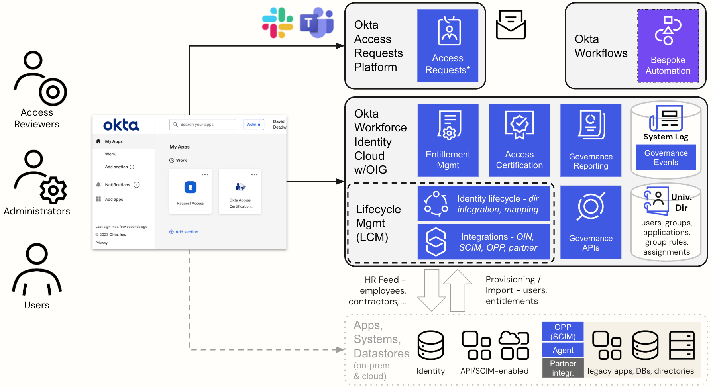

## Architectural Overview of Okta Identity Governance

The following figure shows the major components and interactions with
Okta Identity Governance.

The OIG product provides capabilities presented across three linked SaaS
tenants: your Okta Workforce Identity Cloud org, an Access Requests
tenant, and an Okta Workflows tenant. All three of these reside behind
the Okta Dashboard (or Admin Console for Workflows) which provides a
common interface into the Okta components and the other apps that users
SSO to.

The Okta Workforce Identity Cloud (Okta) org has the **Lifecycle
Management (LCM)**, **Universal Directory (UD)** and **Access
Governance** products. The key components from an OIG perspective are:

- **Universal Directory** - holding the users, groups, applications,
  rules, assignments and other data objects

- **Lifecycle Management** - with the identity lifecycle processing,
  such as directory integration and profile mapping, and the
  integrations, such as the Okta Integration Network (OIN) connectors,
  SCIM integration, On-Premise Provisioning (OPP) and partner
  integrations.

- **Governance APIs** - a library of APIs to integrate with the
  governance objects, some of which are built into the Workflows
  connector.

- **Entitlement Management** - managing fine-grained entitlements for
  applications

- **Access Certification** - providing a means to build and run access
  certification campaigns

Existing Okta Workforce platform capabilities are extended for OIG:

- **Governance Reporting** - pre-built reports for governance using the
  platform reporting interface

- **System Log** - governance events are written to the Okta System Log

The LCM integrations are integrating with the target systems, both
on-premise and cloud. Where apps have APIs for provisioning or exposing
SCIM endpoints, the integrations can talk directly. For legacy apps and
systems, the on-premise provisioning (OPP) agent can be used. There are
also partner-developed integrations that may use deployed components.

The **Access Requests** tenant is providing the engine to run access
request flows. There are [<u>two types of access request
flows</u>](https://help.okta.com/oie/en-us/content/topics/identity-governance/access-requests/ar-overview.htm),
the newer ***Conditions*** and the older ***Request Types***. Both can
be accessed via the Okta Dashboard, chat (Slack, Microsoft Teams) and
emails. Conditions are managed within the Okta Admin Console whereas
Request Types are managed within the Access Requests UI. More detail on
this is provided in the section exploring [<u>Access
Requests</u>](#exploring-requesting-access).

The **Okta Workflows** tenant is providing the backend (or automation)
workflows (such as bespoke provisioning or campaign remediation flows).

There are multiple interfaces that are involved in the IGA use-cases –
Slack/Teams for messaging interface to Access Requests or the Access
Requests web UI, the Okta administration console for managing Okta, and
the Okta Workflows UI for managing flows. All of these can be accessed
via SSO from the Okta Dashboard. Also, email is used by different
components for asynchronous notifications.

---

[← What is Okta Identity Governance?](01-what-is-okta-identity-governance.md) | [Users, Groups and Entitlements →](03-users-groups-and-entitlements.md)
