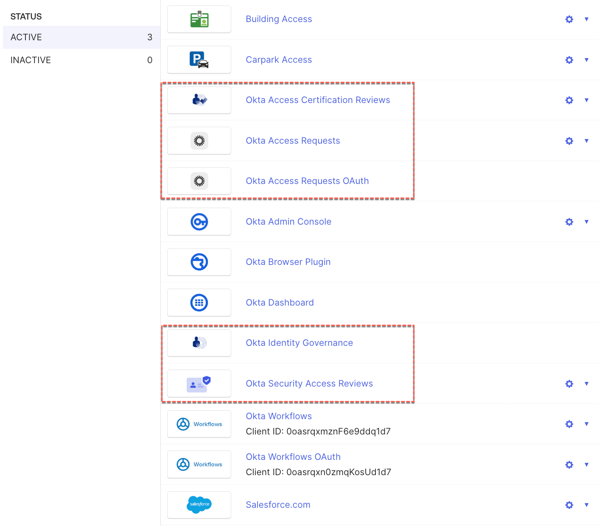
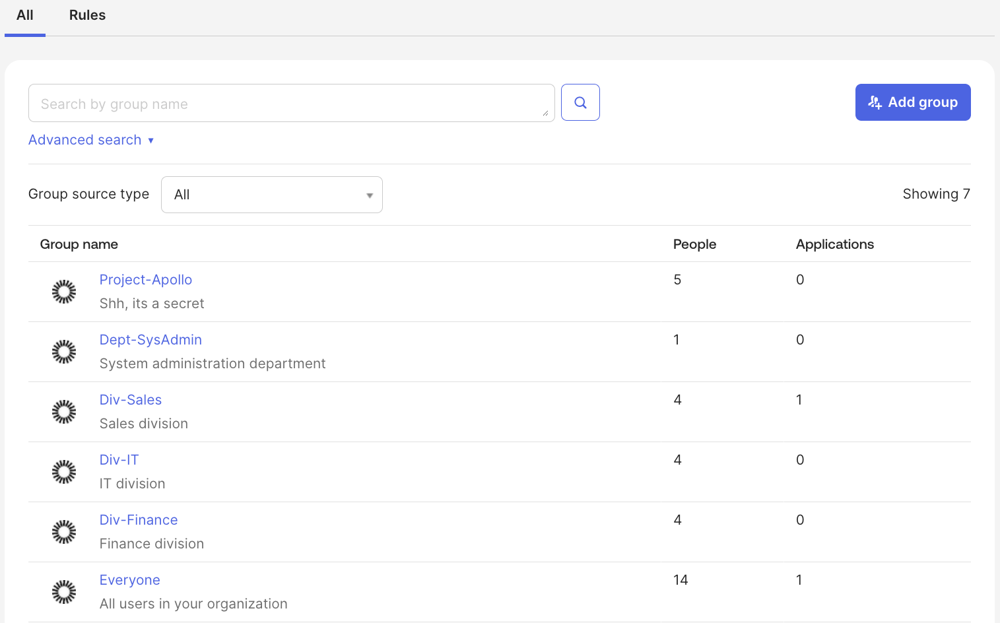

## Preparing Your Okta Environment

Prior to walking through the lab sections you should check that your
Okta environment is ready to run the labs. This includes checking OIG is
in your org, you have users and groups to test with and you have
representative apps configured.

### Early Access Feature Flags

There are some Early Access (EA) features available at the time of
writing this guide that are mentioned or may affect some of the screen
shots you see here. By the time you read this, these features may be
generally available and not visible in the EA Features list.

You can view/enable them in the Admin Console under Settings \> Features
\> Early Access:

- **Access Requests - Unified Requester Experience** - this will become
  relevant in the last Access Requests lab.

- **Create virtual roles with Collections** - collections allow
  cross-app access bundles. We will discuss them later in this document.

- **Import user entitlements from CSV** - this is useful for entitlement
  management and you may want to use it when setting up entitlements for
  disconnected apps.

- **Okta Workflows actions in Access Requests** - run workflows from
  within a Request Type.

Only the first EA feature will affect any of the labs in this guide,
however the other features will be discussed in the [<u>Advanced
Topics</u>](#advanced-topics) section.

### Is Okta Identity Governance Configured in Your Environment?

Okta will have provisioned the products you have purchased, including
OIG. If you are trailing it, you or your account team will have selected
it for the trial.

To check the OIG is configured:

1.  Log into your Okta instance as an administrator and go to the Admin
    console

2.  Go to **Applications \> Applications** and check the list of
    applications

You should see the five applications listed below.

Notes:

\- The **Okta Security Access Reviews** app is a recent addition and may
not be on older orgs

\- The **Okta Access Requests OAuth** app appears when the *Okta
Workflows actions in Access Request EA* flag is enabled

\- You might also see an **Okta Access Requests Admin** app. This was
hidden in Okta Preview environments in Jul 2025, but may still be
visible in Okta Prod environments.

If you do not see these apps, OIG may not be enabled and you will need
to contact your Okta account team or support.

3.  Check there is an Identity Governance menu item, with Access
    Certifications, Access Requests and Settings under it.

4.  Go to the **<u>Okta Access Requests</u>** app and check that your
    administrator is assigned to the app. If not, assign them. Confirm
    that the app appears on the administrators dashboard.

There will need to be some configuration but OIG is installed and ready
to use.

### Users and Groups

You will need a set of users in Okta to request and review access for.
These users could represent different roles and levels of management.

For the access certification and access requests parts of this guide,
you will need some manager-employee relationships, so make sure some of
your users have the ManagerId and Manager profile attributes set to
valid Okta users.

For a production deployment you should think about how you would
maintain any relationships you want to use for access approval or
certification review. The standard user profile includes this field and
some of the OIN apps will maintain it. But you may need to build a
process to monitor and handle any other custom attributes you want to
use for other relationships. Okta Workflows are good for these types of
automated processes.

The users in the environment used to build this guide (in screen
captures) are trivial examples with a Name Role (and
[<u>name.role@email.address</u>](mailto:name.role@email.address)) format
to make the scenarios easier.

Similarly you will need a mix of groups for the labs later in this
document. You should have an all-users group (the default “Everyone”
group can be used) and groups to represent parts of the business. You
can have groups where membership is populated by group rules, but you
will need some with manual assignment for some of the lab sections.

Some of the groups used in the screen captures in this document are
shown below. They include both manual and automated groups.

You should consider how your groups are managed in Okta. If you have
groups automatically assigned via group rules, it doesn’t make sense to
also assign them via access requests and revoking access to groups also
doesn’t make sense (although the certification mechanism will handle
that with an exception list). Similarly for app-managed groups – you can
see them but cannot be added to them or removed from them via Okta
(there is a new bidirectional sync mechanism for AD groups that allows
access requests and access certification to manage the membership of AD
groups).

### Applications

The focus of the labs is not on lifecycle management, but if you are
planning on doing entitlement management you will need a mix of
connected apps (i.e. entitlement management supported apps) and dummy
apps (like SCIM 2.0 apps that aren’t connected to anything).

For this lab guide we have three apps configured:

- **Building Access** - a SCIM 2.0 dummy app

- **Carpark Access** - a bookmark dummy app, and

- **Salesforce.com** - an app connected to a live Salesforce.com
  instance with SSO and provisioning enabled and tested.

You do not need these specific apps, but these will be used for the
screenshots in this document.

In production you would have provisioning enabled for applications for
the full end-to-end lifecycle. You may also have Okta Workflows tied to
application or group membership for bespoke provisioning flows.

### Other Setup

If you are going to use Slack or Teams, you will need to have them
configured in your environment with users tied to Okta users. We do not
cover these integrations in this guide.

See the [<u>Advanced Topics</u>](#advanced-topics) section for other
capabilities you could add to your environment (but not included in
these labs).

---

[← Using this Guide](01-using-this-guide.md)
