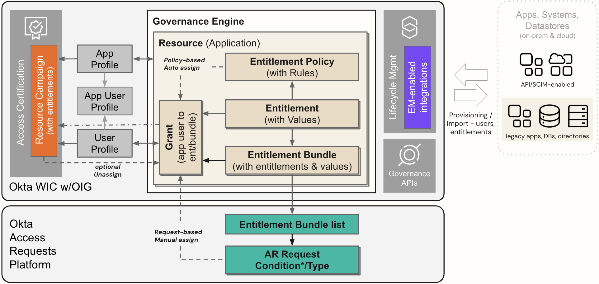

## Entitlement Management in Okta Identity Governance

Entitlement Management is how Okta manages the assignment of users to
application-specific entitlements. These entitlements may be groups or
roles in the application granting access or more specific entitlements
like licenses or permission sets.

Entitlements may be consumed by Okta or synced to the app from Okta for
a growing list of [<u>supported
apps</u>](https://help.okta.com/oie/en-us/content/topics/identity-governance/em/app-connectors-with-entitlements.htm).
This includes both cloud-based and [<u>on-premise
applications</u>](https://help.okta.com/oie/en-us/content/topics/provisioning/opc/opc-connectors.htm).
Okta can also support entitlement management for disconnected apps (i.e.
there is no entitlement-enabled provisioning integration for the app).

### Entitlement Management Data Model Architecture

Entitlement Management in OIG adds additional data objects and
integrations to standard Okta with Lifecycle Management.

The following diagram shows the major components and data objects.

The main component of OIG Cloud Entitlement Management is the new
**Governance Engine**. When an Okta Application has the Governance
Engine enabled, a new Resource is created in the\
Governance Engine to represent that application.

The central object is the **Entitlement**. Entitlements represent
entitlements on connected systems (like a role, profile or license). A
resource can have multiple entitlements and each entitlement can have a
set of values. Entitlements can be single-valued or multi-valued.

Entitlements can be automatically assigned to users via an **Entitlement
Policy**. This attribute-based automatic assignment approach is
analogous to Group Rules for assigning users to Groups based on some
attribute. There will be one policy for a resource, but it may have
multiple rules that are applied based on priority to determine what
entitlements can be granted to a user.

Entitlements can also be collected into **Entitlement Bundles**. Bundles
represent logical groupings of entitlements and one bundle may contain
multiple entitlements and multiple values for each (for multi-valued
entitlements). A bundle might represent a job role where all
entitlements for a specific job in a single application are bundled
together. Or a bundle may be a set of accesses one might request, such
as an employee visiting head office may need general building access
plus a specific privileged access (like the exec suite), and a bundle
could be created to put them in a single access request.

**Grants** represent the association of a user with an entitlement or an
entitlement bundle. With Entitlement Management, the application user
profile is no longer used to store entitlements as was done in Lifecycle
Management (LCM).

Not shown in this diagram are [**<u>Resource
collections</u>**](https://help.okta.com/oie/en-us/content/topics/identity-governance/rc/resource-collection.htm),
currently an early access feature to combine sets of apps and
entitlements. These can be used to emulate user roles across
applications.

With Entitlement Management, entitlement bundles are exposed to Access
Requests making them requestable along with apps and groups. More on
this in the [<u>Access Requests</u>](#exploring-requesting-access)
section later.

All entitlement grants can be reviewed in an Access Certification
Campaign for the Application resource type. If a user has both
entitlement and bundle grants, it can show both and may allow automatic
revocation where that doesn’t conflict with policy.

Entitlement Management supports both a BYOE (Bring Your Own
Entitlements) model and integration with supported applications. For
application integration a new set of connectors has been built to
support key applications. They can consume the entitlements and existing
user-entitlement mapping, and also provision changes to user-entitlement
mapping. These will replace the existing OIN connectors and the list
will grow over time.

The API documentation provides more information about the Entitlement
objects - [<u>Okta Identity Governance
API</u>](https://developer.okta.com/docs/api/iga/).

---

[Introduction to the Labs →](02-introduction-to-the-labs.md)
