## Lab 1.1 - BYO Entitlement Management

In this part of the lab we will explore Entitlement Management within
Okta (we will look at external systems later). The aim of this part of
the lab is to familiarize you with the data objects in Entitlement
Management, and the user interfaces to interact with them.

We will use a “dummy” application - a generic SCIM integration that
isn’t connected to anything. This is the approach you would use for a
Bring Your Own (BYO) model where there is no pre-built integration for
an app, and you either want to manually load/manage entitlements or you
will build the integration yourself connected to the SCIM application in
Okta. We will refer to this as the “Dummy App”.

The first part of the lab will confirm that the Entitlement Management
components are enabled. The dummy application will represent a Building
Access system for badging into office buildings. There will be a default
set of accesses (entitlements) for local employees and requestable
access for visitors and special building access.

### Initial Set Up in Okta

Prior to working with the Entitlements, you will need users in Okta and
they will need some common attribute to use in the example Entitlement
Policy. For this example, I have some users who all have the same city
value of “High Oaks”. You can choose any field to follow this example.

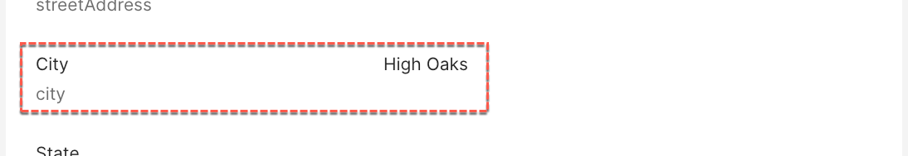

### Set Up Application for Entitlement Management

Entitlement Management must be enabled for each application where
entitlements will be managed. You will see reference to the **Governance
Engine**, which is the entitlement management component.

If the app has not been enabled for entitlement management you will need
to enable it. Looking at the app, there’s no indication whether
entitlement management has been enabled or not. Due to recent feature
enhancements, the Governance tab is added irrespective of whether
entitlement management has been enabled for the app or not.

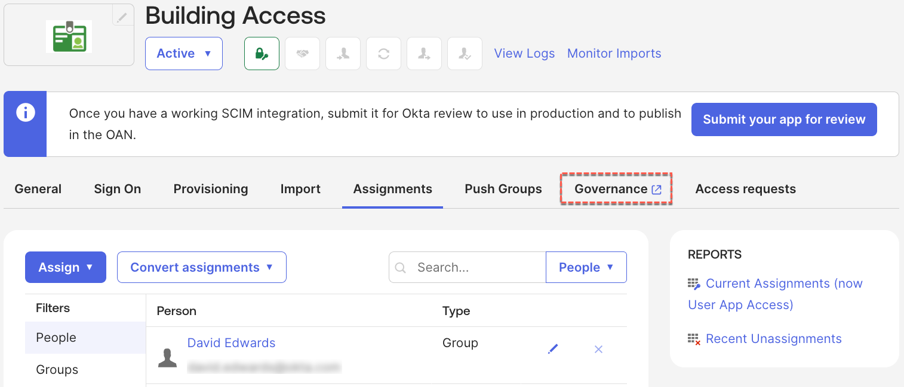

To check (and enable):

1.  Within the app, do to the **<u>General</u>** tab

2.  Scroll down to the **Entitlement management** section and check if
    it is Disabled or not

> 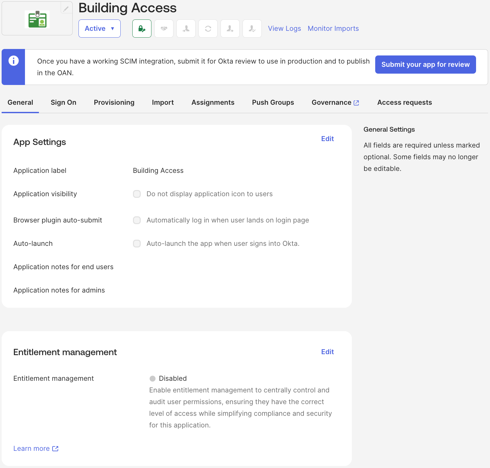
>
> 

3.  If disabled, click **Edit**

4.  Toggle to ***Enabled*** and click the **Save** button

> 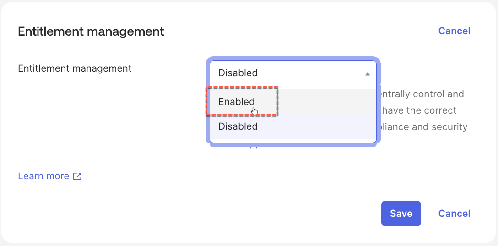
>
> You will see a message indicating Entitlement management is being
> enabled for the app.
>
> 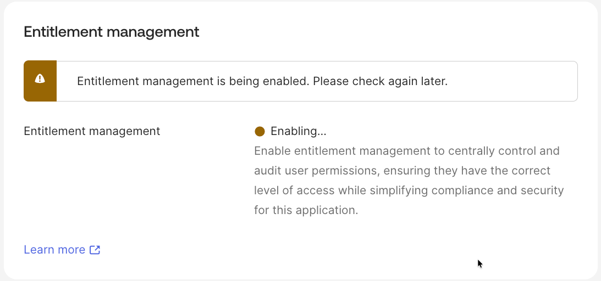
>
> Then it will update to show it is now enabled.
>
> 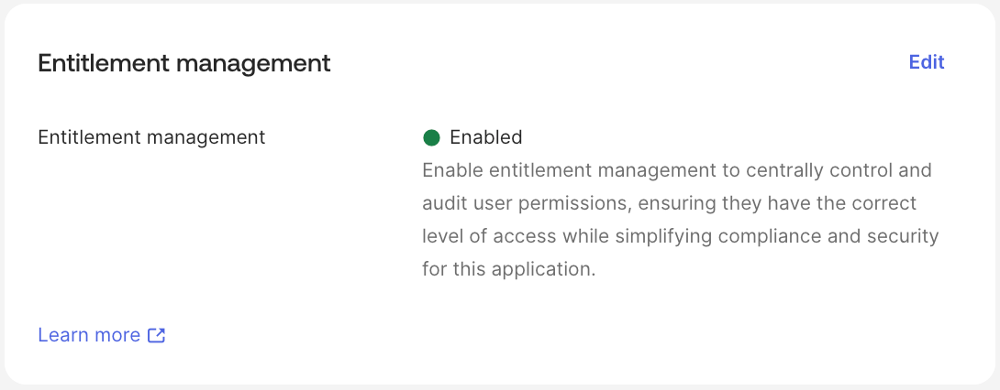

The app is now ready for Entitlement Management.

At this point you have also validated that Entitlement Management is
enabled in your Okta Org.

### Create Entitlements for App

We can now explore Entitlement Management objects in OIG. We will look
at the entitlements first. As the application isn’t connected to a real
external application, we will manually create the entitlements.

#### Open Governance Tab for the App

The Governance Engine aspect of the application is separate from the
normal Okta application administration. When you enabled Identity
Governance above, this created a representation of the application in
the Governance Engine called a Resource. All entitlement objects are
tied back to a resource (application).

To open the Governance Engine for this app:

1.  Click on the **<u>Governance</u>** tab for the app

2.  If prompted for additional authentication, respond to it (you are
    technically entering a different app in Okta but it is transparent)

> 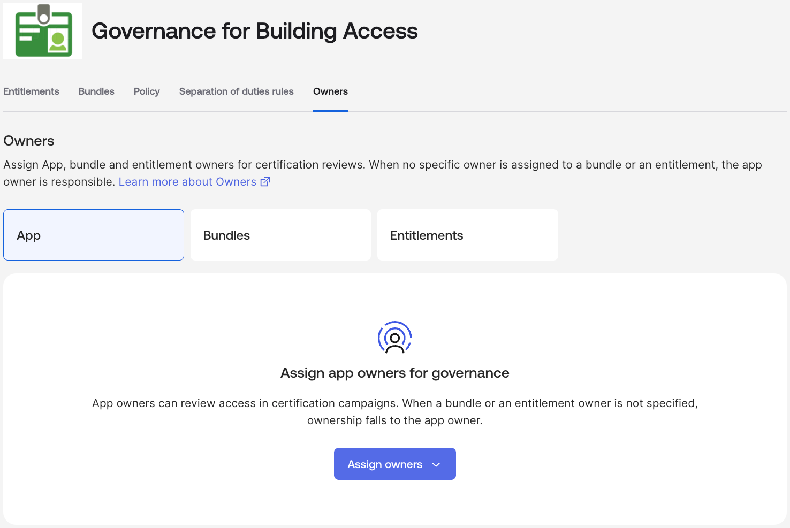

The default Governance tab is the Owners tab to define app, bundle and
entitlement owners (used for other governance functions). We will come
back to this later.

The others are to manage entitlement types and values, entitlement
bundles, entitlement policies and separation of duties (SoD) rules.

We will start by looking at the Entitlements. The example is against the
building access app but it could be any dummy app entitlement values.

#### Create Entitlements

We will start by creating a building access entitlement.

3.  Click on the **<u>Entitlements</u>** tab

> 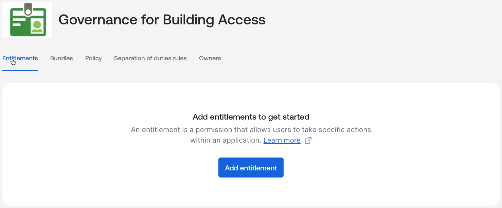

4.  Click the **Add entitlement** button

> An entitlement entry consists of details about the entitlement and a
> set of values.

5.  Enter the following values for a primary building access
    entitlement:

> **Display name** = Building Access
>
> **Variable name** = building_access
>
> **Entitlement Type (Data Type)** = ***String Array***
>
> **Description** = anything
>
> 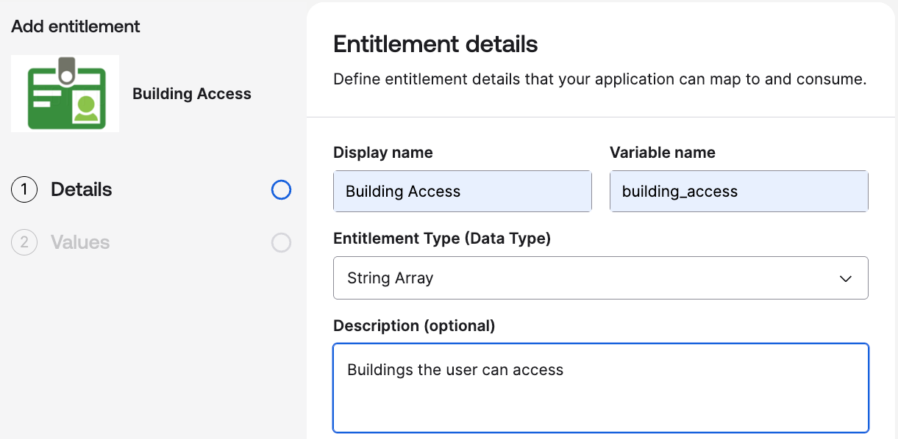

6.  Click the **Next** button

7.  Add entitlement values as per the screenshot below (use the **+ Add
    value** button to add additional values)

> 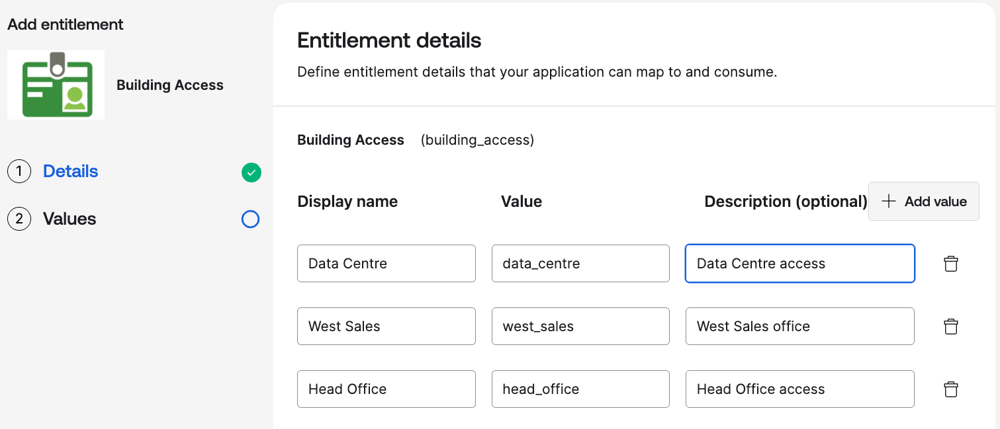

8.  Click the **Save entitlement** button

> The entitlement is added. Notice the green success message that
> briefly appears. The entitlement with all the values are now shown.
>
> 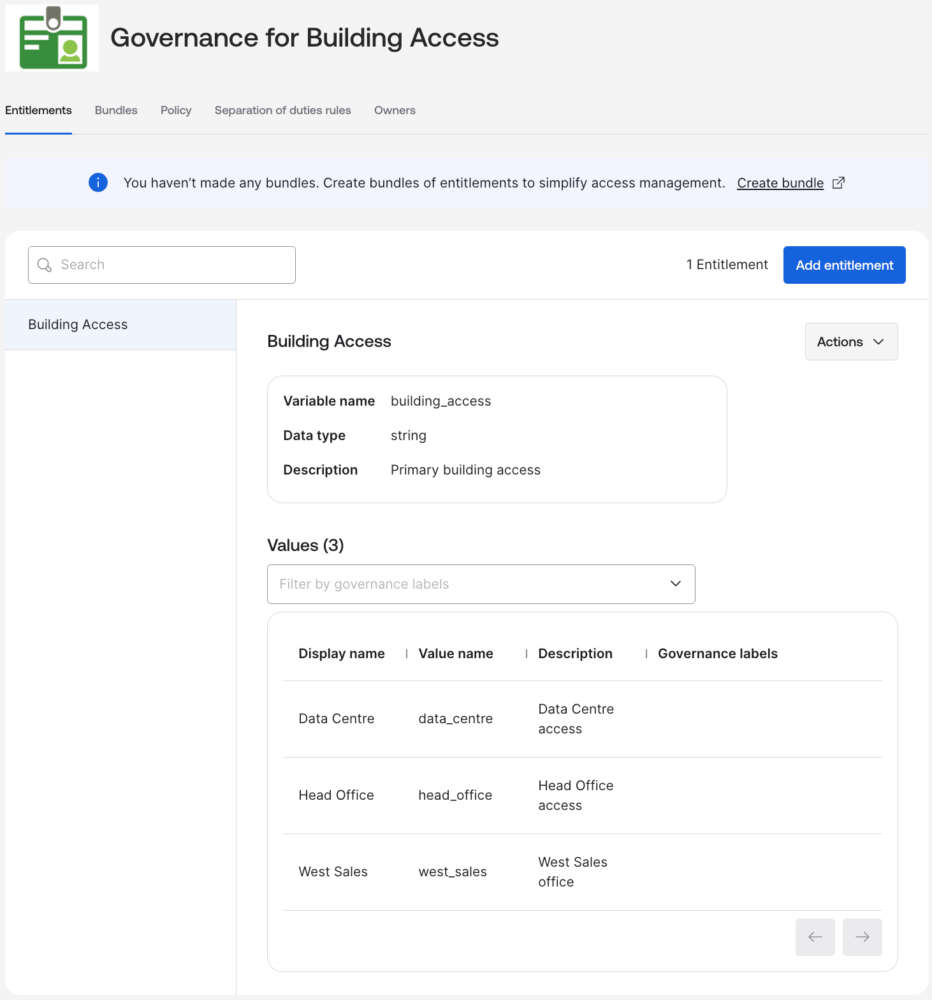
>
> 

9.  Now create a second entitlement using the **Add entitlement** button
    for Privileged Access, **string array** type with the following
    values:

> Executive Offices, exec_offices, CEO office and suite
>
> Computer Hall, computer_hall, Computer hall and ops centre
>
> Doc Archive, doc_archive, Physical document storage

10. Click the **Save entitlement** button to save this new entitlement.

> There are now two entitlements each with a set of values.
>
> 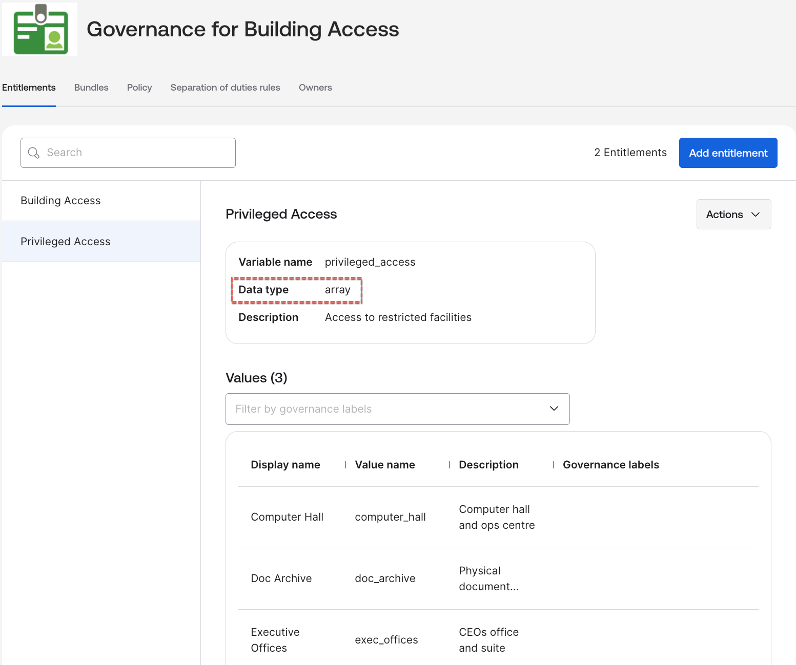

These entitlements can be used in Bundles for exposing via Access
Requests, and in Policy for rule-based assignment.

It is a common requirement to run governance, particularly access
certification, on apps that aren’t connected to Okta. If you plan on
using a dummy app to represent a disconnected app, you may want to look
at [<u>Importing user entitlements from
CSV</u>](https://help.okta.com/oie/en-us/content/topics/identity-governance/em/import-user-entitlements.htm)
in the product documentation.

We will look at the Policy function next.

### \

### Create Entitlement Policy for App

Entitlement Policies are used for automatic assignment of entitlements
based on some logic. Entitlement Bundles (next section) are often used
for manual assignment or via Access Requests.

This is equivalent to using Group Rules to automatically assign the
group membership rather than an admin assigning access to a group or a
user requesting access to an Okta Group in Access Requests. As with
group rules, when a user attribute changes (such as from a HR feed) the
rules will be re-evaluated and entitlement assignments may change.

Policies are a set of one or more rules with a priority sequence of
evaluation.

#### Create Policy Rule

We will create a policy to automatically assign all head office users to
the Head Office employees (those in the city of High Oaks).

To create a policy rule:

1.  Select the **Policy** tab

2.  Click the **Add rule** button

> 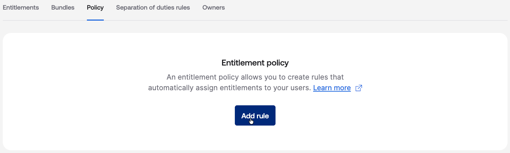

3.  Give the policy a **Rule name** (e.g. “Head Office employees”)

4.  If the **IF User scope** section, specify the selection scope. In
    this example it is ***City*** ***Equals*** High Oaks.

> 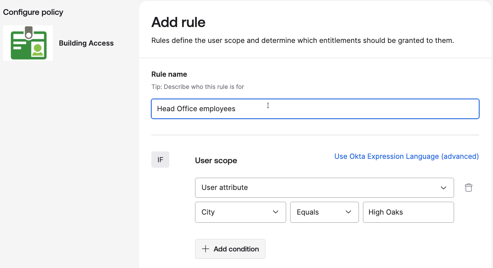
>
> Note that you can also [<u>use Okta Expression
> Language</u>](https://help.okta.com/oie/en-us/content/topics/identity-governance/em/policy-rule-el-examples.htm)
> for more complex criteria. You can also have multiple conditions that
> apply additively (condition1 AND condition2).

5.  Go to the **THEN Assign** section and specify the entitlement and
    value to assign. In this example we are assigning the users to the
    Building Access entitlement, Head Office value.

> 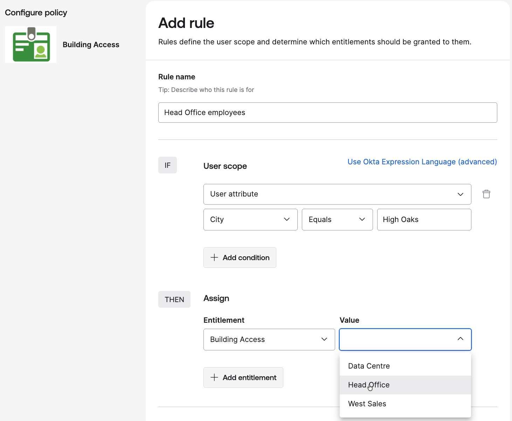

6.  You can use the Preview User function to confirm the rule is working
    against a user you know has the value you want.

> 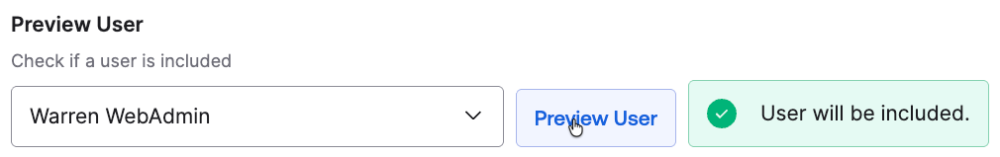

7.  Click **Save rule**

> The Policy tab will now show the new rule.
>
> 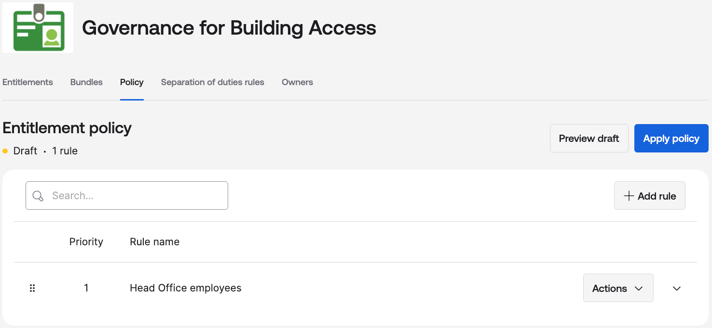
>
> Notice the Preview draft button. This will generate a list of the
> entitlements that will be assigned based on the rules configured. It
> will send an email to the user running the function with a CSV file
> containing the results of the evaluation. This is very useful to
> confirm the rules are configured correctly before applying (enabling)
> the policy.

8.  Click the **Apply policy** button

9.  On the Apply policy confirmation screen, click the **Apply policy**
    button.

10. Check that the policy shows as Active now

> 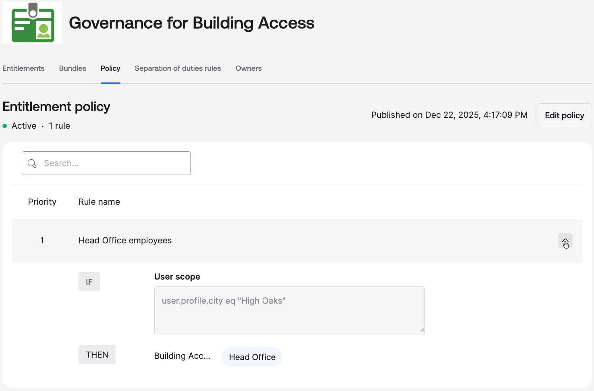

To confirm the policy is working as expected we can check the
assignments:

11. Click the **<u>Back to application</u>** link at the top of the page

> 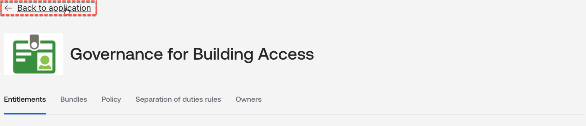

12. Go to the **Assignments** tab

13. Locate a user who should have been subject to the policy and locate
    the menu icon on the right (three vertical dots).

> 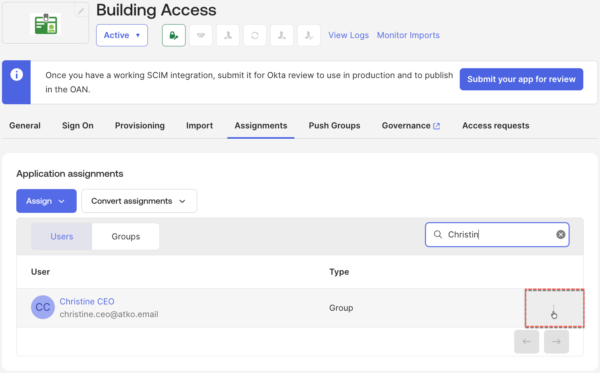

14. Click it and select ***View access details***

> 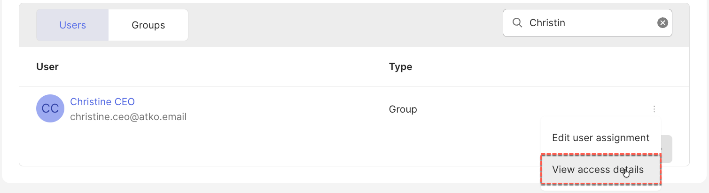

15. A slide out window will appear and you should see the default
    entitlement assigned by policy.

> 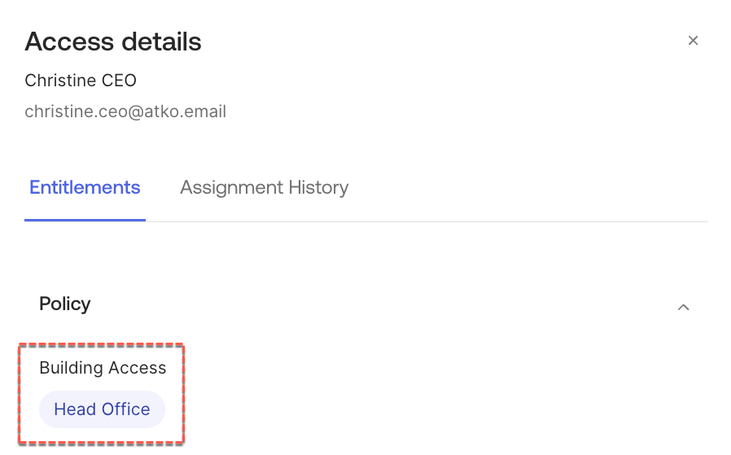

This confirms that the entitlement policy has worked.

The entitlement policy may not run immediately after you enable the
policy. It may take some time to update the user entitlements. If you
don’t see the entitlements appear for a user after some time, you can
try disabling and reenabling the policy, or removing the user (or their
group) from the app and re-adding them. This should force the policy
engine to re-evaluate.

### Create Entitlement Bundle for the App

Entitlement bundles are collections of entitlements for a specific use.
For example you could create bundles to represent roles or job
functions. Bundles can be exposed via Access Requests. Bundles can mix
entitlements within an application, but not from multiple applications.

We will walk through creating a bundle for site contractors to give them
access to the Data Centre and privileged facilities in the site. We will
use it later in this Guide.

To create a bundle:

1.  From within the Application **<u>Governance</u>** tab, select the
    **<u>Bundles</u>** tab.

> 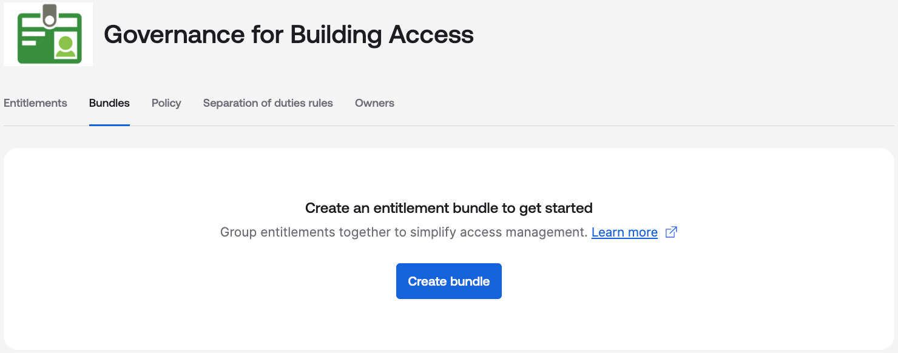

2.  Click the **Create bundle** button

3.  Give the new bundle a name and optionally a description

4.  Select entitlements and values. In this example we are selecting the
    ***Data Centre*** value for the ***Building Access*** entitlement
    and the Computer Hall value for Privileged Access.

> 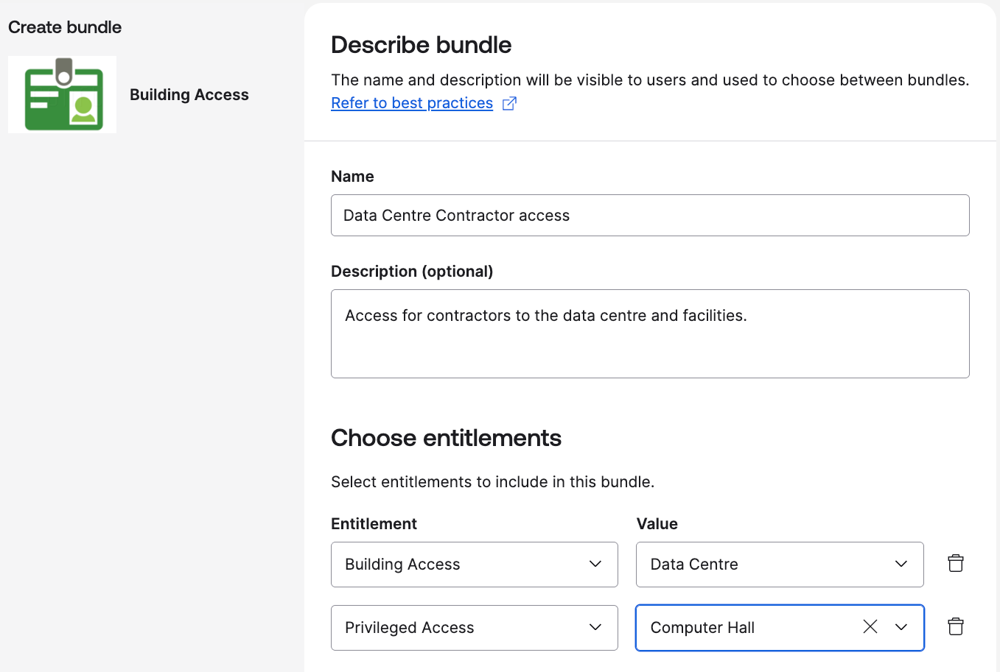

5.  Click the **Create** button to save the new entitlement bundle.

> The bundle is now created.
>
> 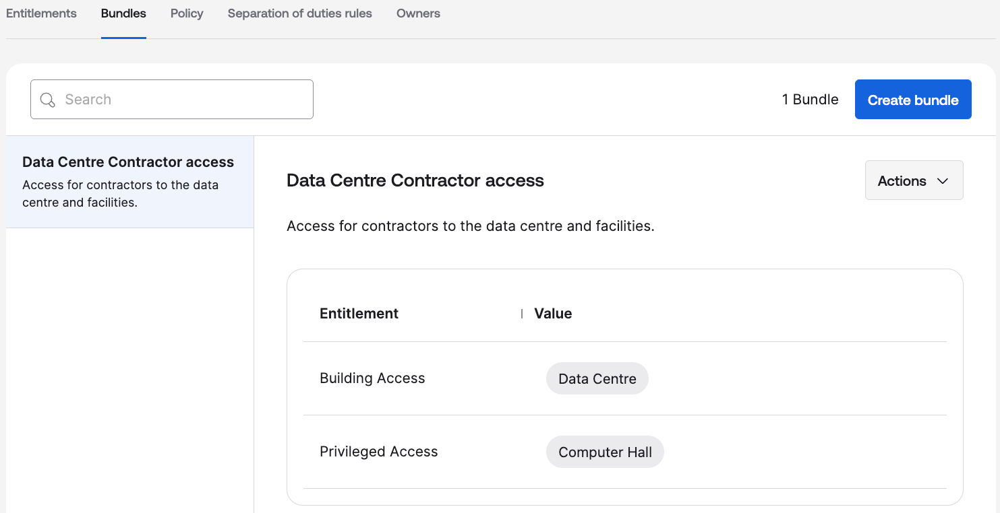

6.  Repeat the steps above to create a second bundle to give building
    access to “Head Office” and privileged access to “Doc Archive”.

You could add more bundles for requestable access. We will use these
ones later in the [<u>Access Requests</u>](#exploring-requesting-access)
section of this Guide.

### Separation of Duties

A newer feature of OIG is Separation of Duties (or Segregation of
Duties, or just SoD). This is a common governance control with Identity
Governance and Administration (IGA) solutions. It manages potential
toxic combinations of access. For example, someone who can raise
purchase orders should not be the same one that approves and pays for
purchase orders. SoD rules are normally applied between application
functions (like transactions or roles) rather than between applications.
This makes it appropriate to apply to application entitlements.

We will create a simple SoD rule to highlight where someone has data
centre and archives access.

To do this:

1.  From within the Application **<u>Governance</u>** tab, select the
    **<u>Separation of duties rule</u>** tab.

2.  Click the **Create rule** button.

3.  In the new rule, define a **Rule Name**, **Description** and
    **Note.**

> 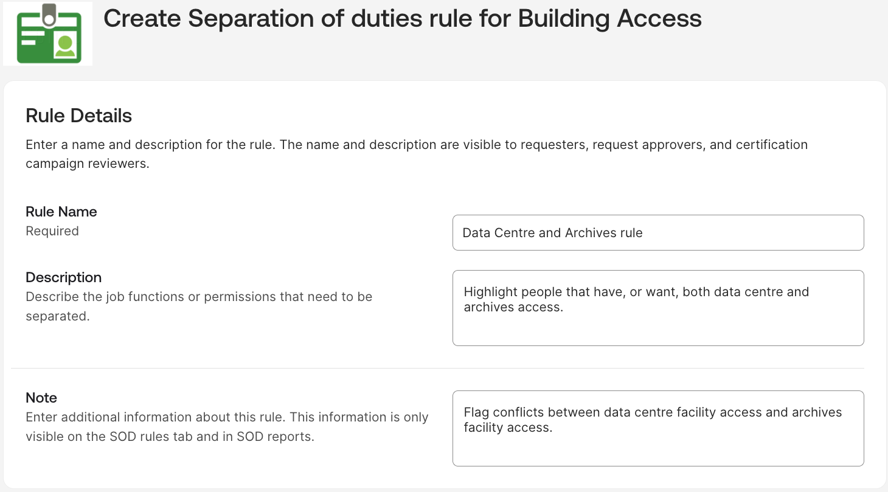

4.  Scroll down to the **Define Conflicts** section. Select two
    entitlements that could be in conflict. In this example we have
    specified two ***Privileged Access*** values - the ***Computer
    Hall*** and the ***Doc Archive***.

> Note that the conditions support “Any one of” or “All of” within a
> list and you can also have multiple entitlements in a list. But you
> cannot have multiple values for the same entitlement in a list if the
> entitlement is not a string array.
>
> You can also rename the List 1 / List 2 labels so they are more
> meaningful.
>
> 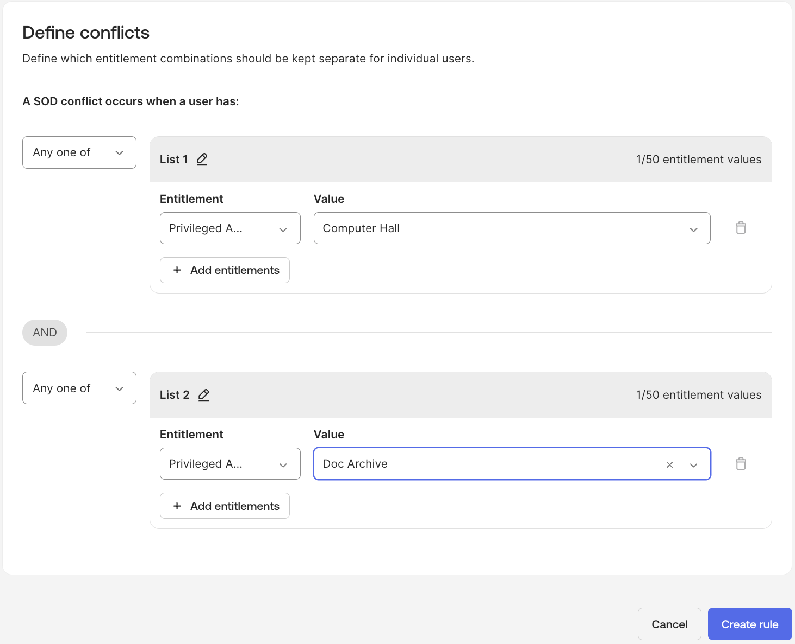

5.  Click the **Create rule** button.

> 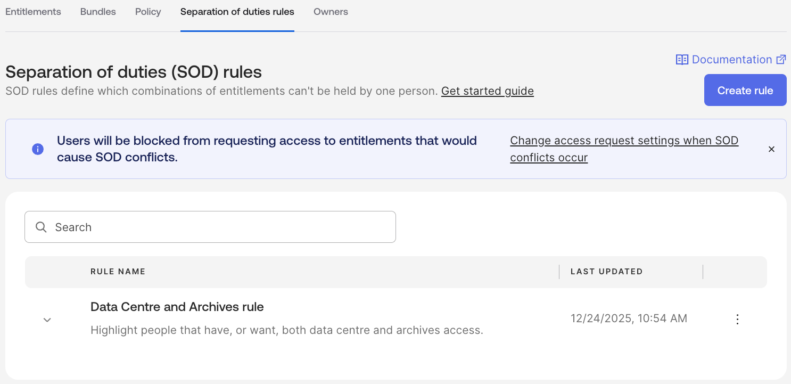

6.  You should see your new rule created. There is no concept of
    draft/live - once a rule is created it is live (published).

You should see the note “Users will be blocked for requesting access to
entitlements that would cause SOD conflicts”. This is an app access
request setting that can be applied. By default, any requests that
trigger a SoD conflict are blocked. They can also be allowed or allowed
with special processing. We will explore this later.

### Owners

Owners is a new capability within OIG. It allows owners to be applied to
an application or specific bundles and/or entitlements. These values can
then be used in access requests and access certifications. We will not
set app owners or entitlement/bundle owners but will highlight them in
the relevant access requests and access certifications section later.

### Access Requests and Access Certification

In this section we have defined application entitlements and their
values. We have defined bundles of entitlements and also separation of
duties rules. Each of these will be used in [<u>Access
Requests</u>](#exploring-requesting-access) and [<u>Access
Certifications</u>](#exploring-access-certifications) later in this
Guide.

---

[← Introduction to the Labs](02-introduction-to-the-labs.md) | [Lab 1.2 - Entitlement Management for Salesforce.com →](04-lab-12---entitlement-management-for-salesforcecom.md)
