## Lab 1.2 - Entitlement Management for Salesforce.com

In this section we will explore entitlement management for a
provisioning-enabled app, in this case we’re using Salesforce.com but it
could be any of the [<u>apps with entitlement
support</u>](https://help.okta.com/oie/en-us/content/topics/identity-governance/em/app-connectors-with-entitlements.htm).

If you are using a Developer Edition trial of Salesforce.com there are
licensing restrictions that may impact entitlements. For example, you
can only have two Salesforce users (one will be the default admin
account) and two Force.com - Free users, but 5,000 Chatter Free users.
But you cannot assign Roles to Chatter Free users. So you will be
constrained in entitlement assignment in Okta and you may see
provisioning errors on the target systems. The steps below will try to
keep in the SFDC licensing guard rails, be careful to avoid issues.

### Planning for Enabling Entitlement Management on a Provisioning-enabled app

If you have existing apps in your Okta that you plan on enabling
entitlement management on, and you have already run an import on the
users in that app, you will probably already have some entitlement
mapping from the import. Most of the apps will import entitlements and
assign them to attributes on the app user profile.

For example Salesforce has a range of entitlements - Feature Licenses,
Permission Sets, Profile, Public Groups, Role. The app integration will
store these for existing users in various attributes.

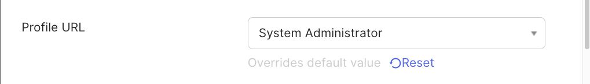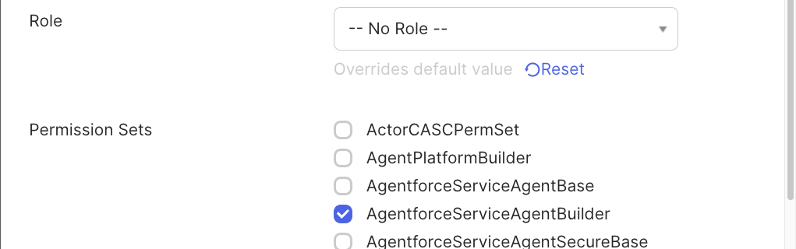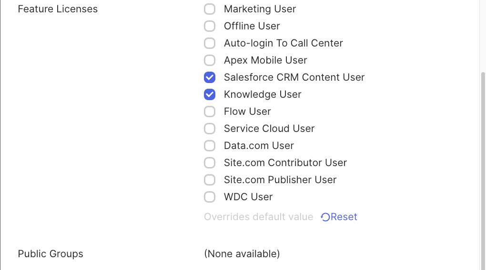

When you enable entitlement management you can break the relationship
between the users and their entitlements. For this reason Okta
recommends starting with a fresh instance of an app integration for
entitlement management.

For more information see:

- [<u>Considerations and
  limits</u>](https://help.okta.com/oie/en-us/content/topics/identity-governance/em/limitations.htm)

- [<u>Configure a provisioning-enabled
  app</u>](https://help.okta.com/oie/en-us/content/topics/identity-governance/em/config-provisioning-enabled-app.htm)

At the time of writing, Okta was looking at migration scripts to move
users and their entitlements across.

For this lab guide we will disable provisioning in the Salesforce app
then follow the steps to enable entitlement management (including
provisioning).

### Test Data to Use with Entitlements

#### Identify Test Users in Okta

The example used below is based on a Developer Edition trial and
demonstration data (e.g. users and groups) and may be different in your
environment.

Given our limitation on licensing for users, it makes sense to identify
which ordinary users you will have and which will have special
entitlements. For this lab we are creating one Entitlement Policy that
will assign a CEO Role and Force.com license, one Entitlement Bundle
that will assign another CFO Role and Force.com license, and all other
users (ordinary users) will be assigned the Chatter Free license via an
Entitlement Policy. This is only due to the restrictions of the
developer edition Salesforce.com.

The example users are:

- CEO Entitlement Policy - **Christine CEO**

- CFO Entitlement Bundle (via Access Requests) - **Claire CFO**

- Other Salesforce.com users (other Policy) and additional Entitlement
  Bundle - **all Div-Sales users**

These will appear in the screenshots below. They have been assigned to
the app, either individually or via the group.

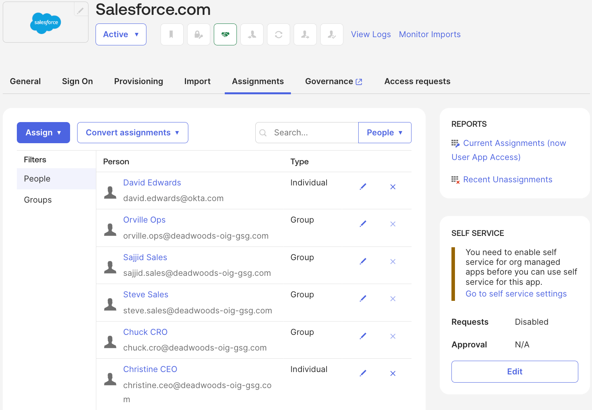

You can use any of the users in your test system.

#### Entitlement Data in Salesforce.com 

Prior to enabling provisioning, you will need to check the entitlement
data in your Salesforce.com instance. The Salesforce.com instance will
have values there for Permission Sets and Profiles.

- You can create some **Roles** of your choosing based on one of the
  sample role hierarchies. For example the Territory-based Sample.

- You can also create some **Public Groups** of your choosing. I created
  “East Region”, “Central Region”, “West Region”, and “Federal”.

These will be imported as entitlement values into Okta.

### Set Up Application for Entitlement Management

#### Confirm App Not Enabled

Prior to setting up entitlement management for the Salesforce app, we
will check that it is not enabled.

1.  Go into the application and go to the **<u>Provisioning</u>** tab.
    Confirm it is not enabled.

> 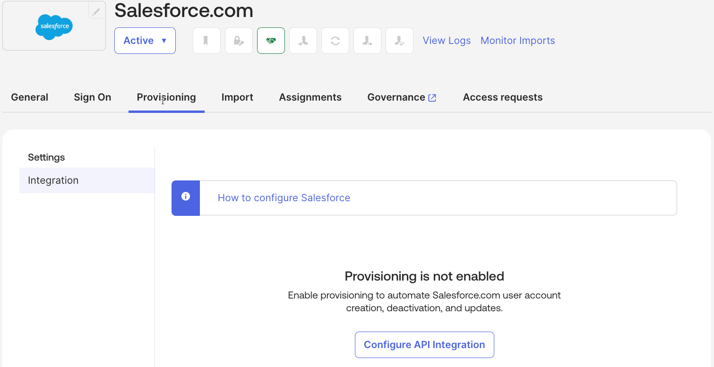

2.  Go to the **<u>General</u>** tab and confirm that **Entitlement
    management** is disabled.

> 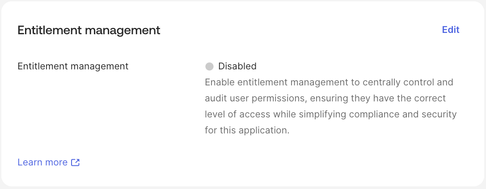

#### Enable Entitlement Management for the App

If both are disabled we are ready to enable entitlement management.

3.  In the **<u>General</u>** tab select **Edit**.

4.  Enable Entitlement management.

5.  Click the Save button

As we saw with the dummy app earlier, you first get a message saying
entitlement management is being enabled, then it shows as Enabled with a
green dot.

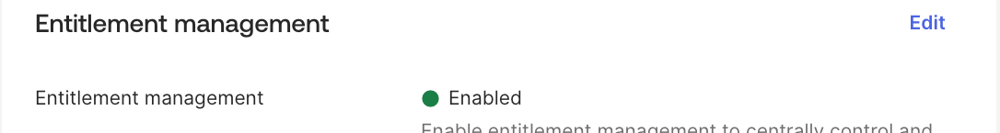

To confirm:

6.  Click on the **<u>Governance</u>** tab

7.  Confirm that you see all the tabs: Entitlements, Bundles, Policy,
    Separation of duties rules and Owners.

The last thing to do is to enable provisioning.

#### Enable Provisioning

The last step is to enable Provisioning for the Salesforce.com app. This
changed with the newer OIN integrations to support OAuth and REST. See
the instructions in
[<u>https://help.okta.com/oie/en-us/content/topics/provisioning/salesforce/sfdc-configure-provisioning-rest.htm</u>](https://help.okta.com/oie/en-us/content/topics/provisioning/salesforce/sfdc-configure-provisioning-rest.htm).

8.  Enable provisioning as per the docs and confirm it’s been enabled.

> 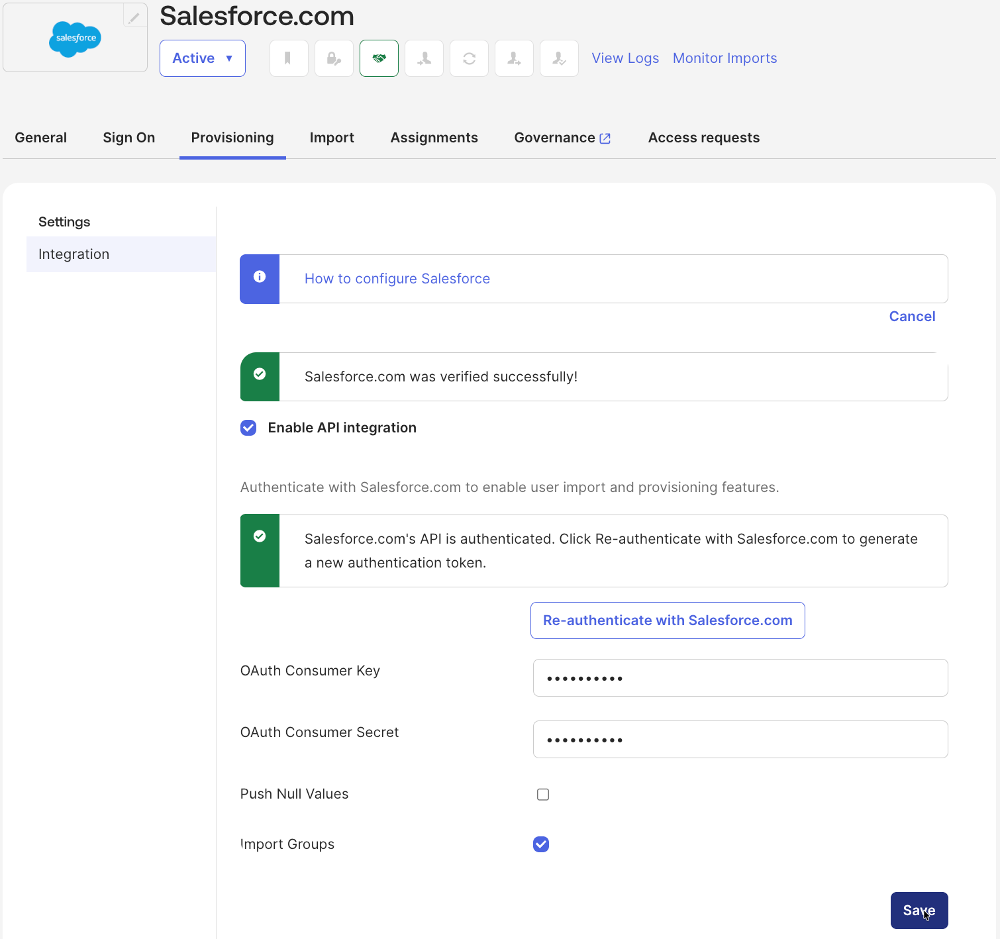

9.  Turn on **Create Users** and **Update User Attributes** in the **To
    App** section.

10. When saved, you should see a message indicating that the Governance
    Engine has been enabled.

> 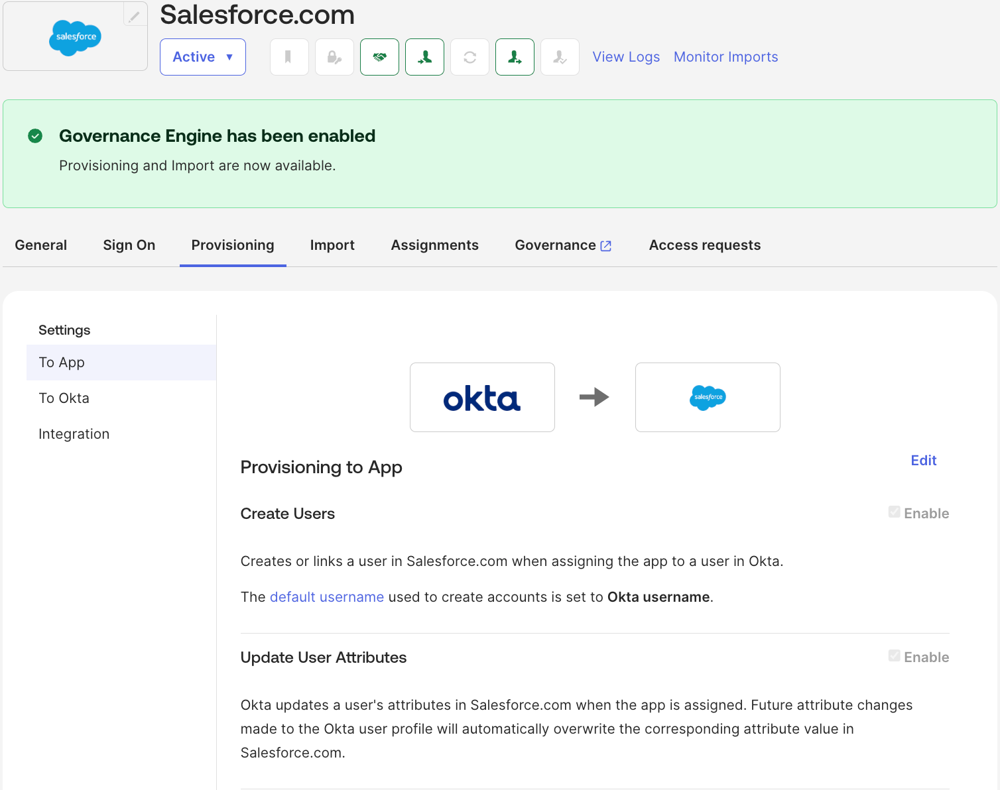

You can now go confirm the entitlements have been imported.

### View Entitlements for Salesforce.com

You do not need to force an import, once provisioning is enabled it will
pull in the entitlements.

To see them:

1.  Go to the **<u>Governance</u>** tab for the application.

2.  Select the **<u>Entitlements</u>** tab.

> 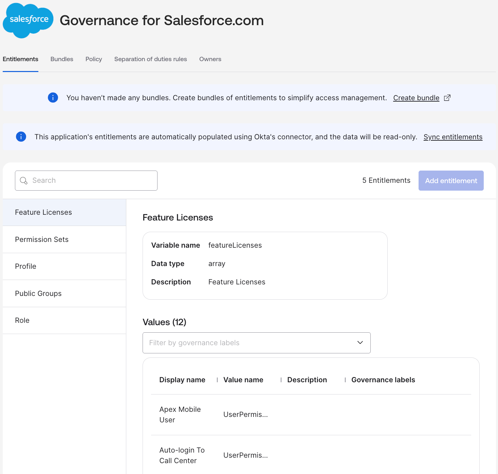
>
> Note the messages displayed. The first is encouraging the creation of
> bundles as we did earlier. The second is saying that the entitlements
> are owned by the app (Salesforce) and cannot be edited in Okta (i.e.
> they are read-only in Okta). We can still create policies and bundles,
> but new entitlement values must be created in Salesforce and sync’d to
> Okta.

3.  Confirm that you see ***Feature Licenses***, ***Permission Sets***,
    ***Profile***, ***Public Groups*** and ***Role***. These are all the
    entitlement types for Salesforce.

4.  Click on the ***Public Groups*** entitlement and confirm the groups
    you added in Salesforce are there.

> 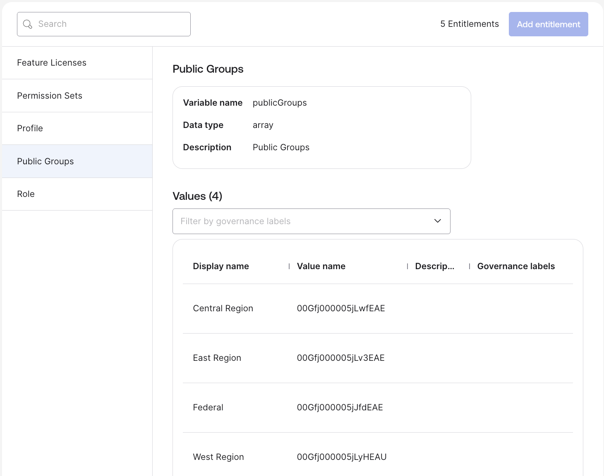

5.  Click on ***Role*** and confirm the roles you had in Salesforce are
    there.

> 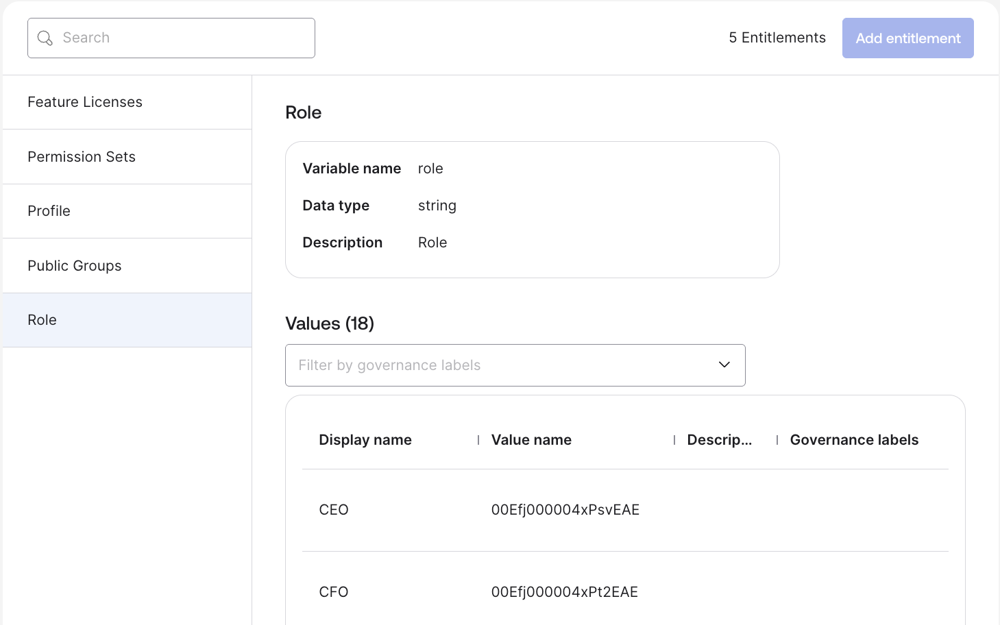

We’re now ready to create policies and bundles as we did earlier.

As an aside, you can see the events in the Okta System Log that followed
enabling provisioning. This includes the import events and a series of
resource.entitlement.create or resource.entitlement.update events. For
example:

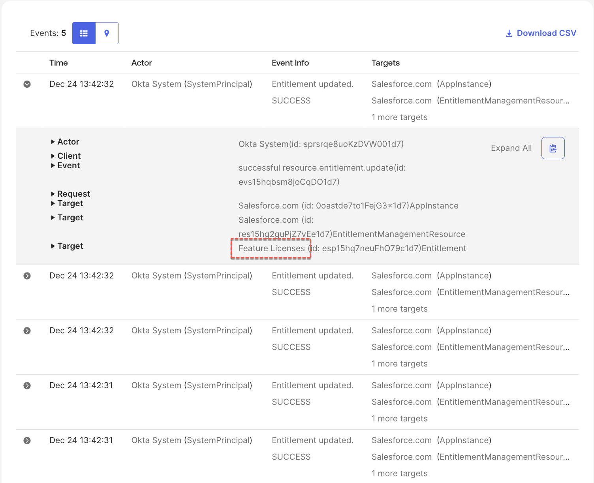

### Create Entitlement Policy for Salesforce.com 

In this section we will create two entitlement policies, one for
ordinary users that will get the Chatter Free user license (profile) and
one, for users (user) with the title of CEO to automatically get the CEO
role in Salesforce.com.

You will need a user with the title of “CEO” and also one of the role
entitlements in Salesforce.com should be CEO. If you don’t have that
role, pick another and set the user title to match.

The steps below are brief as they are the same as done earlier with the
dummy app.

First we will create the ordinary users policy rule.

1.  Create a new **Entitlement Policy Rule** in the Salesforce.com app
    for all users. Give it a name like “All Users”.

> 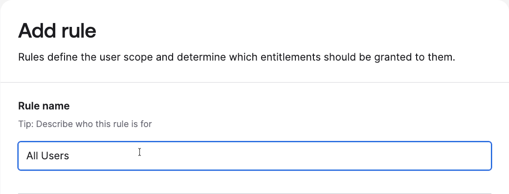

2.  Set the **IF User scope** clause to use Okta Expression Language and
    set it to user.profile.countryCode != 'AU'. You need a rule to catch
    all users, and in my environment no-one has a country code set. If
    this contradicts with data you have in your Universal Directory user
    profiles, you may need to use another.

> 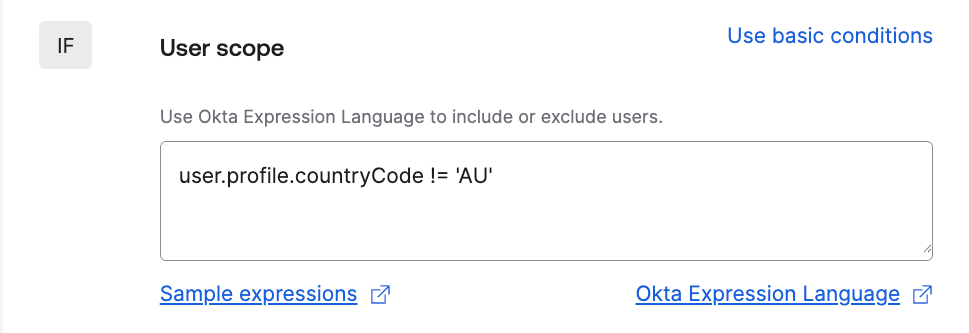

3.  Set the **THEN Assign** clause to the ***Profile*** entitlement and
    the ***Chatter Free User*** value.

> 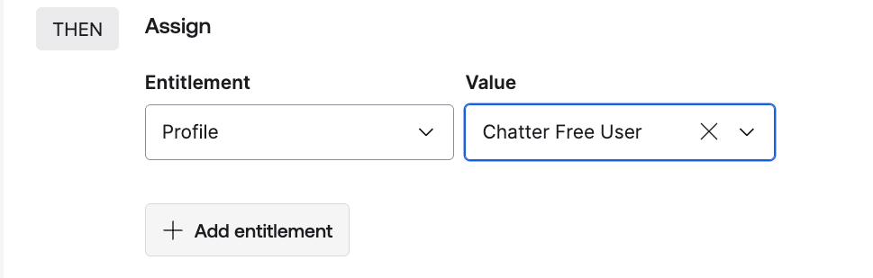

4.  You may want to use the Preview USer function to confirm your rule
    is correct.

5.  Click the **Save** button.

We now have a rule that applies to all users. We will now add another
rule just for the CEO (that will override the rule above).

6.  Create a new **Entitlement Policy Rule** in the Salesforce.com app
    for the CEO.

7.  In the **IF User Scope** clause select **Title** **Equals** CEO

> 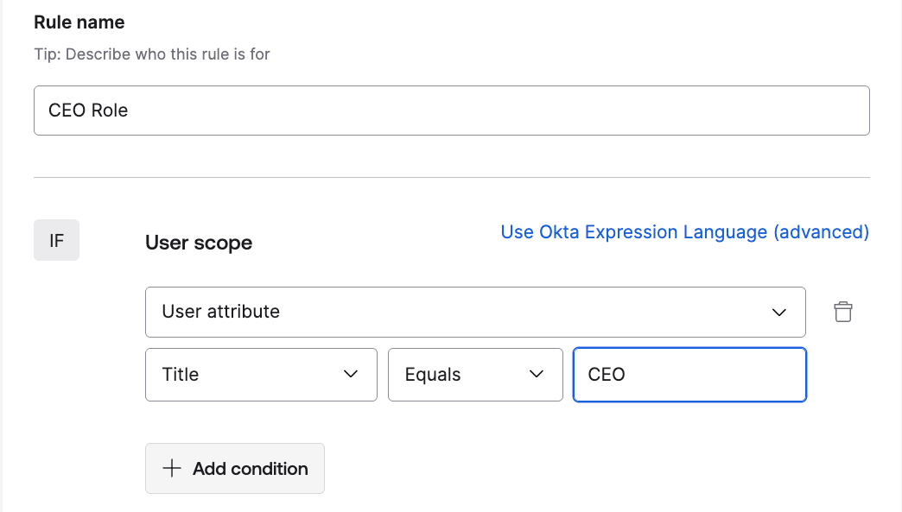

8.  In the **THEN Assign** clause set the following two entitlements:
    **Role = *CEO*** and **Profile = *Force.com - Free User***.

> 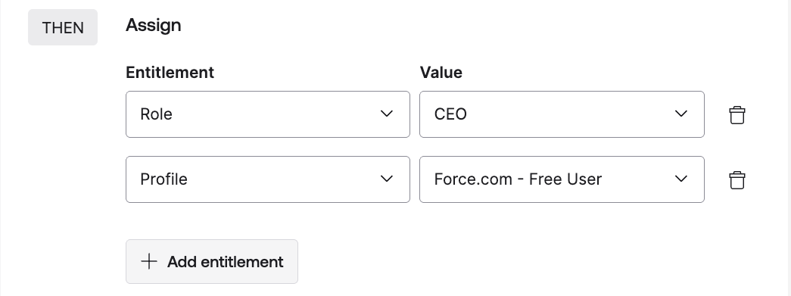

9.  Use the **Preview User** function to confirm the rule picks up your
    CEO.

> 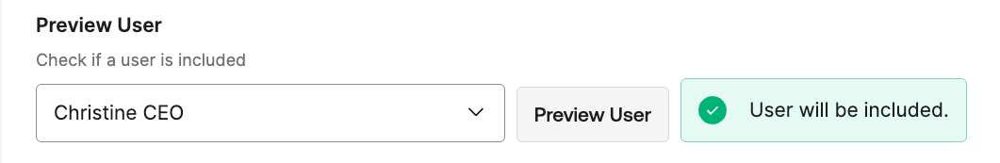

10. Click the **Save rule** button.

> You should now have two rules, with the CEO rule on top (priority 1),
> with the policy in Draft.
>
> 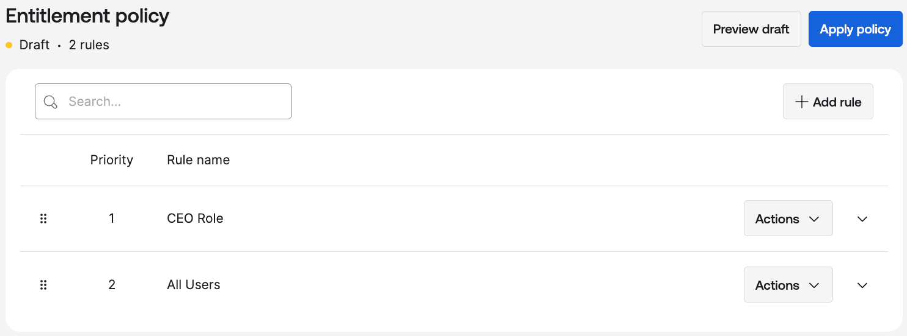
>
> The Priority setting is important. The more specific rules (like the
> CEO one) should come before the more generic rules (like the All Users
> one). You can use the handles beside each rule to drag them to the
> order you want. Note that this only applies to String entitlements. If
> the entitlement is a String Array entitlement, OIG will consolidate
> all values.
>
> You can use the **Preview draft** button to send a CSV to the users
> email to preview the changes.

11. Click the **Apply policy** button to make the policy Active.

> 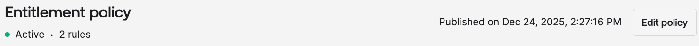

12. Go out of **<u>Governance</u>** and back to the
    **<u>Assignments</u>** tab for the application to see the users
    assigned.

> 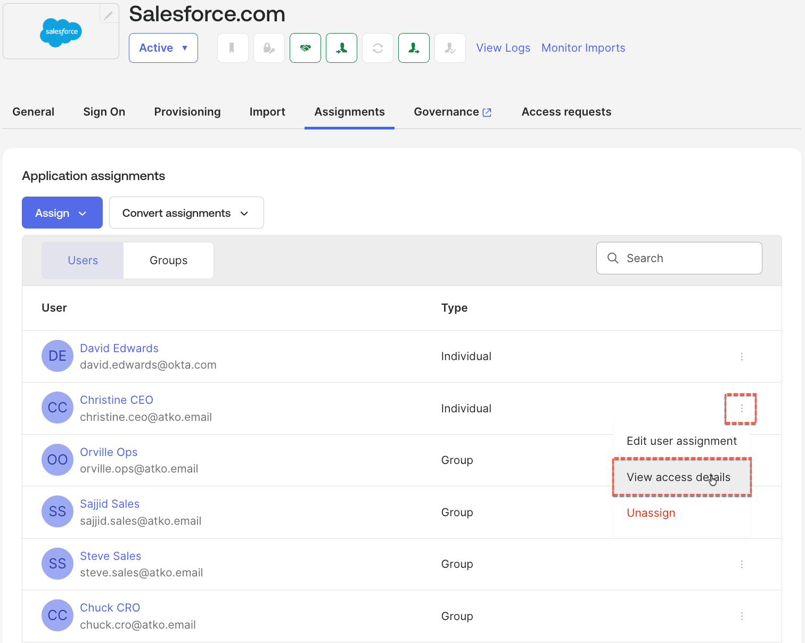

13. Select a non-CEO user, click the menu icon (three vertical dots) and
    select the **View access details** item. You should see them
    assigned to the Chatter Free User entitlement.

> 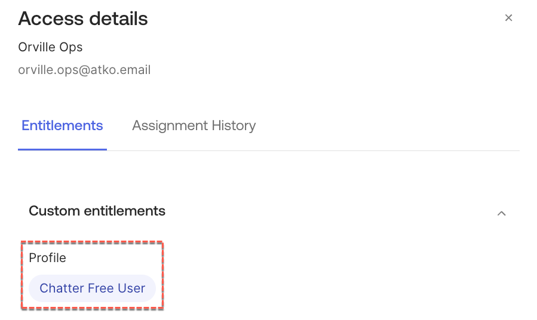

14. Now check the entitlements for your CEO user. It should show both
    the Profile and the Role you specified.

> 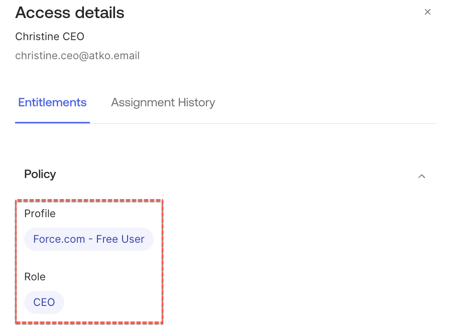

15. You can check your users in Salesforce.

> 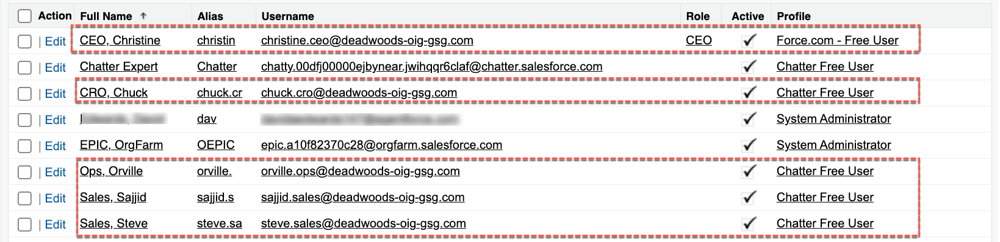

As discussed earlier, the policy evaluation is a background process so
you may not see the entitlements added straight away. If you don’t see
the entitlements assigned after some time, you may need to force a
re-evaluation by removing and re-adding the user, or by using the **Edit
Access \> Revert to Policy** option (this will also set “Policy” instead
of “Custom entitlements”).

### Create an Entitlement Bundle

In this part of the lab we will create an entitlement bundle to be used
in Access Requests.

#### Create Entitlement Bundle for the Channel Sales Role

We will create a single bundle to expose a role and profile combination.

1.  As you did with the dummy app, create an **Entitlement Bundle** to
    request the ***Channel Sales Team*** role and ***Force.com - Free
    User*** profile.

> 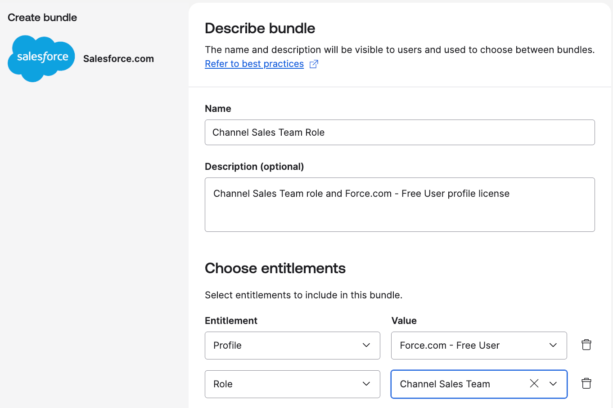

2.  Click the **Create** button to create the bundle.

> 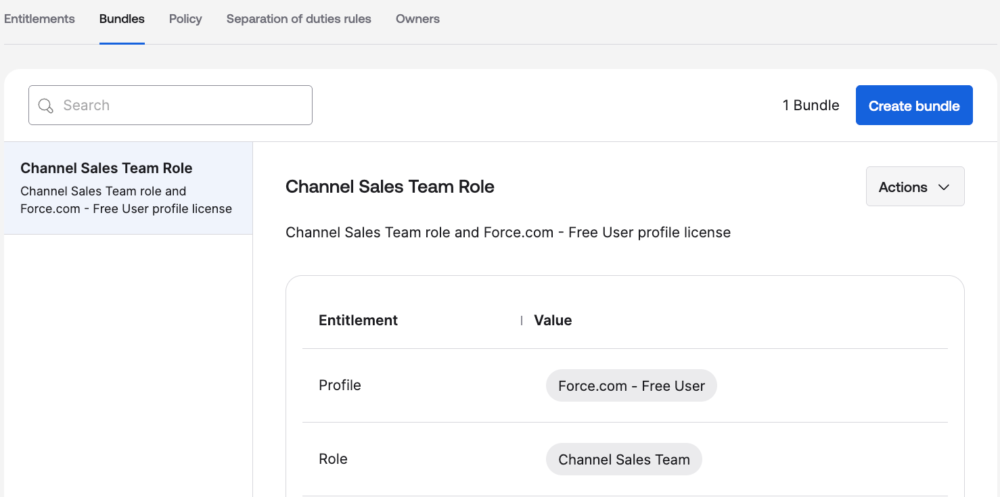

We will use this in the Access Requests section later.

### Access Requests and Access Certification

Unlike with the dummy app, the Salesforce integration will import all of
the entitlements and values (and the other entitlement management
provisioning-enabled apps are the same). We have added a policy for
default assignment of some entitlements and values. We have also created
an entitlement bundle we can use. Each of these will be used in
[<u>Access Requests</u>](#exploring-requesting-access) and [<u>Access
Certifications</u>](#exploring-access-certifications) later in this
Guide.

---

[← Lab 1.1 - BYO Entitlement Management](03-lab-11---byo-entitlement-management.md)
