## Lab 2.1 - Request Conditions with Applications and Groups

The purpose of this lab is to walk through the basics of Access Requests
with Conditions. It uses a simple requirement of requesting access to a
group assigned to an application with manager approval.

For this lab you could do one of the following:

- Requesting assignment to an app directly (i.e. individual assignment
  to the app)

- Requesting assignment to a group that is assigned to an app (i.e.
  group assignment to the app), or

- Requesting assignment to a group that is defined as a push group to an
  app (and membership changes are pushed to the target application
  through provisioning integration.

It doesn’t matter what you choose as the Access Request configuration
and use is basically the same. For this example we will use a dummy
(bookmark) app that has three groups assigned.

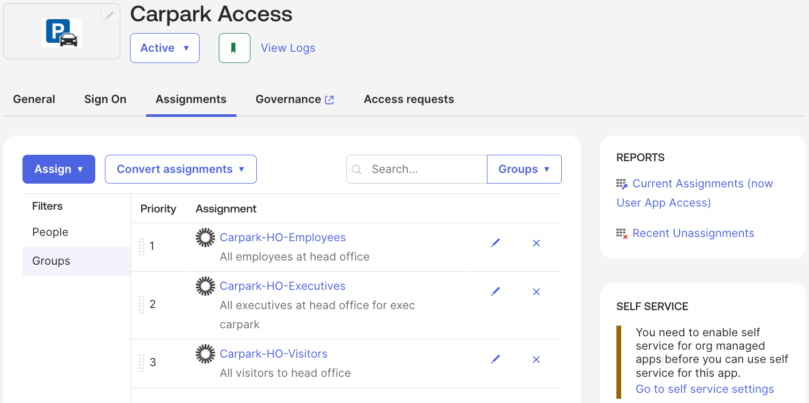

Some users (those that have a city of “High Oaks”) are already assigned
to the Carpark-HO-Employees group (and thus assigned to the app). The
other two groups, Carpark-HO-Executives and Carpark-HO-Visitors,
represent requestable access (visitors to the site using visitor spots
and people that are allowed to part in the exec spots).

The lab will walk through configuring the conditions for the two groups
and a user requesting access.

### Create Conditions and Sequences for Groups Assigned to an App

In this part of the lab we will walk through the administrative side of
creating and enabling two conditions (with sequences) for our app.

#### Create a Condition for a Group Assigned to the App

The first thing we need to do is to create a Condition for requesting
access to the app. To do this:

1.  Go into the Okta Admin Console as an administrator who can modify
    applications and find and select the app you want to create a
    condition for.

> 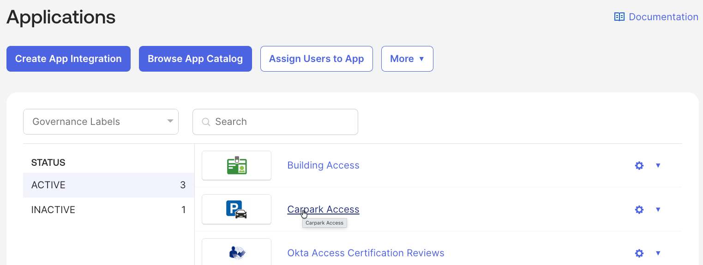

2.  In the app, click on the **<u>Access requests</u>** tab.

> 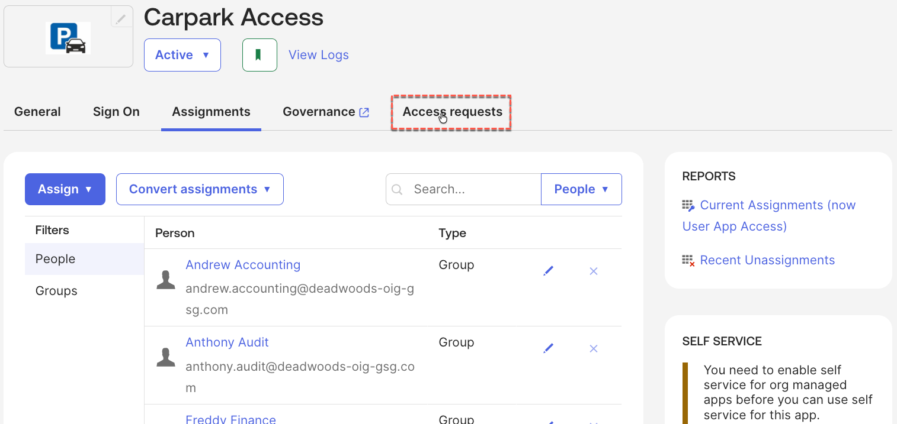
>
> Note that there is a SELF SERVICE section on the app page. This is the
> older access requests mechanism that was built for Okta Lifecycle
> Management many years ago. It should not be used, and will be removed
> from the UI at some point.
>
> The Access requests page will show all conditions defined for the app.
> As there are none, we need to create one.

3.  Click the **+ Create condition** button.

> 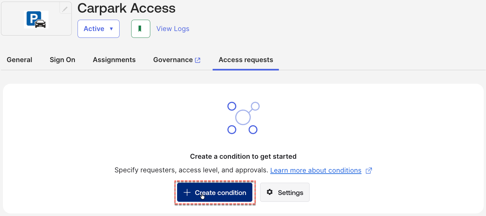

4.  On the Access request condition page, give the condition a **name**.

> For the **Requester scope**, you have the option to make this request
> visible to all users in the organization or specific groups.

5.  Select **Everyone in the organization**.

> The **Access level** section allows you to specify whether you’re just
> exposing access to the app (i.e. for individual assignment to the app)
> or specific groups (assignment groups or push groups).

6.  We want this condition to apply to a specific group, so select
    **Groups associated with the app**.

> 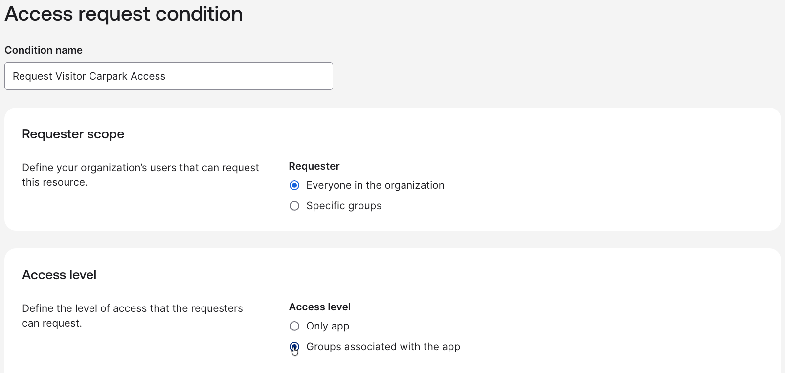
>
> This will expose a **Groups scope** option. It will allow you to
> search for and select from any assignment groups or push groups
> associated with the app.

7.  Search for and select the **App group** you want to assign (in this
    case the visitors group).

> 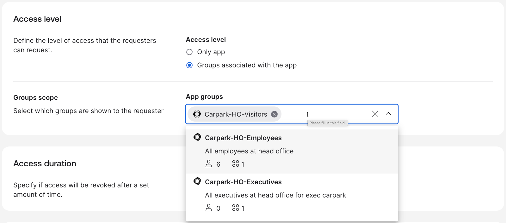
>
> The next section is the **Access duration**. Access requests can be
> set to automatically remove access after a period of time. You can
> define this in the condition, or allow a user to specify a duration.
> In this case we will set a period.

8.  Enable the **Access duration** option, leave it as **Specify
    expiration now**, and set the value to **30 Days**.

> 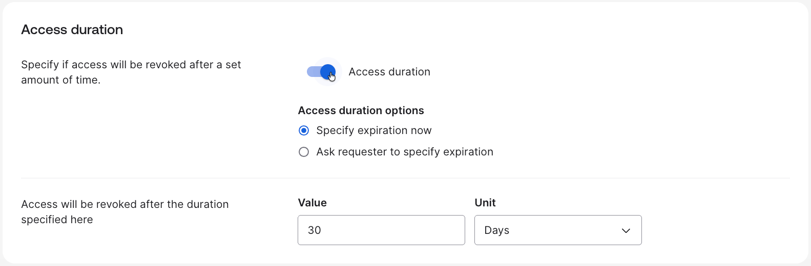
>
> The last section of the condition is to select (and in our case,
> create) a sequence to use.

#### Create a New Sequence for the Condition

Sequences define the flow of the access request. You can specify
information to be provided by the requester, approval steps and other
actions to occur within a flow.

9.  In the **Approval sequence** section of the condition, click on the
    **Select sequence** button.

> 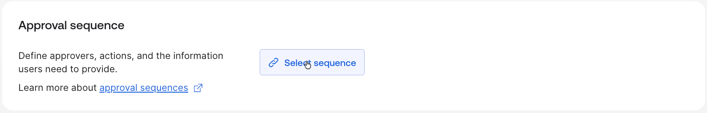
>
> This will open the sequence editor page. You are presented with an
> empty sequence, with a Trigger step (the start) and a Deliver step
> (the end). Both of these are fixed and we will add steps between them.
> However first we need to set the sequence name.

10. Click the **pencil icon** beside **Untitled Sequence** in the top
    left corner of the page.

> 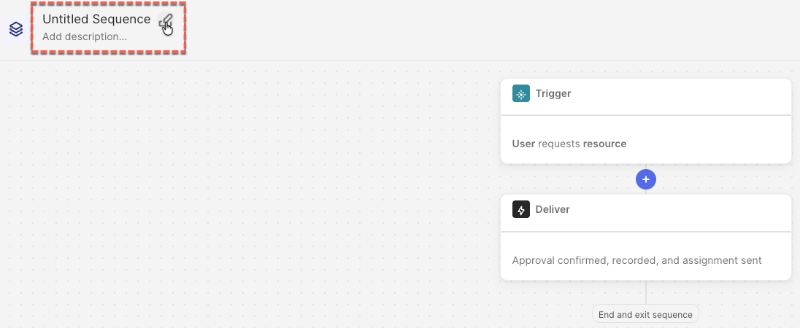

11. On the Sequence Details window that pops up, provide a **Name** and
    **Description** and click the **Continue** button.

> 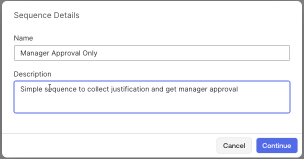
>
> We are now ready to build the flow.

12. Between the Trigger and Deliver steps there is a plus sign in a
    circle. Click it to add a step.

> 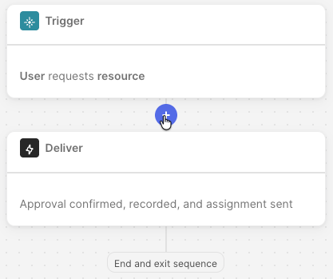
>
> The Add step window opens on the right side of the editor. There are
> five step types available:

- **Questions for Requester** - a question (prompt to supply
  information) will be presented to the requester on the same screen as
  when they select the app, group or entitlement for the request (we
  will see this later).

- **Questions** - a question for anyone that must be answered in the
  Access Requests UI before the request goes to the next step. This is
  different to the above in that it can be for anyone (e.g. a manager
  may need to supply additional information) and it is entered in the
  Access Request UI.

- **Approval** - an approval step, where an approver can review the
  request and approve or deny it (more on this below)

- **Task** - create and assign a manual task. This is where something
  needs to be done externally (e.g. an admin needs to manually create an
  account on a system not connected to Okta) and come back into the
  request to mark when it’s been done.

- **Workflow** - call a delegated flow in Okta Workflows. This currently
  requires an [<u>Early Access Feature</u>](#early-access-feature-flags)
  to be enabled and won’t be used in these labs (workflows integration
  will be discussed later in the [<u>Advanced
  Topics</u>](#advanced-topics) section).

> You can have multiple instances of these step types in a sequence. A
> common use is to have different levels of approvals on some requests.
>
> The Request Types (covered in a later lab) has more step types
> available for complex flow requirements.

13. Click on the **Questions for Requester** option.

> 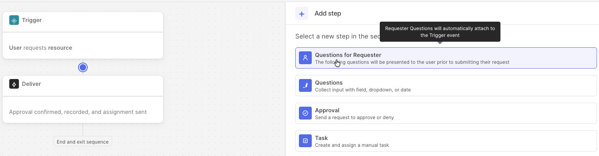
>
> This will open the Questions for Requester window where you can define
> the Prompt (the label that will appear to the end user) and the type
> of question. There are three options:

- **Dropdown** - define a set of values the user can select from.

- **Text** - text field for the user to enter

- **Date** - date widget to select a date

> These values will be made available to anyone who can access the
> request, but cannot be tied to automation (unlike Request Types who
> can leverage some of the values in flows).

14. Specify a **Prompt** like Business Justification and leave the type
    as **Text**.

> 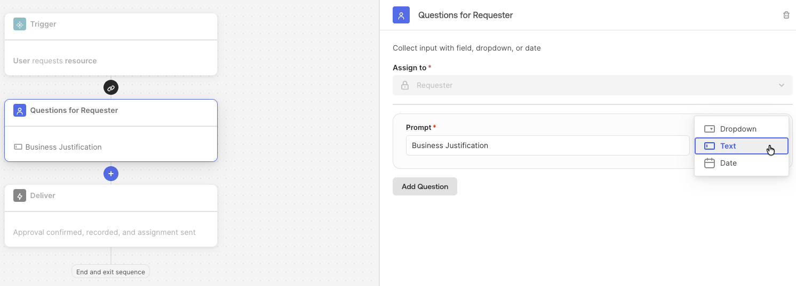
>
> Notice that the step in the flow updates as you enter the values. Also
> you cannot set the Assign to. This is different to the Questions step
> where you can assign it to anyone.
>
> We have now created the first step to get a business justification
> from the requester.

15. Click the **plus icon** in the flow below the new step to add
    another step, and select the **Approval** step type.

> 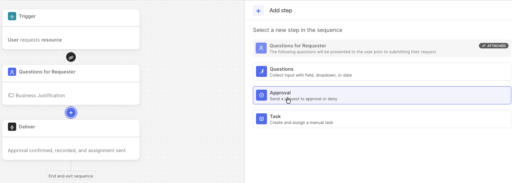
>
> The approval step can be assigned to a range of users:

- **Requester’s manager** - the users manager based on the user-manager
  relationship defined on the user profile in Okta UD.

- **An Okta group** - a group in Okta, where any of the users in that
  group can approve the request.

- **An Okta group owner(s)** - use the group owner feature to
  dynamically get the group owner of a specific group. This is similar
  to using an Okta group, but depending on how you manage group
  memberships this may be easier to manage.

- **A specific user** - assign one Okta user as the reviewer. This could
  be a specific administrator or maybe an application owner.

- **Resource owner(s)** - this is using the new feature where owners may
  be assigned to apps or entitlements.

> One of the design goals with sequences is to make them re-usable
> across different conditions. Appropriate choice of approvers can
> support this, such as using the manager, a common admin group or the
> resource owner option.
>
> Be careful of assigning specific individuals to an access request flow
> as it may cause requests to stall if the approver is away. There is a
> new Delegate feature where any user can delegate their tasks to
> someone else in Okta. However it’s best practice to assign approvals
> to a group of users.

16. Select the **Requester’s manager** option.

> 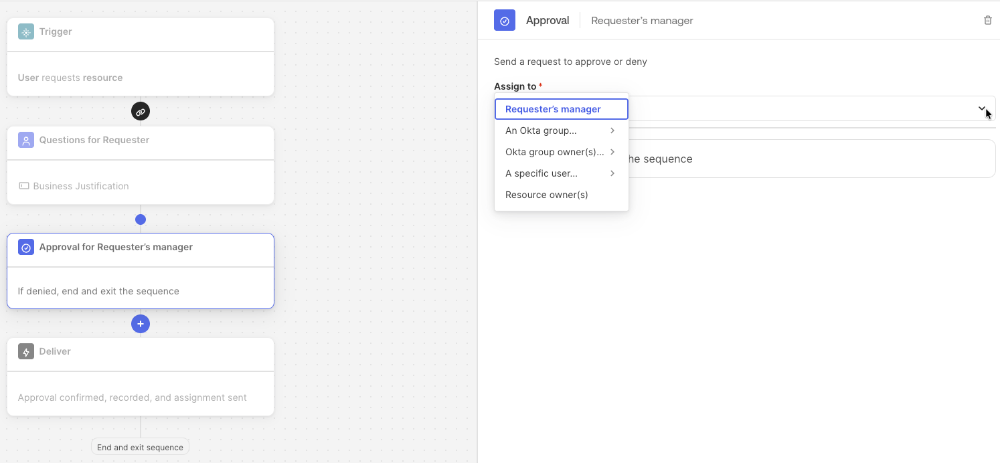
>
> 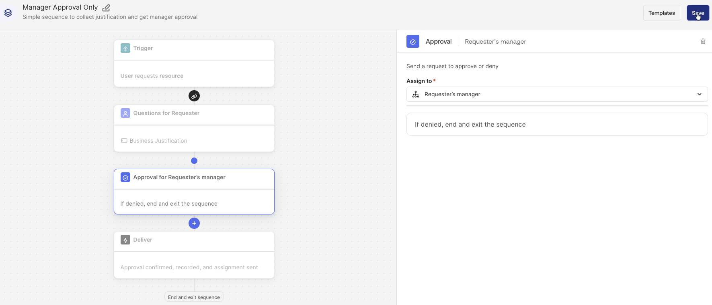
>
> The sequence is now complete with two steps, one to collect a business
> justification and one to get the managers approval.

17. Click the **Save** button.

> Note that there is a Templates button that will show pre-built
> sequence templates that you can use to start your sequence.
>
> 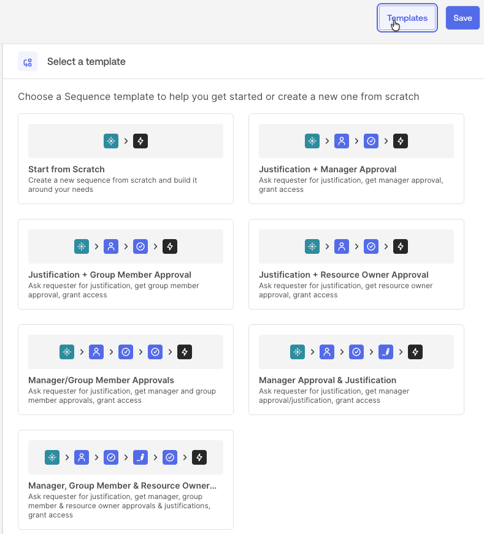

18. Close the tab with the sequence editor and go back to the tab
    showing the condition approval sequence.

19. Click the **Refresh list** button.

> 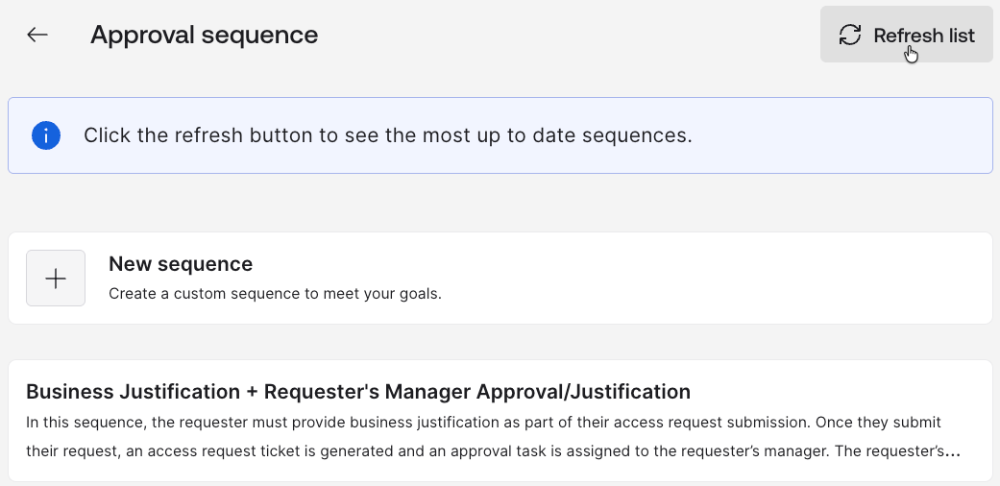
>
> You should see your new sequence appear.
>
> 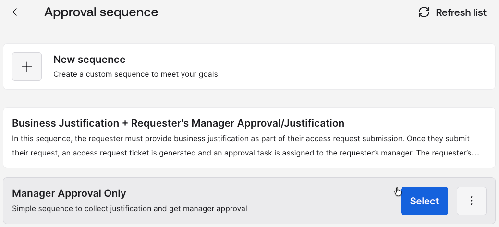

20. Click on the new sequence and click the **more actions** icon (three
    vertical dots).

> 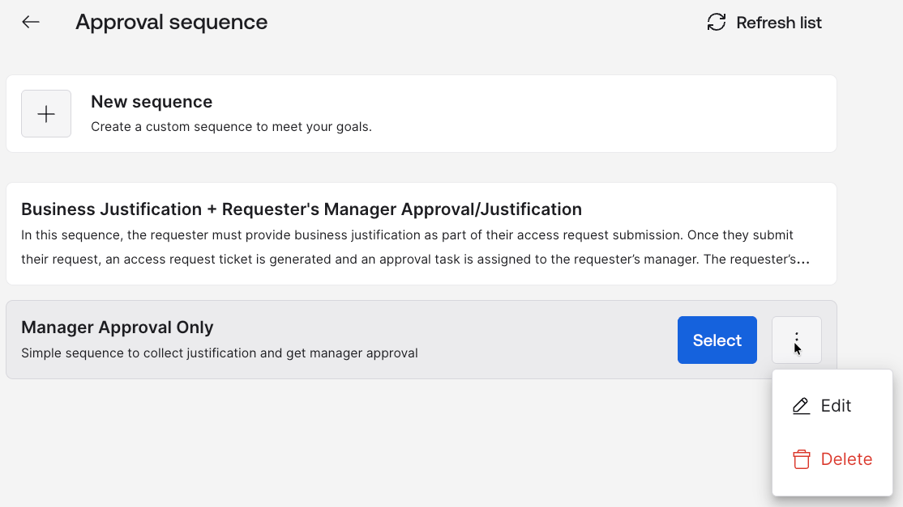
>
> You can edit (or delete) this sequence from here. We won’t use them
> now but this is how you update a sequence.

21. Click the **Select** icon to assign this sequence to the condition.

#### Save (Create) and Enable the New Condition

22. Check that the new sequence is assigned to your condition.

> 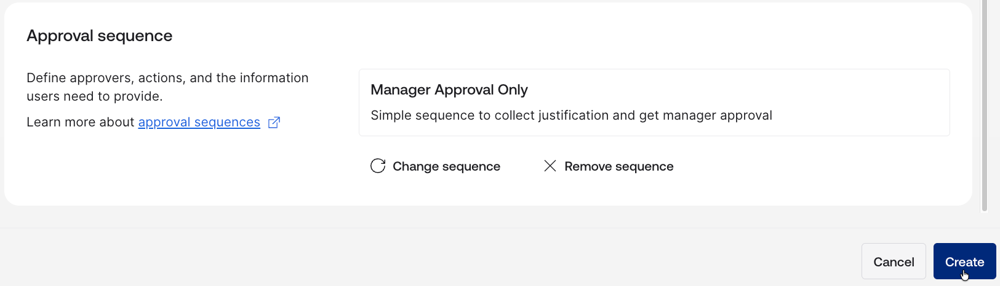
>
> To change the sequence assigned, OR to modify an existing sequence,
> you must click the **Change sequence** option and then Edit the
> sequence on the Sequences page as mentioned above.

23. Click the **Create** button to create the new condition.

> 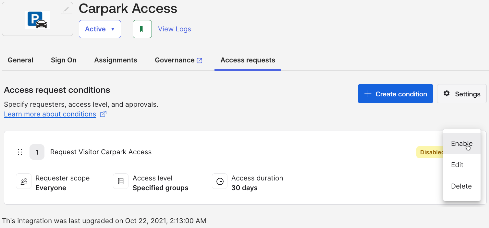
>
> The new condition is created in a Disabled state. To edit a condition
> it must be in a Disabled state.

24. Click on the **more actions** icon and then click on the **Enable**
    option.

> 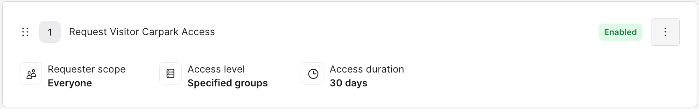
>
> The condition is now enabled and ready to use.

#### Create a Second Condition and Sequence for App Access

To show different options when a user goes to request carpark access we
will create a second condition and sequence.

25. Repeat the steps above but with the following settings:

- Condition:

  - Scope of everyone in the org

  - Group scope set to the executive parking group

  - Access duration set to “Ask requester to specify expiration”

- Sequence:

  - New sequence with a business justification

  - Approval for a specific user (in the example it is the CEO)

> Your new condition should look like this.
>
> 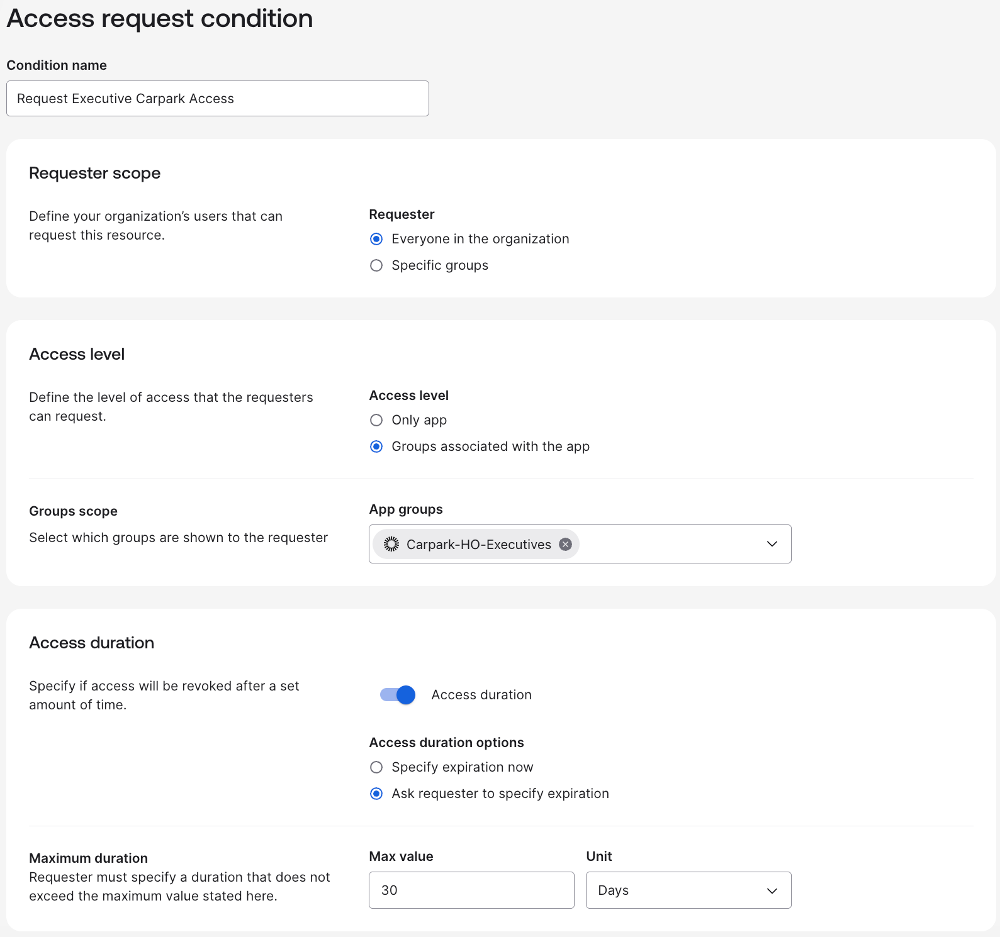
>
> 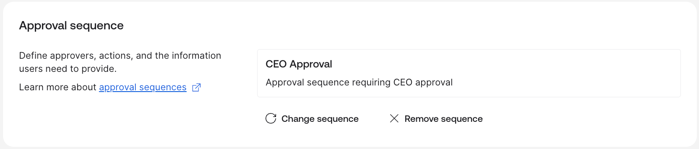
>
> Your new sequence should look like this.
>
> 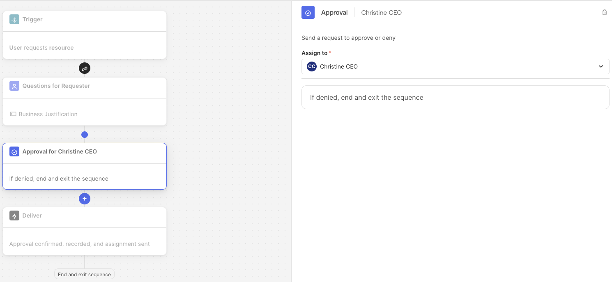

26. Save (Create) and enable the sequence. You should now have two
    enabled conditions for the app

> 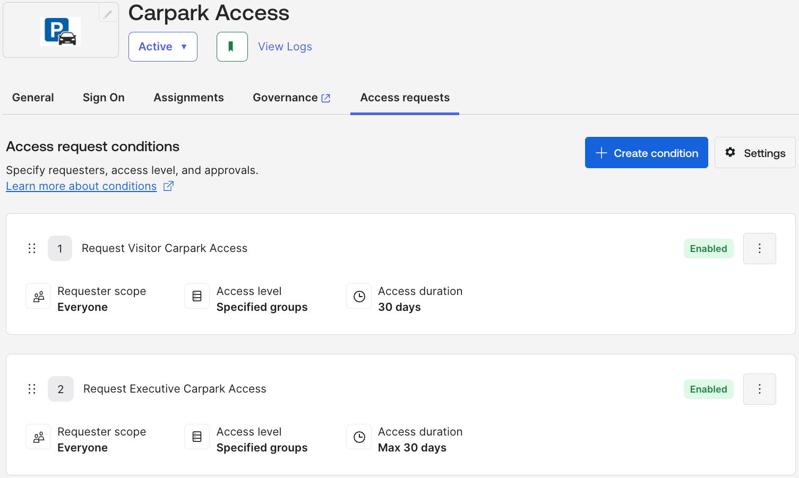
>
> You can see there are priorities associated with the conditions. Where
> there are multiple conditions (and sequences) that apply to the same
> resource being selected, the condition with the highest priority
> determines which approval sequence is used to approve the request and
> which access duration is applied.
>
> When designing the access requests, with conditions and sequences, you
> should consider whether there is a potential for conflicting or
> overlapping conditions, and if they are unavoidable, which is the
> highest priority.

### Testing the New Conditions and Sequences

Now that we have created and enabled conditions for our app, we can test
them by requesting access.

Some of these steps will be performed as an end user and some as their
manager or a designated person. You may need to log out of your admin
session, or run the testing in a separate or incognito browser and leave
your admin session running.

#### User Requests App Access

We will start with a user requesting access to the app using the first
condition.

1.  As a user who can request access to the app, log into the **Okta
    Dashboard**.

2.  Click on the **Request access** button.

> 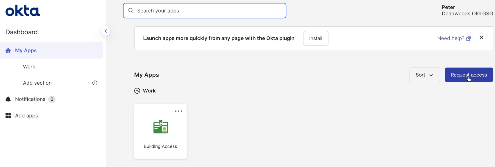
>
> You may notice an Add app menu item on the left in your system. This
> is the old access request mechanism shipped with Okta Lifecycle
> Management many years ago. It is still being used by some customers,
> but new deployments should not use it and it has nothing to do with
> the access requests mechanisms described in this guide.
>
> You are taken into the Request Access function.

3.  Click on the app tile to start the access request flow.

> 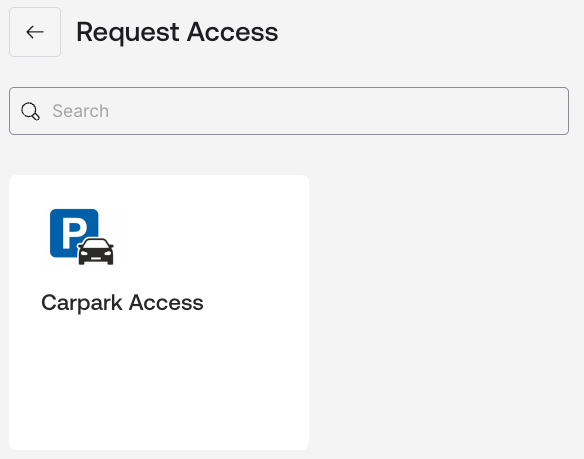
>
> Note that if you have not enabled the **Access Requests - Unified
> Requester Experience** EA feature (see the [<u>Early Access
> Features</u>](#early-access-feature-flags) section above) you may see
> an additional tile for **More items**. You can ignore that and just
> click on the app tile.
>
> 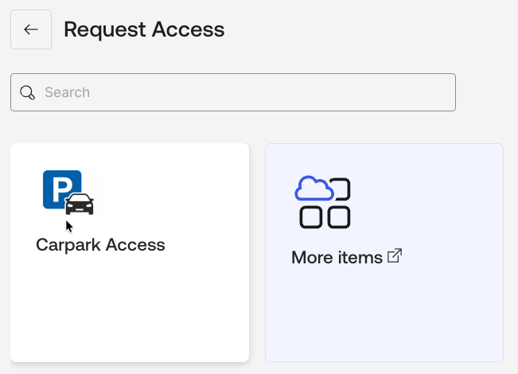
>
> Selecting the app tile will trigger OIG to evaluate the conditions on
> the app that apply to this user and present all the resources the user
> can request (in this case groups).

4.  Select the group related to the first condition you created (in the
    example, it’s the visitors group).

> The condition fires the sequence and prompts for **Business
> Justification** which was the first step in the sequence.
>
> 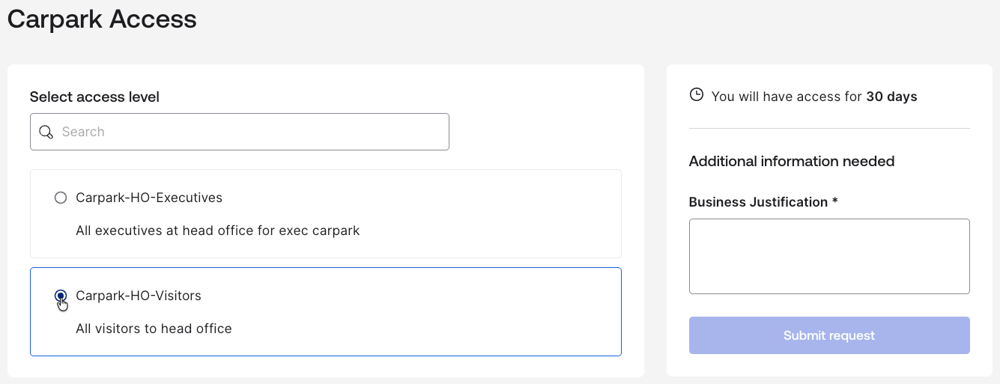
>
> Any Questions for Requester that you specified in the sequence will
> show up here.

5.  Enter a **Business Justification** and click the **Submit** request
    button.

> 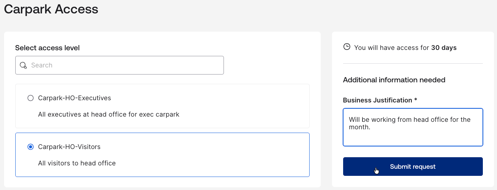
>
> The rest of the sequence is now run in the Access Request Platform.
> Emails will be sent to the first level of approvers (such as the
> requesters manager) informing them of actions they need to complete.
>
> The user sees a **<u>Request submitted</u>** link appear beside the
> group they have just requested. The user can follow the link or ignore
> it and wait for an email saying the access was granted.

6.  Click the **<u>Request submitted</u>** link.

> 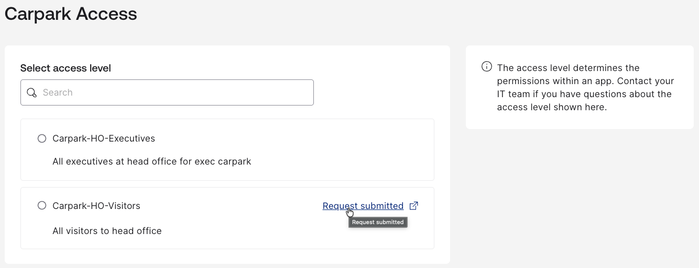
>
> This will open up a new window in the Access Request Platform UI
> showing the user request under the Requests menu item.
>
> 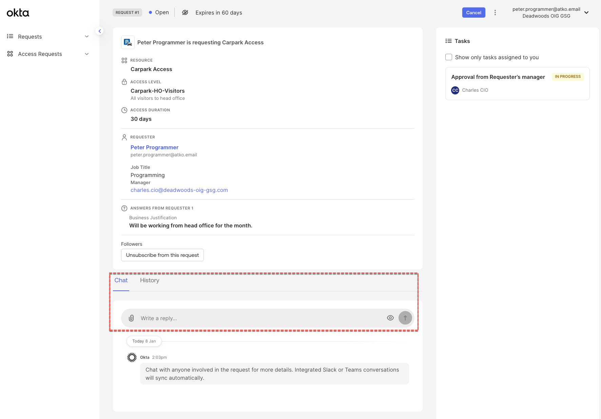
>
> Ignore any other menu items for now.
>
> This view shows the details of the request (condition and sequence)
> that was submitted. It shows the tasks in the right pane - in this
> case it is showing the “approval from requester’s manager” and who
> that manager is.
>
> There is also a **<u>Chat</u>** function built into the app, so you
> could chat with the admin or the approver. This could be useful if the
> approver needs to clarify some information. It even hs a way to attach
> files to the request. If you are also using Slack or Microsoft Teams
> with OIG, you can chat there as well (see [<u>Slack and Microsoft
> Teams Integration with Access
> Requests</u>](#chat-collaboration-integrations-slack-and-microsoft-teams)
> for more details).
>
> You can also look at the history of the request using the
> **<u>History</u>** tab. We will look at this more when we review the
> request as the manager.

#### Manager Reviews and Approves Access Request

Next we need to review the request by the user's manager. They would
have received an email notifying them that they have a request to
review.

7.  Log in to the **Okta Dashboard** as the requester’s manager (in our
    example that’s Charles CIO).

8.  Click on the **Okta Access Requests** tile.

> 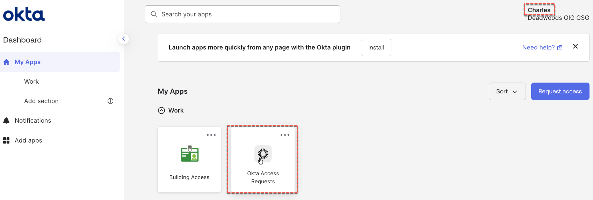
>
> This takes the manager into the Access Requests Portal UI.

9.  If not taken there by default go to the **Requests \> Inbox** view.
    There should be a single request showing under the **Requests that
    need action from you** section.

10. Click on that request.

> 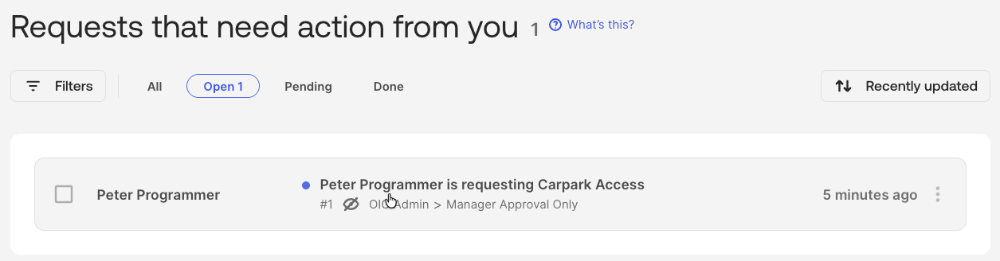
>
> This opens up the details of the request. This is similar to the view
> the user saw above. However in the **Tasks** pane there is the option
> to **Deny** or **Approve** the request. It shows the task is IN
> PROGRESS, meaning it’s the currently active step in the sequence.

11. Click the **Approve** button to approve the request.

> 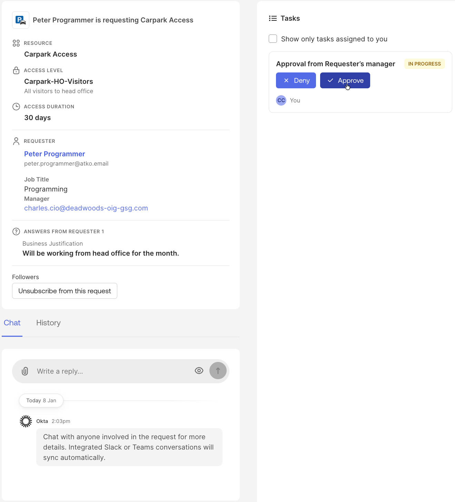
>
> The task status changes to APPROVED.
>
> 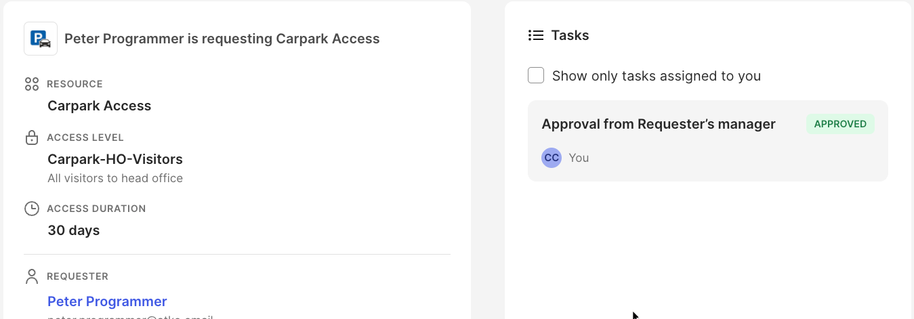

12. Click on the **<u>History</u>** tab (beside the **<u>Chat</u>** tab)

> 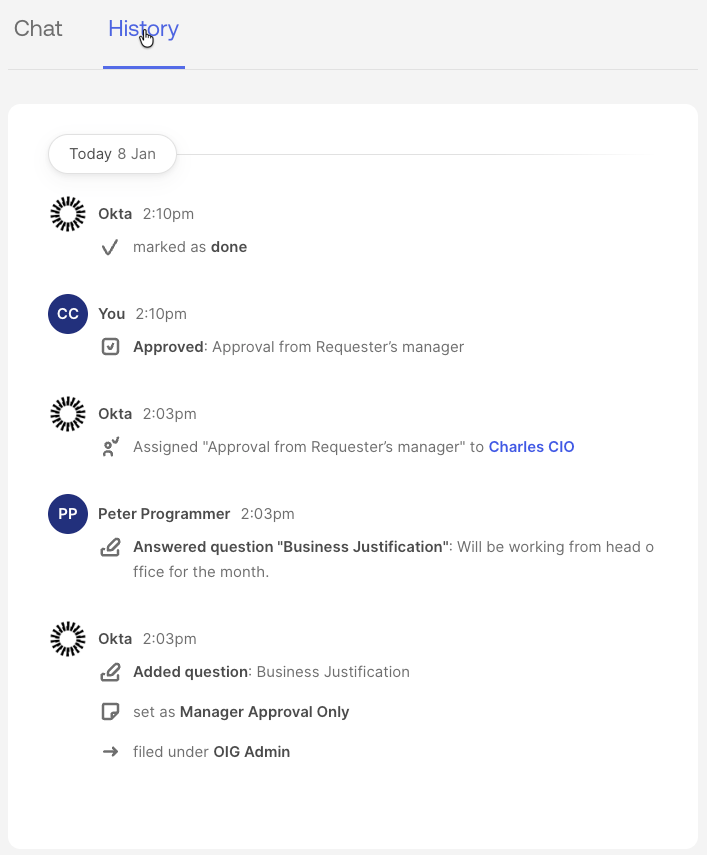
>
> This shows all the activity associated with the request, newest first.
> In this case it shows the requester questions (Business
> Justification), manager approval and completion. Note that it doesn’t
> explicitly show the resource / app assignment (this is in the Okta
> System Log).
>
> If you find requests aren’t behaving as you expected from the
> conditions and sequences you configured, you can check the History to
> see exactly what is being run in the request.

13. Log back into the **Okta Admin Console** as an administrator and go
    to the app to confirm that the requesting user has been added.

> 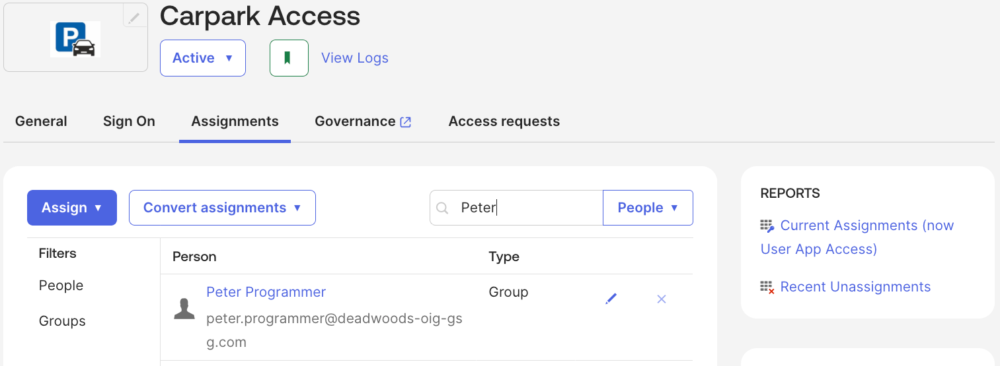
>
> This confirms the user has been added to the group and assigned to the
> app via that group.

14. Go to **Reports \> System Log** and look at the entries matching the
    times shown in the History view from above (in this example it was
    14:03 through 14:10).

> At the top you should see events relating to the completion of the
> request.
>
> 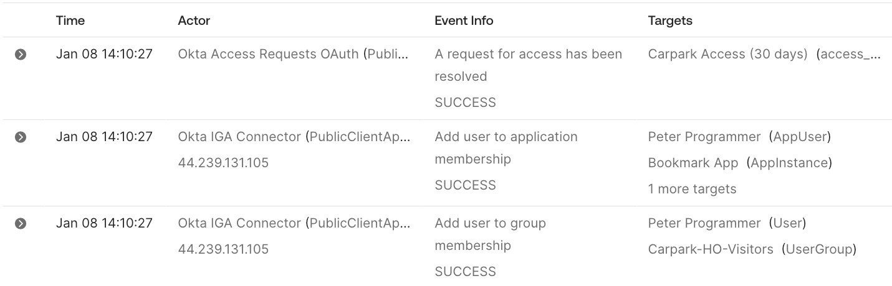
>
> This shows the user being added to the group (by the integration
> between the Access Requests Platform and Okta “Okta IGA Connector”),
> the user being added to the app as a result of the group membership,
> and the access request being completed (resolved) by the Access
> Requests app (“Oka Access Requests OAuth”).
>
> Scrolling down you will see some events relating to the manager
> signing in (but nothing specific for the Access Requests approval
> step).
>
> Further down you will see events related to the user initiating the
> request.
>
> 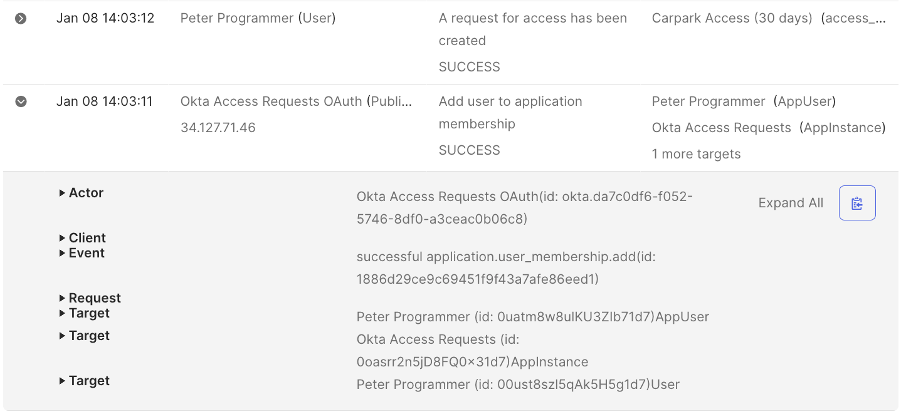
>
> There is an event for the user raising the request and the request
> being raised in the Access Requests app.
>
> We will not drill into the different events here, but they can be very
> useful for debugging issues and also if you want to introduce
> automation (like using [<u>Okta
> Workflows</u>](#triggering-workflows-from-system-log-events)).

This completes the flow for the first Access Request condition.

#### User Requests Additional App Access

We will close out this lab by running through the second condition to
highlight the differences based on the different condition and sequence
configuration.

15. Log into the **Okta Dashboard** as your user who needs to request
    access.

16. As before click on the **Request access** button.

> 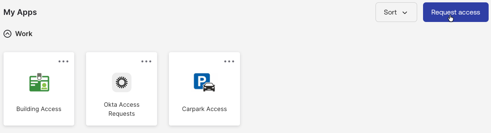

17. Select the other group (in our case, the executives group).

> 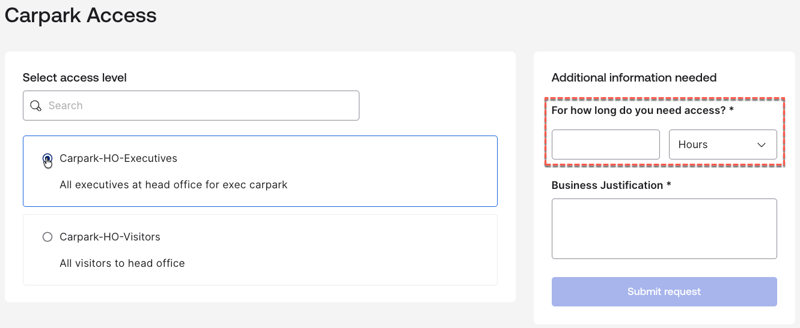
>
> There are now two questions for the user. There is the Business
> Justification as before, which we specified as the first step in the
> sequence.
>
> But there is also a prompt for access duration. Recall that when we
> set up the condition, we allowed the user to specify a duration (“Ask
> requester to specify expiration”). When the condition runs this
> setting is presented as another requester question automatically.

18. Enter the duration and justification and click the **Submit** button

19. Log into the **Okta Dashboard** as the user who can approve the
    request (recall that we selected a specific user, in the example
    this was Christine CEO).

20. Go to the Access Requests app and the new request

21. Review and **Deny** the request

> 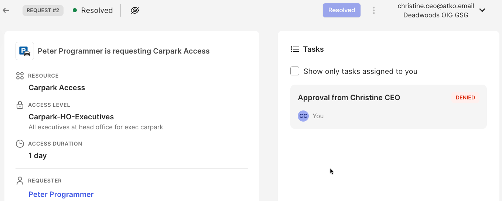

22. Log into the **Okta Admin Console** as an administrator and confirm
    that the user was NOT added to the second group.

23. Go into **Reports \> System Log** and have a look through the
    events. You should see events relating to the access request
    creation and closure (access.request.resolve) but there will be no
    events for assigning the group to the user.

> Note that the access request resolve event doesn’t show that the
> request was denied, just that it was completed.

This completes the first Access Request lab. We have walked through
creating two conditions and sequences for a user to request access to an
app via specific groups. We have looked at how the conditions and
sequences are created. We have tested them showing the user and approver
experience. We’ve also shown how you can monitor and manage the
conditions.

The following labs will expand on this to look at entitlements on apps.

---

[← Introduction to the Labs](02-introduction-to-the-labs.md) | [Lab 2.2 - Request Conditions with Application Entitlements →](04-lab-22---request-conditions-with-application-entitlements.md)
