## Lab 2.2 - Request Conditions with Application Entitlements

In the previous lab we walked through creating access request conditions
so that users could request group access to an application. If you have
entitlement-enabled apps in Okta, you can also expose those entitlements
to access requests.

In this lab we will walk through exposing some entitlements for an app
we set up for entitlement management earlier in this document. For the
example we will use the building access app, but you could use any
entitlement-enabled app.

### Create Access Request Conditions for App Entitlements

As with the previous lab we will start by creating two conditions with a
new sequence (we will use the same sequence for both conditions).

#### Confirm Entitlement Bundles for App

Before creating the conditions we will confirm we have two bundles on
our app.

1.  As an administrator log into the **Okta Admin Console**

2.  Go to **Applications \> Applications** and select the app you want
    to use (in this case the Building Access app)

> 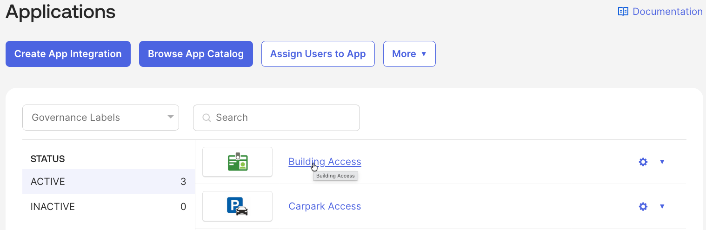

3.  In the app, select the **<u>Governance</u>** tab.

> 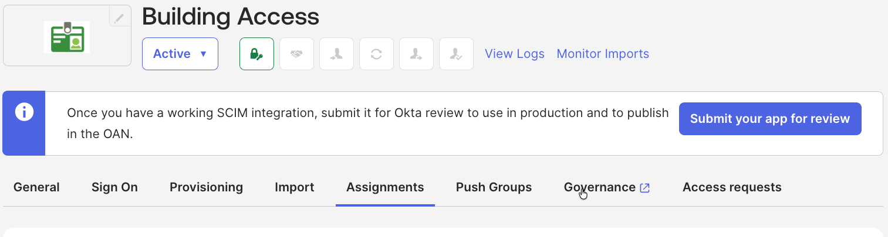

4.  Click on the **<u>Bundles</u>** tab and confirm that you have the
    two bundles you created in the earlier Entitlement Management lab.

> 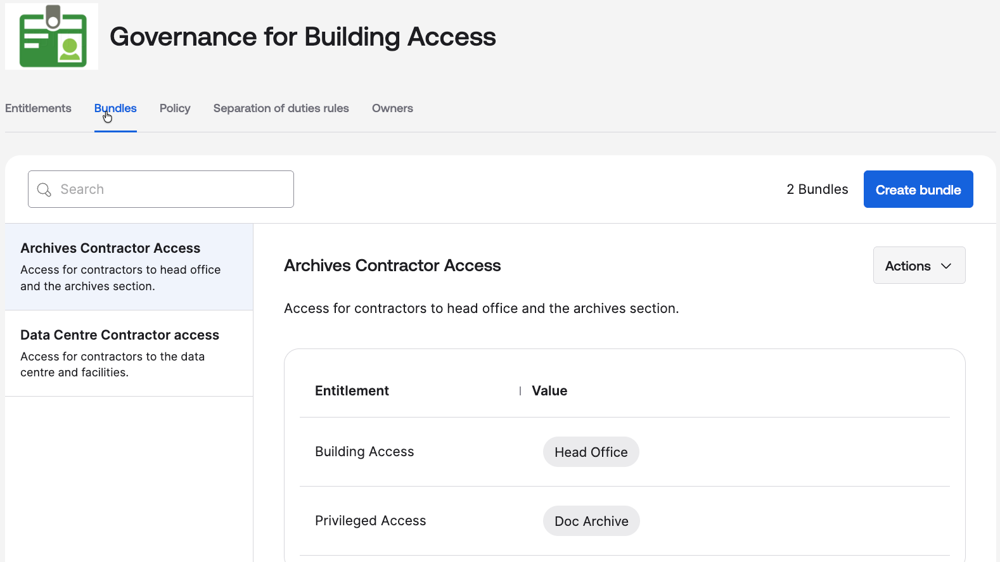
>
> These are the bundles created for the BYO app. They also contain some
> entitlements that we configured in the Separation of Duties (SoD)
> rules for the app. We will use these in this lab and the next (SoD)
> lab. If you want to use a different app, make sure you have two
> bundles and an SoD rule that has entitlements from the two bundles in
> it.

We will use these bundles to create conditions and sequences.

#### Create First Condition and Sequence

We will follow the same flow as earlier to create a condition and
sequence.

5.  Use the **<u>Back to Application link</u>** to return to the app
    main page

6.  Click on the **<u>Access requests</u>** tab

> 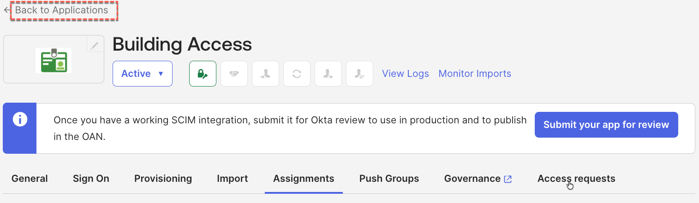

7.  Click the **+ Create condition** button to start creating the first
    condition.

8.  Give the condition a **name** like Archives Contractor Access.

9.  For the **Requester scope**, select Everyone in the organisation.

10. In the **Access level** section, notice that there is now an
    entitlement option. Click the **Requester must specify
    entitlements** option.

> 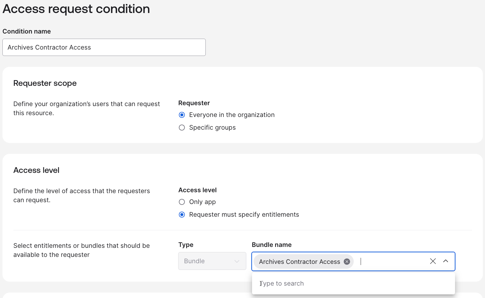

11. When prompted, search for and select the corresponding entitlement
    bundle.

12. Enable the Access duration option and accept the default duration
    options and timeframe.

13. In the Approval sequence section, click the **Select sequence**
    button.

14. Click the **+** (New sequence) icon

15. On the sequence editor page, edit the name and description (pencil
    icon) and set the name to something like Supervisor and CIO Approval
    and give an appropriate description.

> 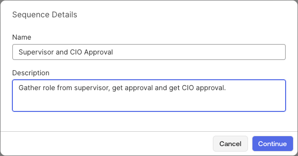

16. Click the **Continue** button.

17. We will create the sequence to have four steps: a Business
    Justification question for the requester, a Role field to be
    provided by the supervisor (manager), supervisor (manager) approval
    and then CIO approval.

18. Back on the editor page click the add step (**+**) icon

19. As done earlier, select **Questions for Requester** and specify a
    text field with a prompt of Business Justification.

20. Click the add step (**+**) icon and select **Questions**.

21. Leave the **Assign to** as ***Requester’s manager*** (note that this
    could be assigned to different users) and specify a **Prompt** of
    Contractor Role.

> 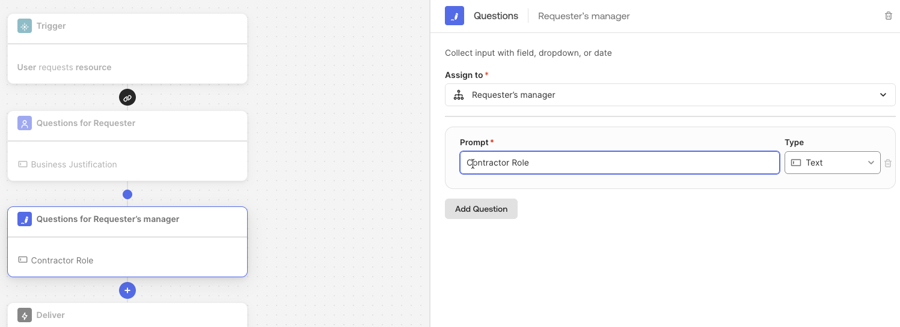

22. Click the add step (**+**) icon and select **Approver**, and leave
    the **Assign to** as ***Requester’s manager***.

23. Click the add step (**+**) icon and select **Approver**, and in the
    **Assign to** field select A specific user and select your CIO (or
    equivalent) user.

> 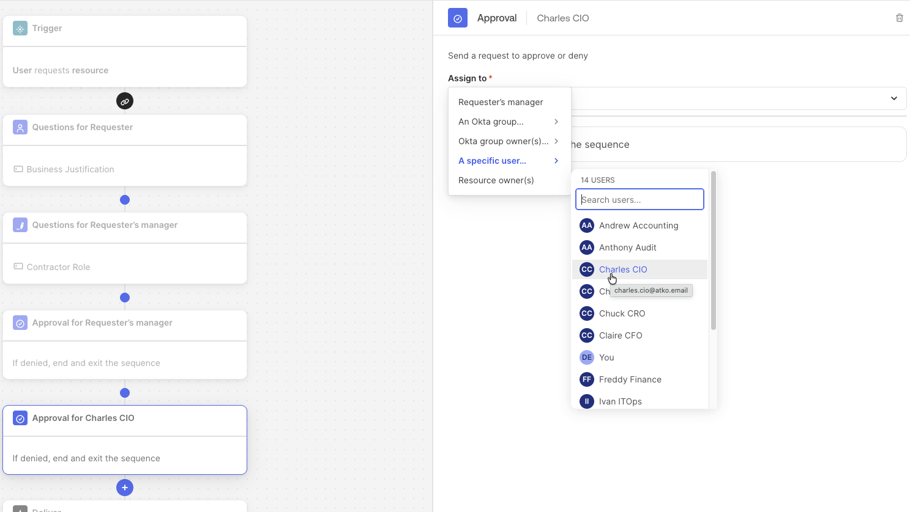

24. Click the **Save** button and close the browser tab with the
    sequence editor.

25. On the sequence list page, click the **Refresh list** button.

26. Find the new sequence, hover over it and click the **Select**
    button.

> 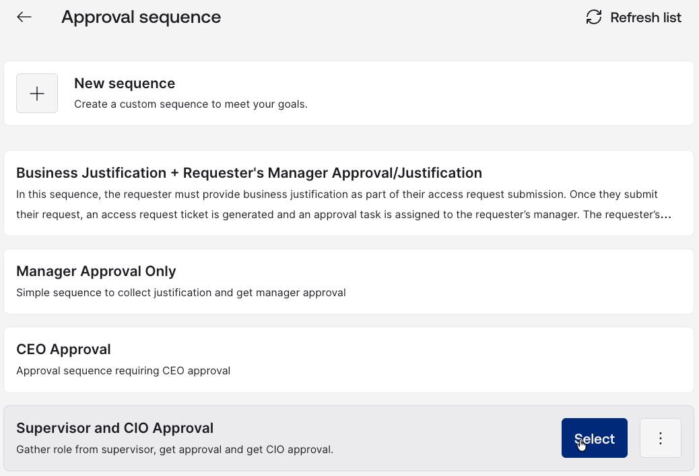

27. Confirm the correct sequence is added and click the **Create**
    button.

> 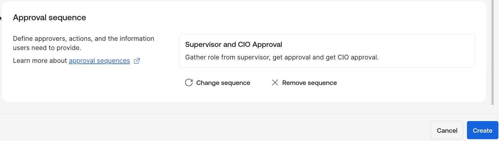

28. As before, enable the condition.

> 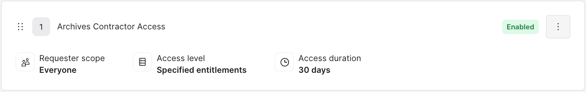

#### Create Second Condition and Sequence

29. Repeat the steps above to create a second condition for the other
    entitlement bundle.

    - Give it a different name and description.

    - Select the other entitlement bundle

    - Use the same sequence as before

> 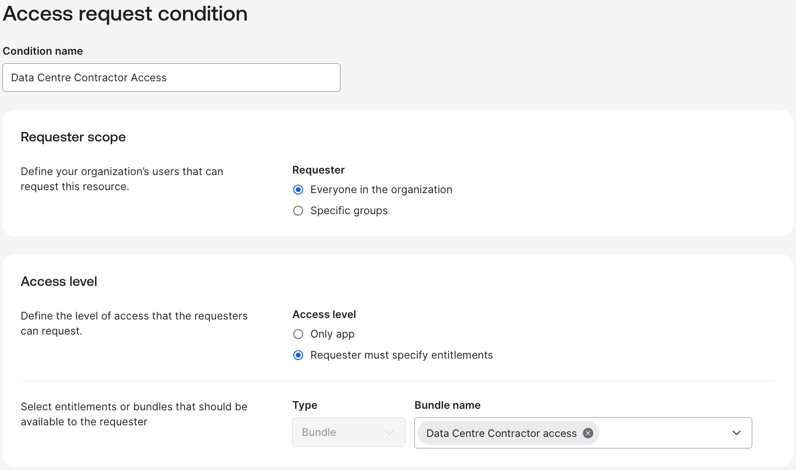
>
> 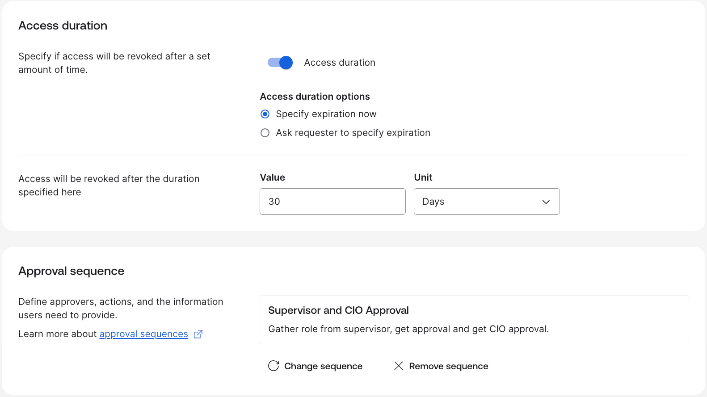

30. Enable the second condition.

> 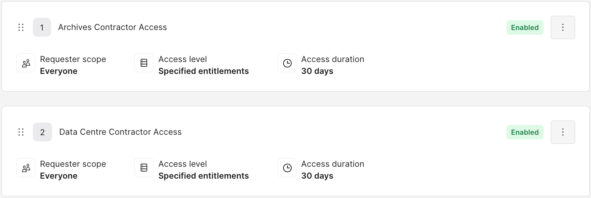

There are now two entitlement-based conditions on our app ready for
testing.

### Test Access Request Conditions for App Entitlements

We will follow a similar flow as in the previous lab to test the new
conditions, however we will only test one of them and leave the second
one to test the SoD rule in the next lab.

Create New User (Contractor)

1.  Prior to running this lab, create a new contractor user in Okta and
    set their manager.

Request App Entitlement Bundle

The user will request one of the bundles (via the condition).

2.  Log into the **Okta Dashboard** as your new contractor.

3.  Click on the **Request access** button on the Dashboard.

4.  On the Request Access screen click on the tile for the entitlement
    app you just created the conditions for (in our case this is the
    Building Access tile).

> 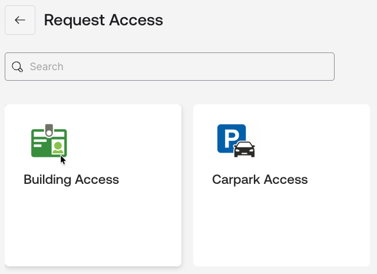

5.  Select one of the entitlement bundles presented.

> 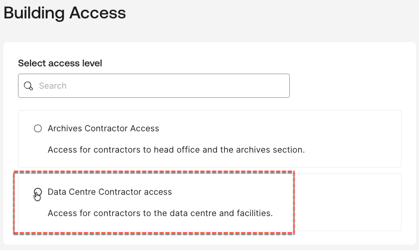
>
> This will open up the questions on the right side, showing the
> Business Justification we put in the sequence.

6.  Enter a **Business Justification** and click the **Submit request**
    button.

> 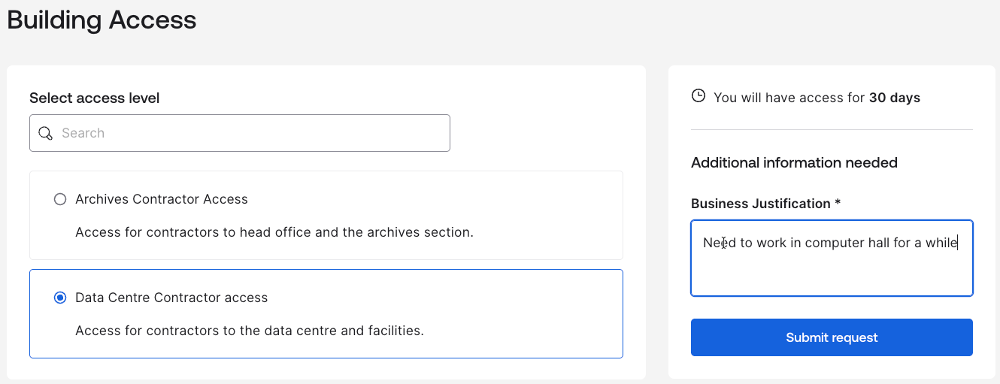
>
> The request is submitted and the sequence is started. The people who
> have the first task to perform (in this case supplying more
> information on the contractor role) are sent emails.

#### Manager Reviews, Supplies Information and Approves

7.  Log into the **Okta Dashboard** as the user’s manager.

8.  Click on the **Access Requests** tile.

9.  If not taken to the new request, go to **Requests \> Inbox** and
    select the new request.

> 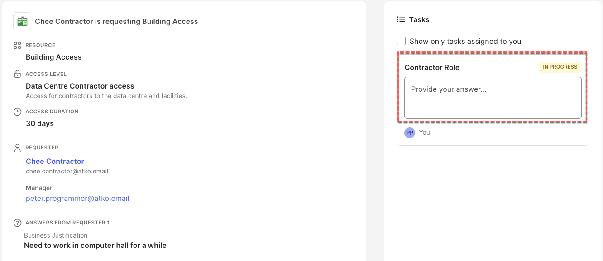
>
> Notice that the **Tasks** pane on the right has a text field labeled
> **Contractor Role**. This is being presented because the first step in
> the sequence was to prompt the supervisor (requesters manager) to fill
> out a text field called Contractor Role.

10. Put some text into the field and click the **Submit** button.

> This task is now marked as COMPLETED.
>
> The sequence moves to the next step which is supervisor (manager)
> approval.

11. Click the **Approve** button.

> 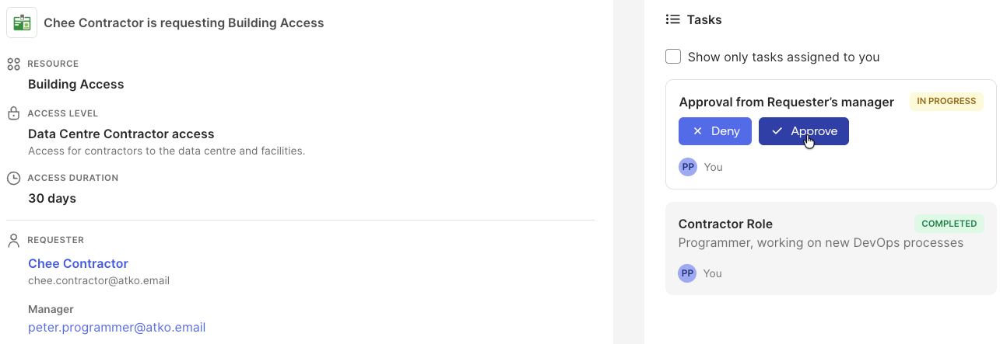
>
> This task is now marked as COMPLETED.
>
> The sequence moves to the next step which is the second level approval
> which we fixed to a specific user.
>
> 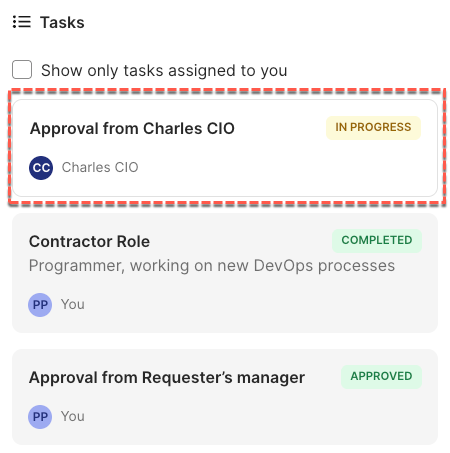
>
> This should be a different user.

12. Log in as the second-level approver, go to **Okta Access Requests**,
    and open the request

> 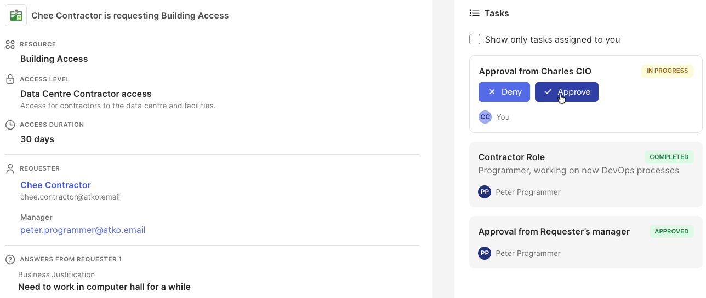

13. Click the **Approve** button.

14. Go to the **<u>History</u>** tab of the request and look at the
    entries there.

> 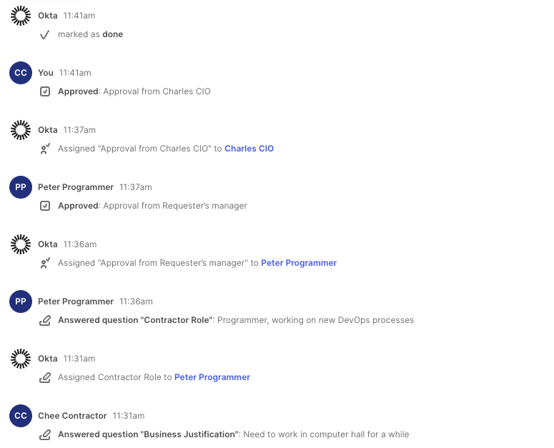
>
> As we saw earlier, you can see all the steps being executed for this
> request.

15. Log into the **Okta Admin Console** as your administrator.

16. Go to **Applications \> Applications** and select the application.

17. In the **<u>Assignments</u>** tab, find the user who just requested
    access and click the more actions icon (three vertical dots beside
    the user).

> 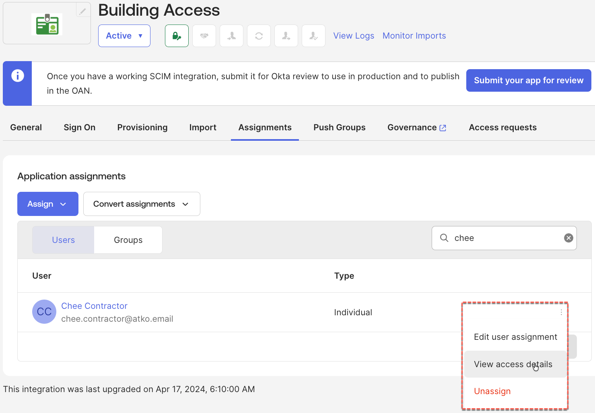

18. Click the **View access details** option. The Access details for the
    user slides out from the right of the screen.

> 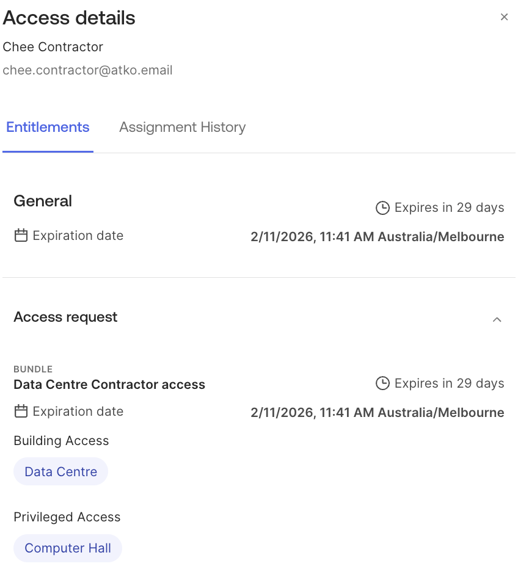
>
> This contractor was granted app access (the General section) as a
> result of the request (they were not in a group assigned to the app.
>
> The other two accesses were granted from the entitlement bundle, Data
> Centre Contractor access. This includes **Building Access = Data
> Centre** and **Privileged Access = Computer Hall**.
>
> For both the app and entitlement accesses the display shows the number
> of days to expiry, and the expiration date. On the expiry date, the
> access granted via this request is automatically removed. If the user
> did not have any entitlements (or assignment via other means, like a
> group) they would also be removed from the application.

19. Have a look at the **<u>Assignment History</u>** tab. You should see
    the entitlements being assigned.

20. Now go to **Reports \> System Log** and look for the events around
    the time the sequence completed. You should see events similar to
    the previous lab, with one showing the entitlements being updated
    for the user and the other showing the request completing
    (resolved).

> 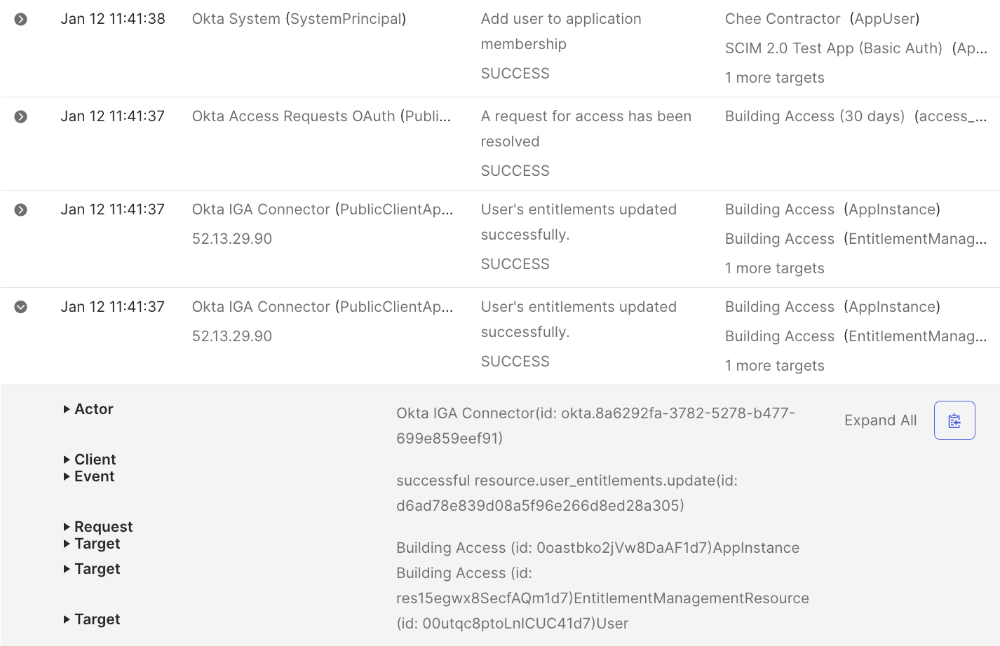

This shows that the entitlements were updated and you have an audit
trail of the change.

This completes the second Access Requests lab. We have walked through
creating two conditions and sequences for a user to request access to an
app via entitlements. We have looked at how the conditions and sequences
are created and added some complexity to the sequences. We have tested
them showing the user and approver experience. We’ve also shown how you
can monitor and manage the conditions.

The following labs will expand on this to look at SoD checking on
entitlements in Access Requests.

\
-

---

[← Lab 2.1 - Request Conditions with Applications and Groups](03-lab-21---request-conditions-with-applications-and-groups.md) | [Lab 2.3 - Request Conditions with SoD Checking →](05-lab-23---request-conditions-with-sod-checking.md)
