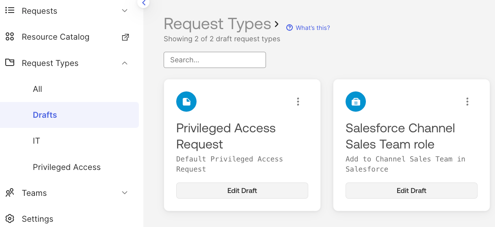

## Lab 2.4 - Request Types for Complex Requirements

The previous three labs have looked at the Access Request Conditions.
These should be used as the standard approach to configuring access
request flows in OIG. They are far simpler to use and more scalable than
the older Request Types. However you may find flow requirements that
cannot be addressed by conditions. For these we need to look at the
legacy Request Types.

This lab will look at the configuration of the Access Request Platform
and building and using request types.

### Initial Access Requests Platform Set Up

Before creating a request type you need to check that the platform is
ready for them. Some of the initial configuration has already been done,
and if you’ve worked through the previous Access Requests labs, you will
have interacted with the platform.

Follow the steps in [<u>Appendix
B</u>](#appendix-b---configure-the-access-requests-platform-for-request-types)
to check that the Access Requests Platform is ready to use.

### Define Groups to be Used In the Request Type

For this lab we will create a request type for any employee to request
the channel sales entitlement bundle in Salesforce. As with the other
labs you could use any application for this, but the example will follow
the Salesforce entitlement bundle request. For this we will need two
groups, with membership, pushed to access requests

- A requester scope group, i.e. who can request the access (we will use
  an employee group),

- An approver group (we will use another group, in this case a list of
  execs).

To add these groups as push groups:

1.  Sign into the **Okta Admin Console** as an administrator.

2.  Go to **Applications \> Applications** and select the **Okta Access
    Requests** app.

3.  Go to the **Push Groups** tab.

4.  Select and add the two groups as push groups.

>  src="../media/image146.png"
> style="width:6.48958in;height:3.75662in" />

5.  Go into the **Access Request UI** (go to **Identity Governance \>
    Access Requests** in the Admin Console or the Access Requests app on
    the Dashboard).

6.  Go to **Settings \> Pushed Groups** and confirm the two groups are
    there (they should appear very quickly as the push function runs as
    soon as they are added to the Push Groups for the app).

>  src="../media/image212.png"
> style="width:6.48542in;height:2.23958in" />

They are now ready to be used in a request type.

### Create a New Request Type

#### Start Creating the Request Type

Now we will create the new request type.

7.  Still in the **Access Request UI** go to **Request Types \> All**.

8.  Click the **Create request type** button (either one).

9.  (optionally) Change the **request type icon** (it will not be used
    in most cases).

10. Give the request type a **Name** and **Description**.

11. Select the **IT** Team.

>  src="../media/image29.png"
> style="width:4.48942in;height:4.69679in" />

12. Click on the **Audience** **\> Select and option** dropdown.

>  src="../media/image173.png"
> style="width:4.46655in;height:1.42903in" />
>
> There are three options available:
>
> Everyone in the organization (i.e. everyone in the Okta org connected
> to the Access Request Platform)
>
> Members of the Team assigned to this application. We only have the
> admin and do not want to maintain another list of users, so we won’t
> use this.
>
> An Okta group. This will be one of the groups we pushed from Okta.

13. Click on the **Select an Okta group…** option.

>  src="../media/image126.png"
> style="width:4.47292in;height:1.95024in" />
>
> The two push groups from above are shown.

14. Select the employee group (or the group you want as those who can
    request this access).

#### Start Building the Request Flow

15. Click the **Continue** button. This takes you to the request type
    editor page.

>  src="../media/image252.png"
> style="width:6.48125in;height:2.98022in" />
>
> The options look similar to sequences in the earlier labs, with the
> addition of Action (which will make sense when we look at it). We will
> walk through **Questions**, **Approvals** and **Actions**, but ignore
> **Tasks**, to create a request type. There is a fifth, **Timer**, we
> will see in a few steps.
>
> Note that at this stage we have not associated the request type with
> an application, group or entitlement. This is a fundamental difference
> between request types and conditions (which were attached to an
> application’s groups/entitlements).

#### Create Questions for the Requester

16. Select the **Add to request type** button beside **Question** to add
    a question. This will add a question step to the flow.

17. Provide a **Text** (label) and notice that it is added to the step
    in the flow.

>  src="../media/image117.png"
> style="width:6.48125in;height:2.36296in" />

18. Leave the **Make it a required field** on, this makes the field
    mandatory (notice the red asterisk beside the title in the flow).

19. Click the down arrow for the **Type** field. There are three
    options, Text, Date or Dropdown. Text and Date are obvious, and we
    will look at Dropdown in a few steps.

20. Leave it as **Text**.

21. Click the down arrow for the **Assigned to** field. There are
    multiple options.

>  src="../media/image105.png"
> style="width:2.7321in;height:2.59318in" />
>
> If you recall from the conditions labs, when creating sequences you
> have Questions for Requester and Question types. This is the same
> thing, but in one type. You can assign questions to be answered to the
> **Requester** (which is normally the case) or someone else, who could
> be the administrator of this request instance (**Request assignee**
> from the Team), **Requester’s manager**, a **member of** a team, a
> **specific user** or any member of an **Okta group**.
>
> You will see the same options available for many of the steps/tasks in
> request types, not just questions. This is a very flexible and
> powerful aspect of request types.
>
> You do not need to save a step, it’s updated in real time.
>
> The initial landing page has gone away to be replaced by a row of step
> types at the bottom of the editor page.
>
>  src="../media/image24.png"
> style="width:6.47292in;height:0.655in" />

22. Click the **Question** button.

23. Give the question a **Text** (label) of Primary Office and leave it
    as required.

>  src="../media/image16.png"
> style="width:6.48958in;height:3.91113in" />
>
> This is to present a list of options in a dropdown list to someone
> (the requester or someone else). These options could be text values or
> Okta objects (like groups) that Access Request knows how to handle.

24. Click the **Data source** down arrow to see the options.

>  src="../media/image68.png"
> style="width:1.97102in;height:1.78958in" />
>
> There are two options:

- **Custom options** - this is where you build a list here for this
  specific Request Type, or

- **Configuration items** - this is where you select from one of the
  configuration lists you have built in the Settings menu, that may be a
  set of text fields or a subset of the resources (e.g. Okta groups).

> If you were going to reuse a list across multiple request types, it
> makes sense to create a configuration list for them. We will create
> simple on in the request type.,

25. Use the **+ Add option…** field to add some values - Head Office,
    Data Centre, West Sales and East Sales.

26. Leave the **Multi-select?** option disabled (we only want a single
    value selected).

>  src="../media/image67.png"
> style="width:1.98958in;height:2.24516in" />

27. Leave the question **Assigned to** the requester.

We now have two steps defined in the flow, one to ask for a text field
(Business Justification) and one to get the requester to select their
Primary Office from a dropdown list.

If you need to leave the flow editing before it’s finished, you can use
the **Save draft** button on top of the editor page. To go back to it
later, go to **Request Types \> Drafts** and click the **Edit Draft**
button.

#### Add Approval Steps with Flow Logic

We need to add some approval steps for this access request. For this
example we will use a (somewhat fabricated) requirement where if the
user's primary office location is the Head Office, then approval will be
by their manager, whereas if it isn’t then it will be via anyone in the
executives group. This is merely to show how we can use conditional
logic in an approval flow (one of the benefits of using a Request Type)
and using an Okta group for approvers.

28. In the request type editor click the **Approval** button at the
    bottom.

29. In the **Text** field for the Approval, type something like Manager
    Approval for HO Employees and leave it as **a required task**.

30. Click the down arrow in the **Assigned to** field and select
    ***Requester’s manager***. Note that there are the wide range of
    assignee options we saw with the Question field earlier.

31. Leave the **Due date** as ***No due date***. You can use this to set
    a time limit for approval and if the time limit expires, reminders
    will be sent via emails.

>  src="../media/image255.png"
> style="width:6.47396in;height:2.9865in" />
>
>  src="../media/image255.png"
> style="width:6.47396in;height:0.37572in" />
>
> We have created an approval step, but need to define the conditions
> where it will run. Notice there is a Logic tab at the top of the
> Approval panel and an Edit logic button at the bottom. This is how we
> define the logic around this step running.

32. Click either the **<u>Logic</u>** tab or the **Edit logic** button.

33. Click the **Always show this task** option and replace it with the
    ***Only show this task if*** option.

>  src="../media/image214.png"
> style="width:2.49913in;height:1.5119in" />
>
> The heritage of Access Requests is as an ITSM tool, thus the
> terminology of “show” vs. “run” and “task” vs. “step”. This selection
> is saying “only run this step if…”.

34. In the **Field or task** field, click the dropdown and select
    ***Primary Office***.

>  src="../media/image52.png"
> style="width:2.48925in;height:2.27188in" />
>
> This dropdown will list any preceding steps (not question steps) and
> any questions that have been prompted for.

35. Leave **is** as the selected condition.

> You can have the current step conditional on the execution (successful
> or not) of preceding steps, a value entered/selected through a
> question being equal to a specific value, or a value entered/selected
> through a question being in a conditional list. You cannot pass a
> value in programmatically (like via an API or Workflow) and have it
> drive subsequent steps. For example, you can’t run a workflow to get a
> certain value off the user profile, pass it back in and run
> conditional logic off it. This is one of the limitations of request
> types and conditional logic that you need to consider in your design.

36. Click the **Select a value** field and select Head Office from the
    list.

>  src="../media/image75.png"
> style="width:2.48918in;height:3.33745in" />
>
> This has been populated with the values for that dropdown we created
> in an earlier step.

37. Confirm the logic is “Only show this task” if the Primary Office
    value selected earlier is “Head Office”. Note the bottom line in the
    step “Show if **Primary Office** is **Head Office**”.

>  src="../media/image92.png"
> style="width:6.48438in;height:2.71147in" />
>
> The UI has some visual queues to show you how the logic is applied.
> The step being referred to in the logic (i.e. the one selecting the
> Primary Office) is outlined in a colour and there’s a line of the same
> colour connecting that step to the step that’s conditional on it. This
> highlighting is only shown when the conditional step is selected.

38. Repeat the steps above (28 - 31) to create another Approval step.
    Give it a unique name (like Exec Approval for Other Employees). In
    the **Assigned to** field, select ***An Okta group …*** and click
    the Exec group.

>  src="../media/image270.png"
> style="width:6.48438in;height:3.30973in" />

39. Go to the **<u>Logic</u>** tab and set logic to be ***Only show this
    task if Primary Office is not Head Office***.

>  src="../media/image292.png"
> style="width:6.48438in;height:3.42553in" />
>
> Did you notice when you went to select Primary Office, there was an
> additional option of Manager Approval for HO Employees with a tick
> beside it? This is saying you could make this step cond
>
>  src="../media/image103.png"
> style="width:2.48438in;height:1.32385in" />
>
> This is saying you could make this step conditional on the previous
> step. This is how we set up multi-level approvals with the second
> level approval being based on the outcome of the previous approval.
>
> Notice also the icons used, a tick in a circle for a previous task
> (task, approval, action), a text box icon and a dropdown icon. These
> can make it easier to determine what your building you condition
> against.

40. Check that you have set up the conditions correctly and the step
    shows “Show if **Primary Office** is not **Head Office**”.

>  src="../media/image17.png"
> style="width:6.48438in;height:3.40623in" />

We now have questions and approvers defined. The last step is to
actually grant the access. We didn’t need to do this with Request
Conditions as we were attaching the condition to a specific resource
(application, group, entitlement bundle).

#### Add Step to Assign User to the Bundle

41. Click the **Action** button at the bottom of the editor screen. Then
    click the ***Other Okta actions*** to see the complete list of Okta
    connection actions.

>  src="../media/image243.png"
> style="width:6.49479in;height:1.32409in" />
>
> These are the actions that are defined for the Okta integration with
> Access Requests, i.e. the things that the Access Requests Platform can
> do back into Okta. The List actions will just return the data into the
> request messages - you can’t do anything with the data.
>
> If you enable the other platform integrations (like Jira or
> servicenow) you will see additional actions with different icons
> displayed against them. We don’t have any others enabled so only see
> the Okta actions.

42. Select the **Grant access to entitlement bundle** option.

43. Give it a name (like Assign SFDC Channel Sales role).

44. Leave the **Type** (that’s what you selected above) and enable the
    **Run automatically?** option.

>  src="../media/image278.png"
> style="width:6.47917in;height:3.64235in" />

45. In the expanded section, for **Email address** select ***Requester’s
    email address***. In the **Select the entitlement bundle** field,
    select Entitlement bundles and select the entitlement bundle you
    want to assign to the user.

>  src="../media/image289.png"
> style="width:4.59553in;height:5.52188in" />
>
> The entitlement bundle list includes the name and description of the
> entitlement bundle (and the tooltip also includes the description).
>
> There are two fields passing data into the action - Email address and
> entitlement bundle. For email address we have two fixed fields
> available (Requester’s email address and Request assignee’s email
> address) and the two data fields we’d entered via questions. Thus you
> could prompt the requester for additional info (like another email
> address) and pass that on to the action. This is the mechanism used
> when running Okta Workflows from request types - you specify the
> fields to be passed to the delegated workflow and they show up in the
> action to be populated from fixed fields or data collected from the
> requester.

46. Go to the **<u>Logic</u>** tab for the action.

> We want the assignment to happen when either the manager has approved
> or one of the execs has approved. So we will need to build a
> combination of logic conditions.

47. Create a logic condition of ***Only show this task if*** the task
    ***Manager Approval for HO Employees*** has the value of ***is
    approved*** (when selecting an approval task as the condition, the
    only options are is approved, is denied or is completed).

>  src="../media/image42.png"
> style="width:2.49423in;height:2.412in" />

48. Click the **Add a Condition** button.

49. Change the “**all of these conditions are true”** option at the top
    to ***any***. This will change the “and” between the conditions to
    an “or”.

50. Create the second logic condition for the task ***Approval for Other
    Employees*** has the value of ***is approved***. Your logic should
    look like the following.

>  src="../media/image274.png"
> style="width:6.48438in;height:4.12993in" />

This completes the flow of the access request. We are almost ready to
publish it.

We did not look at the Task or Timer steps. Task is merely a placeholder
for an admin to go and perform a manual task and mark it done here, the
same as for request conditions.

The other type is Timer. If you recall from above (step 41) there were
options to assign a user to an app, group or bundle. There are also
options to remove a user from an app or a group. You could use a Timer
to set a delay between assigning access and removing access, either
based on a fixed interval or asking the requester for an end date. The
actions to add a user to a group or app also has this baked into the
action. However there is no action to remove an entitlement from a user.
If you wanted to automate the removal of an entitlement you may need to
look at request conditions rather than request types.

51. Click the edit (pencil) icon beside the request type name at the top
    of the editor.

>  src="../media/image210.png"
> style="width:6.47396in;height:2.20616in" />

52. On the **Request Type Details** dialog, enable the **Mark as done
    automatically?** option.

>  src="../media/image114.png"
> style="width:4.77604in;height:4.99636in" />
>
> This will auto complete the request when all steps have run.

53. Click the **Continue** button.

54. On the main editor screen, click the **Publish** button to publish
    the request type and make it available to users.

### Test the New Request Type

The process to test the flow is the same as for the earlier labs - a
user requests access, the approval flow runs and the requested access is
assigned to the user.

The following steps assume you have the **Access Requests - Unified
Requester Experience** Early Access feature enabled. This feature folds
the request types into the same request flow and screens as for request
conditions. If you do not have this enabled you will need to:

1.  Assign all users who need to request access via a request tye to the
    Okta Access Request app, and

2.  Users will need to use the Okta Access Request tile on their
    dashboard to go into the Access Requests Platform and request the
    access there.

You will see where that flow joins in the following sections.

#### User Requests Access

For the user to request access:

1.  A user signs into the **Okta Dashboard** and clicks the **Request
    access** button.

>  src="../media/image262.png"
> style="width:6.48438in;height:2.23865in" />
>
> Note that this user has the Okta Access Requests app because they had
> to approve access in the contractor SoD lab. However they cannot use
> that tile to request access via a request type.
>
> In the Request Access view, they see a new tile called Salesforce
> Channel Sales Team role which is the request type we just set up. This
> sits alongside the existing request conditions we created in earlier
> labs.

2.  Click the **Salesforce Channel Sales Team role** tile.

>  src="../media/image21.png"
> style="width:4.81839in;height:2.29089in" />

3.  On the next page click the ***Request access*** link which will take
    you into the Access Request Platform UI.

>  src="../media/image228.png"
> style="width:6.4845in;height:1.66937in" />
>
> The next page shows the questions you set for the request type - the
> Business Justification and the Primary Office.
>
>  src="../media/image153.png"
> style="width:6.47396in;height:3.08333in" />
>
> Notice that there is a **Request for** option. This is to allow users
> to request access on behalf of others that we mentioned in an earlier
> lab.

4.  Enter a **Business Justification** and select a **Primary Office**
    that is NOT the Head Office.

>  src="../media/image20.png"
> style="width:4.50663in;height:3.3062in" />

5.  Click the **Submit new request** button.

> On submission you are taken to the request details screen, which you
> saw in the earlier labs for request conditions.
>
>  src="../media/image44.png"
> style="width:6.48438in;height:7.34317in" />
>
> The first step (task) is Approval for Other Employees. Recall the
> conditions we applied to approvals - if the user was in the Head
> Office, get their manager approval, otherwise get the exec team
> approval. You can see that the logic routing has worked as expected.
> There is a list of approvers assigned.

6.  Hover your mouse over the list of approvals to see the full list.

>  src="../media/image95.png"
> style="width:3.92188in;height:2.30819in" />
>
> Note that Access Requests will only pick ten (10) users to assign the
> approval step. With an Okta group of approvers, anyone in the list can
> approve.
>
> The request is now ready for approval.

#### Exec Approves the Request

7.  As one of the execs in that list, sign into the **Okta Dashboard**,
    select the **Okta Access Requests** tile and find the latest
    request. This is the same as for the other labs.

>  src="../media/image136.png"
> style="width:6.48438in;height:1.55427in" />

8.  Review the details of the request and click the **Approve** button.

>  src="../media/image100.png"
> style="width:6.47396in;height:3.0443in" />

9.  Monitor the page. You will see another task appear for the Assign
    SFDC Channel Sales role in an IN PROGRESS status. This should change
    to COMPLETED.

>  src="../media/image287.png"
> style="width:6.49479in;height:3.01544in" />

10. Click on the **<u>History</u>** tab to see the flow of steps (tasks)
    in the request.

>  src="../media/image90.png"
> style="width:4.23438in;height:7.18094in" />
>
> You can see the two questions, the single approval and the step to
> assign the entitlement bundle to the user.
>
> We can check that the entitlements were added to the user.

#### \

#### Admin Checks Entitlement Assignment

11. As an administrator, log into the **Okta Admin Console**, go to
    **Applications \> Applications** and select the relevant application
    (in our case [<u>Salesforce.com</u>](http://salesforce.com)).

12. Find the user who requested access, click the more actions icon
    (three vertical dots) and select the **View access details** option.

>  src="../media/image10.png"
> style="width:6.48438in;height:4.02379in" />

13. Check that the entitlements in that bundle have been assigned to the
    user.

>  src="../media/image101.png"
> style="width:4.72396in;height:3.95846in" />

14. Go to the **<u>Assignment History</u>** tab to see when they were
    assigned.

> This confirms that the entitlements have been assigned correctly.

This completes this lab on Request Types. We have configured the Access
Requests Platform, created and tested a new request type. This has
included showing some of the differences between conditions and request
types, such as the flexibility and use of logic to route the flow in a
request type.

This was a fairly trivial example of a request type and should give you
a basic foundation of how they work and how to configure them. There are
many more articles and examples available on the internet.

---

[← Lab 2.3 - Request Conditions with SoD Checking](05-lab-23---request-conditions-with-sod-checking.md)
