## Lab 3.1 - User Access Review

In this lab we will create and run a user-centric campaign, often called
a User Access Review, for a group of users in Okta.

### Create a User Access Review Campaign

We will walk through the creation of the campaign:

1.  Log into the **Okta Admin Console** as an administrator.

2.  Go to **Identity Governance \> Access Certifications**

> 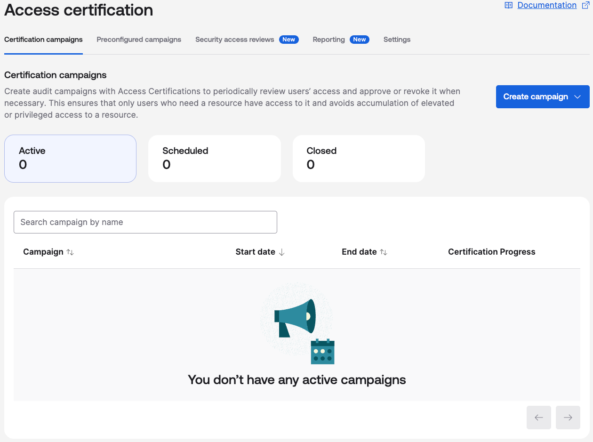
>
> This takes you into the access certifications section of Okta. This is
> the main management page showing the number of active, scheduled and
> closed campaigns (currently there are none) and listing the campaigns
> for each status (again, nothing at this stage).

3.  Click the **Create campaign** button which will provide two options:
    ***Resource Campaign*** and ***User Campaign***.

> 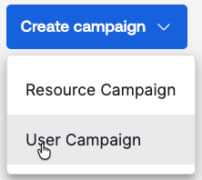

4.  Click on the **User Campaign** option.

> 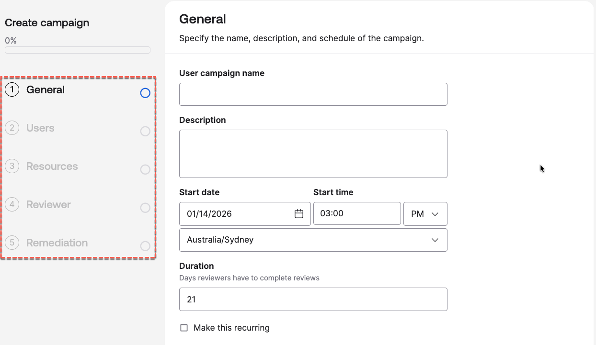
>
> The campaign creation process is set out like a wizard where you are
> guided through the configuration steps. As you progress the details
> are summarised on the right of the page.

5.  Give the new campaign a **name** and **description**.

> The start data and time will be automatically set to some time in the
> near future. You can specify a date/time or leave it and the campaign
> will be automatically launched on that date/time. As we will be
> manually launching the campaign we can leave it as is.

6.  Click on the **Make this recurring** option and have a look at the
    options to have this campaign relaunched and rerun periodically.

7.  Uncheck the **Make this recurring** option.

> 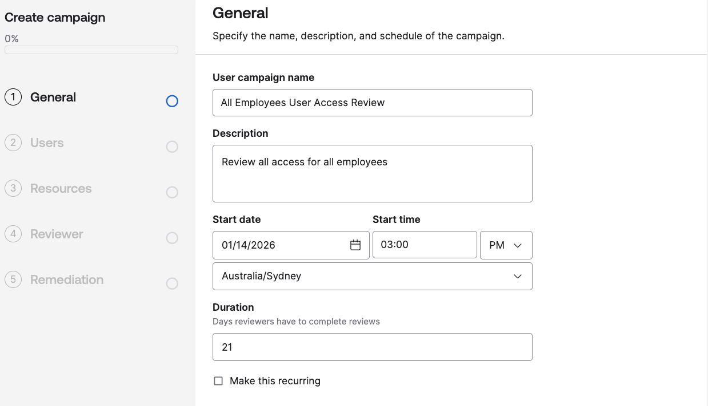
>
> 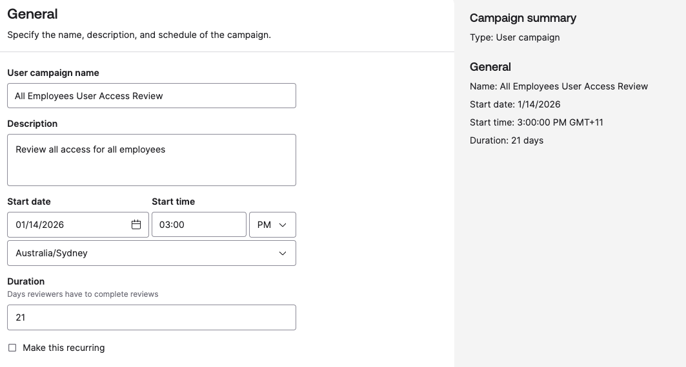

8.  Click the **Next** button at the bottom of the page. Note that you
    can move forward and back between the configuration pages as needed.

9.  On the **Users** page, in the **Select users or groups** field click
    the down arrow to see the options.

> 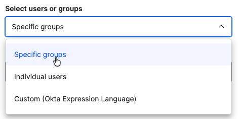
>
> You can define **Users** in the campaign via specific groups,
> selecting them individually or by using [<u>Okta Expression
> Language</u>](https://help.okta.com/en-us/content/topics/identity-governance/access-certification/iga-el-examples.htm)
> to determine users based on some user attributes or group memberships.

10. Leave Specific groups option selected for **Select users or
    groups**, and in the **Select groups** field, find and select the
    employee group.

> 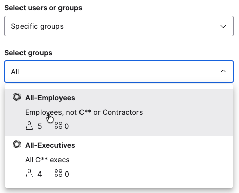
>
> Notice that the list includes the group name, description, number of
> users and number of assigned apps.
>
> 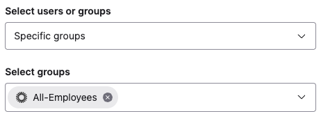

11. Click the **Next** button to move to the next page.

> 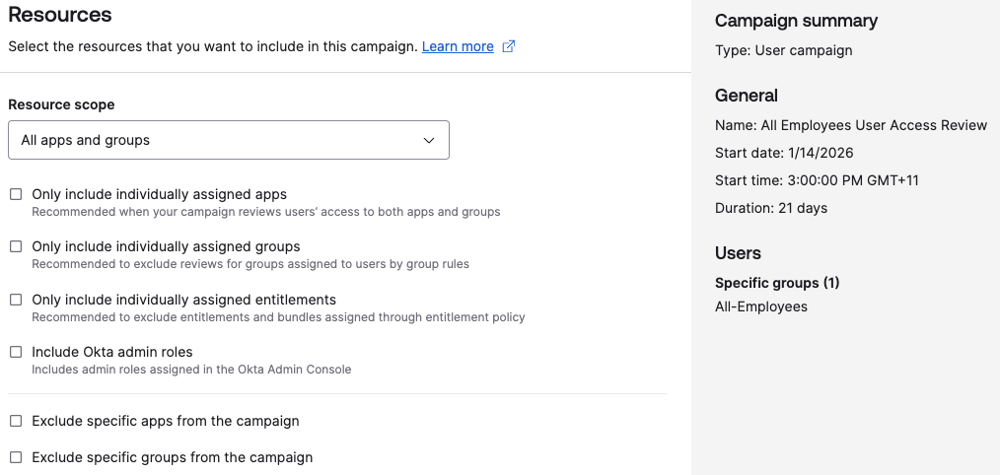
>
> The **Resources** page has many options to control which resources are
> to be reviewed for the selected users.
>
> 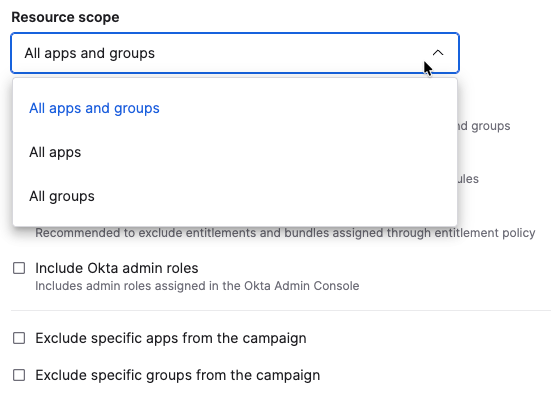
>
> You can limit it to all apps assigned to users, all groups assigned to
> users or both. You can limit it to individual user assignment or
> assignments via groups, include entitlements, and Okta admin roles.
> You can exclude specific apps or groups.

12. For this campaign select **Resource scope** of ***All apps and
    groups*** and leave all other options deselected. This will give the
    maximum number of resources for each user (other than Okta admin
    roles, but none of the employees are Okta admins).

13. Click the **Next** button to go to the Reviewer page.

> 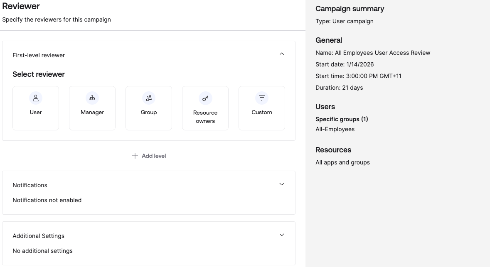
>
> First, look at the options under the Select reviewer heading. There
> are different reviewers you can assign to the campaign:

- **User** - a specific Okta user,

- **Manager** - the manager of the user being reviewed, based on the
  manager defined on the user profile,

- **Group** - a group of users,

- **Resource owners** - the owners of the resource (app, group,
  entitlement) defined for the resource being reviewed,

- **Custom** - defined using Okta Expression Language

> If you select one in error, you can return to the list of reviewer
> types by clicking the pencil icon beside the one you just selected.
>
> 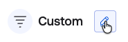

14. Select the ***Manager*** option so each user’s manager will need to
    review their access.

15. Specify a **Fallback reviewer** so that if there are users without a
    manager defined, there will be someone assigned to perform the
    review.

> 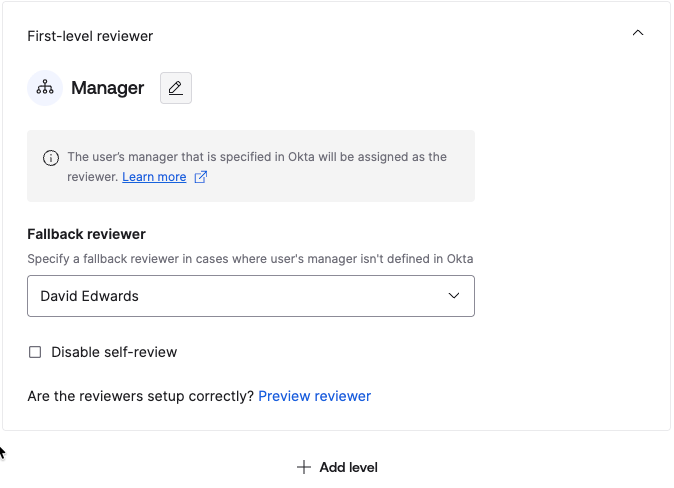
>
> There is a Disable self-review option to stop people from reviewing
> their own access if they somehow have themselves as their manager or
> they are the fallback reviewer. We will not use this.
>
> Once you have selected the reviewer, you could add a second level
> reviewer with the + Add level button. We will not do this.

16. Click the down arrow in the **Notifications** box.

> 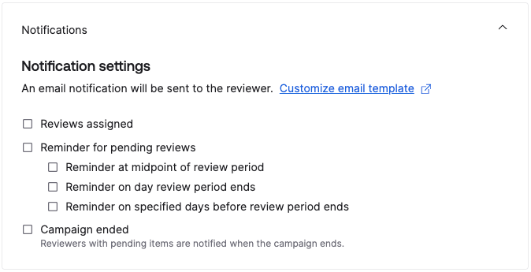
>
> This section allows selection of the different notification emails
> that can be sent out during different phases of the campaign,
> including reminder emails at specific points in the campaign. We will
> not use these as we will not look at the emails being sent.

17. Close this section (up arrow icon) and open the **Additional
    Settings** section (down arrow).

> 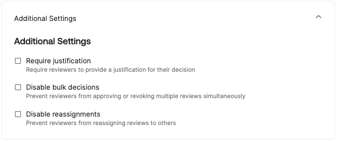
>
> The first option is to require justification for all decisions
> (approve, revoke, reassign). We will see this in action when we run
> the campaign.
>
> The second option is to disable bulk decisions. The way the reviewer
> UI is designed, you can multi-select reviews and apply a decision
> (e.g. select multiple apps for a specific user and click the Approve
> button). This multi-select capability can be disabled.
>
> This is a business security decision as allowing multi-select can lead
> to bad practices where reviewers just select all and approve without
> thinking about each one. This might be acceptable for low risk
> reviews. If you want a reviewer to focus on each review item, then you
> might want to select this option.
>
> The last option is to disable reassignments. By default reviewers can
> reassign a review item to someone else. This option will stop that
> option being presented to a reviewer.

18. Click the **Next** button to go to the Remediation page.

> 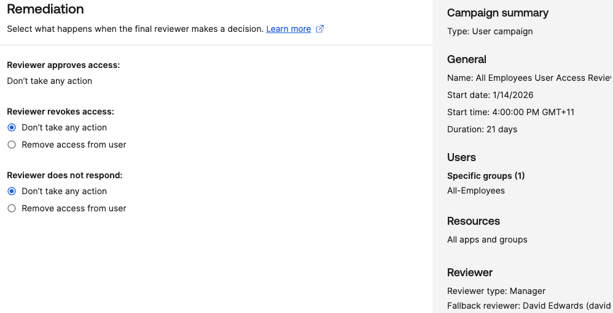
>
> This page is for the remediations when the following actions occur:

- When a reviewer approves a review item - there is no configuration
  here as the user retains the access.

- When a reviewer revokes a review item - there are two options when a
  reviewer says the user no longer needs access. The first is to NOT
  make any changes to access. The second is to remove the access in the
  review item.

- When the campaign ends - when the end data arrives and there are
  review items that haven’t been reviewed, you have the same two
  options: remove or retain access.

> The options you select here may depend on the type of application or
> access. It may also depend on the outcome desired. If you just want an
> audit trail of access that should be removed/retained, then not
> removing access is viable. If there is a risk in removing access that
> might not be obvious to the reviewer, then not removing access is
> viable.
>
> There is also the option to trigger bespoke processing (such as in
> Okta workflows) based on the revoke events written to the Okta System
> Log. In this case you don’t want the campaign to remove access, but
> instead leave it for the bespoke process.

19. Leave the default values as they are. Review all of the information
    in the right pane summarising the configuration of this campaign
    (notice how it’s been built up as you have moved through the pages).

20. Click on the **Schedule Campaign** button to save the campaign ready
    for launch.

> 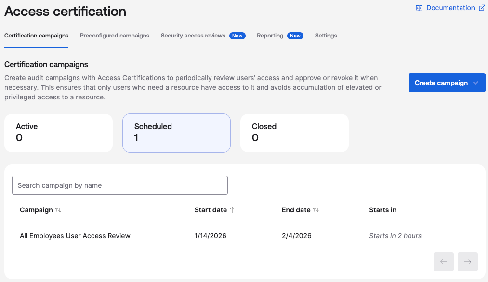
>
> You will also see a confirmation message appear in a green box on the
> bottom right of the screen. This will disappear automatically.

This campaign is now ready to launch.

### Launch the Campaign

Campaigns will automatically launch on the selected start date/time (as
shown in the previous screenshot). They can also be manually launched,
which we will do to speed up the process.

1.  As the administrator in the **Okta Admin Console** on the **Access
    certification** page, click on the campaign you just created.

> 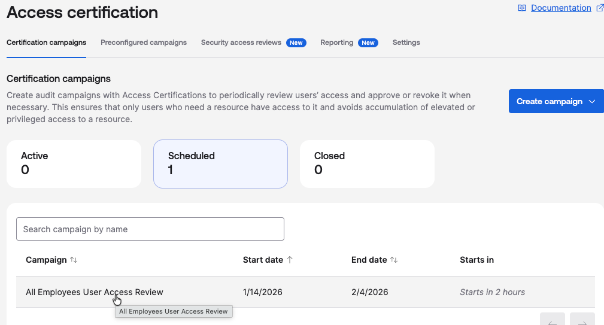

2.  Review the details of the campaign. It should reflect the settings
    you configured when you created the campaign.

> 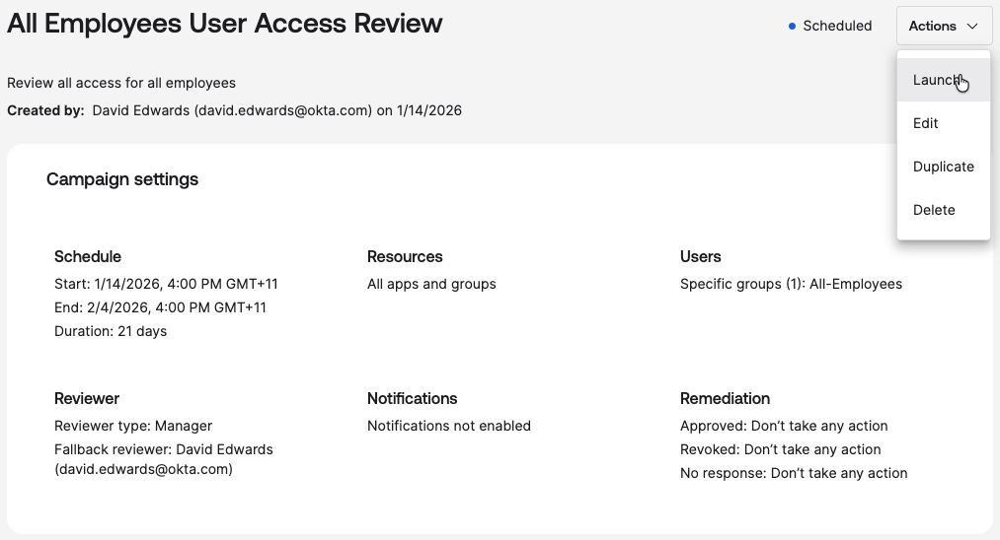

3.  Select **Actions \> Launch** to launch the campaign.

4.  On the **Launch campaign** confirmation dialog, click the **Launch**
    button.

> 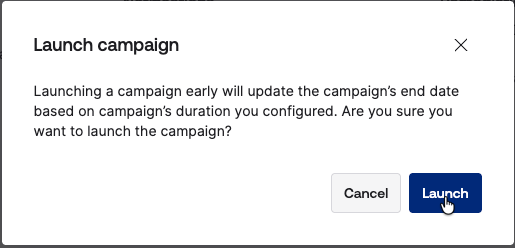
>
> A confirmation message is displayed and the campaign shows *Campaign
> launching* in the Starts in column.

5.  Click on the **Active** field to see the campaign once launched (it
    may take a few minutes to launch).

> 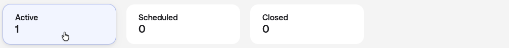

6.  Click on the campaign again to see the details.

> 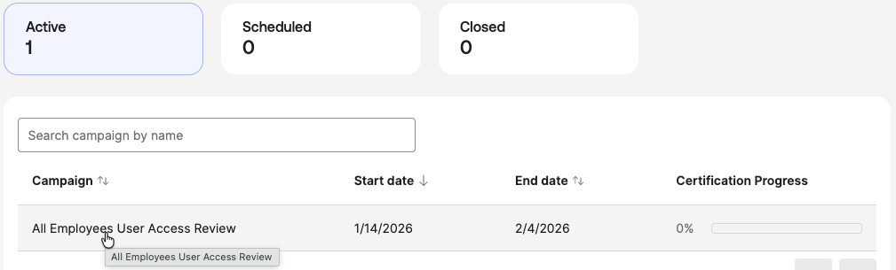
>
> Notice that there is a Certification Progress column for active
> campaigns. This Active view can be used to get an overview of the
> progress of running campaigns.

7.  Look at the information presented on the top of the campaign page.

> 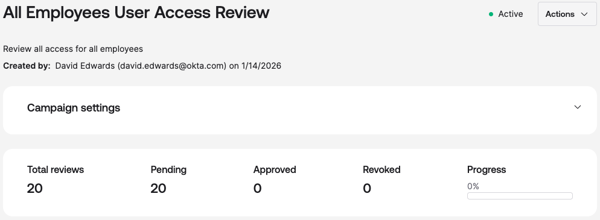
>
> It provides counts of the total, pending, approved and revoked review
> items.

8.  Scroll down to the section showing the review items for this
    campaign.

> 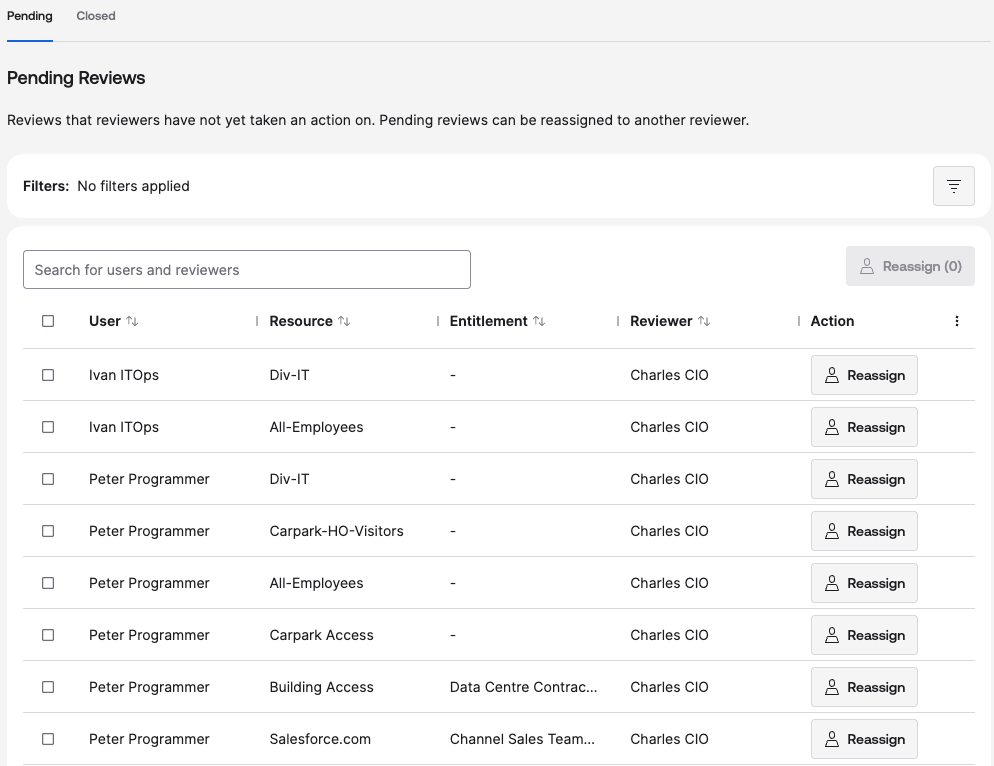
>
> There are two tabs - the **<u>Pending</u>** items and the
> **<u>Closed</u>** items. As there have been no reviews performed,
> there will be nothing in the Closed tab. The Pending tab shows all
> users with the resources, entitlements, reviewer and action.
>
> Each line in the table is a review item. Each reviewer will see a
> similar view.
>
> Some of the review items are groups and some are applications. Some of
> the applications have entitlements.
>
> The Action column shows the actions this admin can perform. There are
> no review items explicitly assigned to him, so he cannot
> approve/revoke any items. However he can reassign them. This is
> particularly useful if the assigned reviewer cannot perform the review
> in time (such as being on leave) and an admin needs to reassign all
> their review items. There is also the ability for reviewers to
> delegate their governance responsibilities to others.

This campaign is now launched and reviewers can process their assigned
reviews.

### Review Access

We will now look at the reviewer experience. If we had enabled the
notification feature and selected campaign launch, each of the reviewers
for this campaign (the users’ managers) would have received an email
telling them there is a campaign they need to review access in.

We will use one of the reviewers (in our case charles.cio) to review
some access.

1.  As the reviewer sign into the **Okta Dashboard**.

> 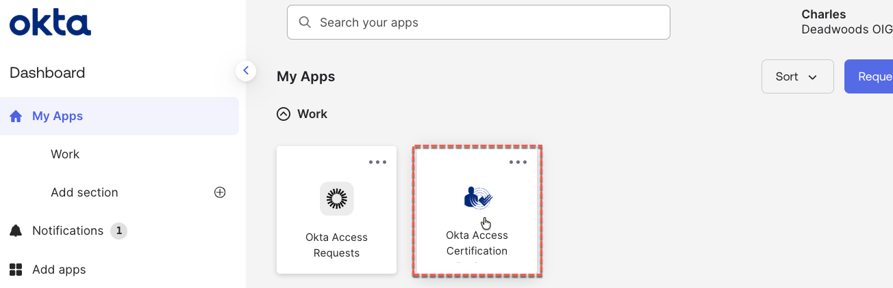
>
> There is a new tile showing - Okta Access Certification. This is tied
> to a group that OIG manages - whenever there is an active campaign,
> all the reviewers are added to this group and will see this tile on
> their dashboard.

2.  Click on the **Okta Access Certification** tile. The Access
    certification app opens.

> 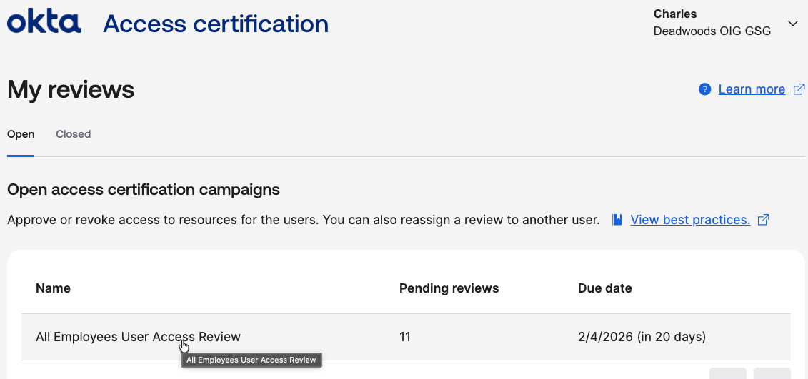
>
> This page shows all the Open or Closed campaigns where this user is a
> reviewer, including the number of pending reviews and due date for the
> open campaigns.

3.  Click on the campaign just launched to see the campaign details.

> 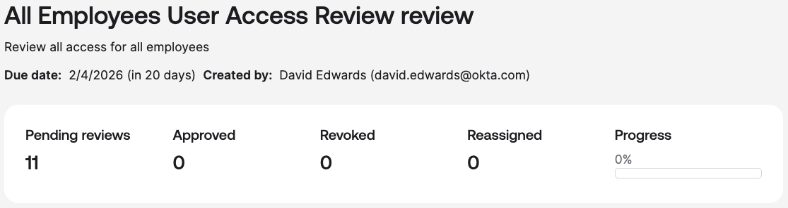
>
> The top of the page shows the campaign summary for this reviewer.

4.  Scroll down to see the review items.

> 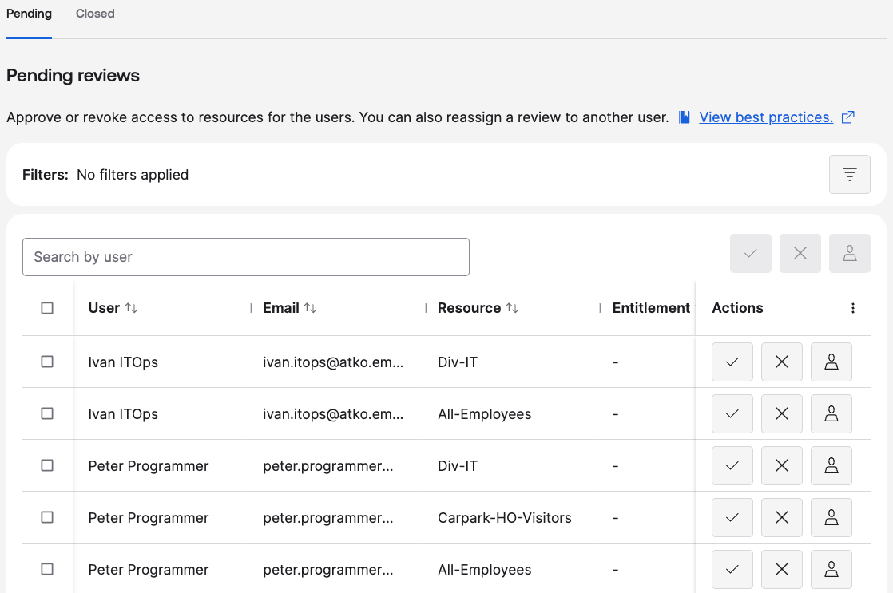
>
> The review sees a table view of either the **<u>Pending</u>** or
> **<u>Closed</u>** review items for them (similar to the admin view).
>
> Depending on the screen width, you will see either icons or icons+text
> for the Actions.
>
> 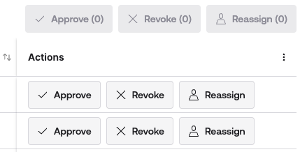
>
> The actions are to approve, revoke or reassign a specific item. Also
> there are multi-select boxes beside each item to allow for bulk
> actions (as we did not disable this option in the campaign settings).
> We will come back to the actions.

5.  Select one of the rows where the resource is a group.

> 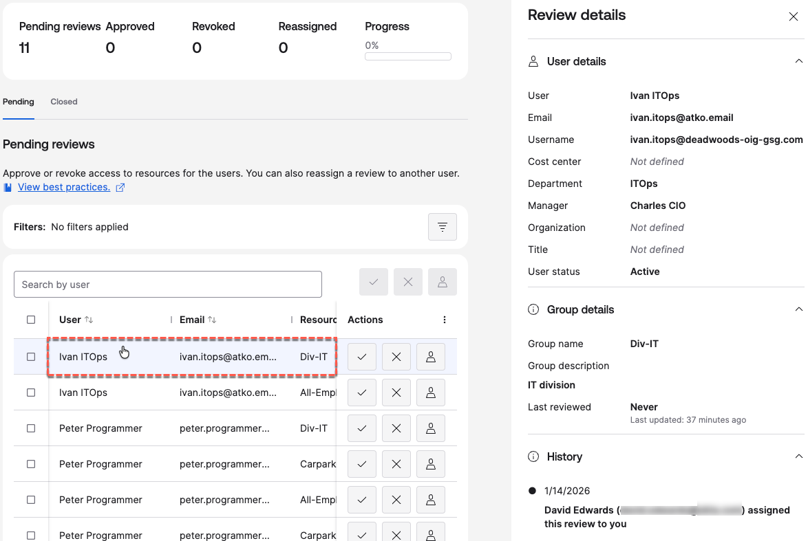
>
> A panel will slide out from the side of the screen showing details of
> the review item. It shows information about the user (pulling data
> from their profile). As this resource is a group, it shows information
> about the group. It also shows a history of this review item in this
> campaign (i.e. it’s just been created so it only shows this item being
> assigned to this reviewer).

6.  Close the panel and select an item with an application and
    entitlement.

> 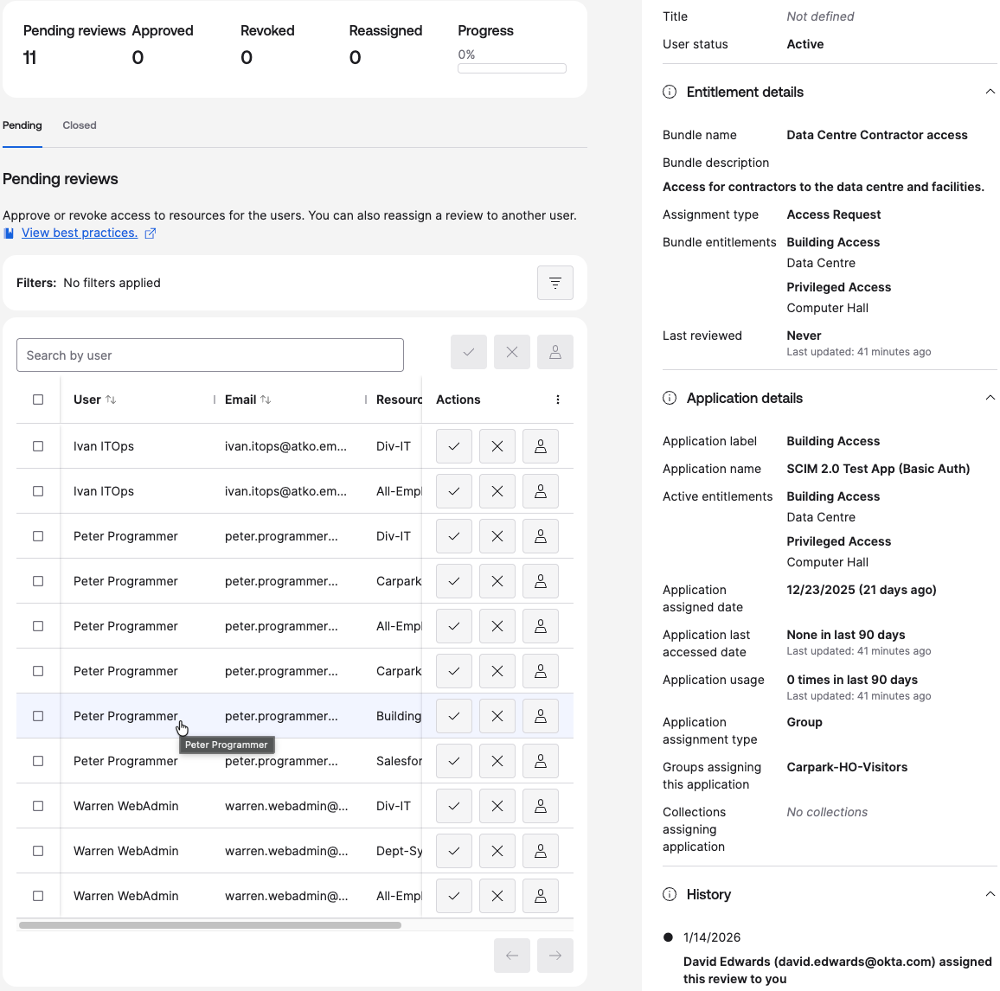
>
> In this case a lot more information is provided in the slide out panel
> for both the entitlement and application. This includes whether it was
> a bundle (access request) or specific entitlement (entitlement
> policy). For the application it shows the details of the application
> and when it was assigned, how it was assigned (in this case it was via
> a group) and when it was last accessed via Okta.

7.  Close the panel and select one of the group entitlements. Click the
    **Revoke** action.

> 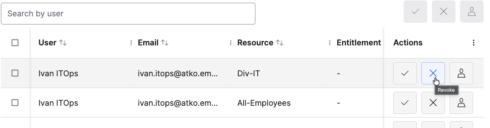
>
> A **Revoke access** confirmation dialog is displayed.
>
> 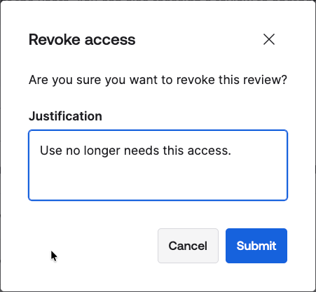
>
> Recall during the campaign configuration there was an option to
> Require justification (that we did NOT select). That option would make
> this field mandatory instead of optional.

8.  Enter a **Justification** and click the **Submit** button.

> The item disappears from the Pending view and goes to the Closed view
> (we will check this in a minute).

9.  Select multiple application accesses.

> 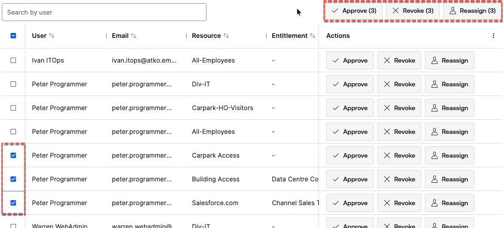
>
> Notice that the Approve/Revoke/Reassign items at the top of the table
> now have (3) beside them (you will not see this if you have the
> compressed view only showing icons). This indicates you can action all
> items together. If you had selected Disable bulk decisions in the
> campaign configuration, you would not be able to do this.

10. Click on the **Approve** option for the bulk items.

11. On the **Approve access** confirmation dialog, Ignore the
    **Justification** field, and click the **Submit** button.

> If you look at the summary numbers at the top of the campaign you will
> see the numbers have changed to reflect the approve and revoke
> actions. Also the progress has been updated.
>
> 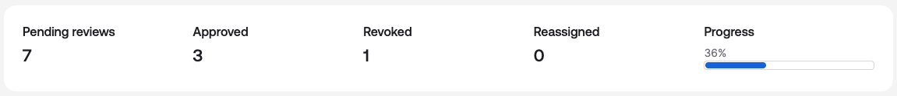

12. Click on the **<u>Closed</u>** tab to see the items you have
    reviewed.

> 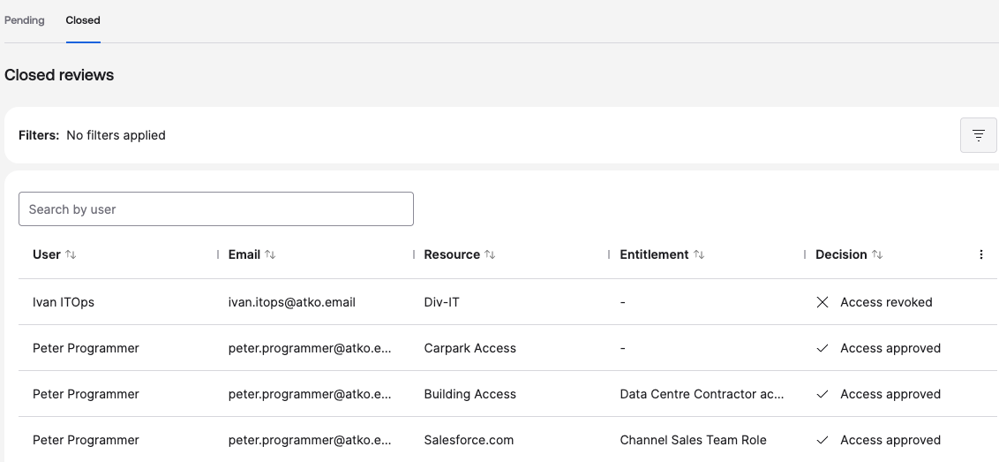

13. Click on the item where you revoked access (***Access revoked*** in
    the **Decision** column).

> 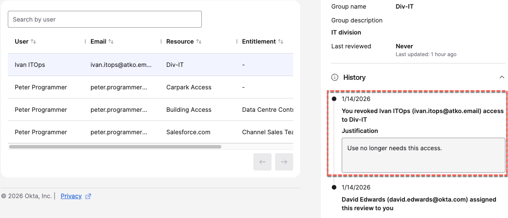
>
> Notice how the history has been updated.

We will not review all the items in this campaign. Nor will we cover
reassignment as this is trivial.

### Managing Campaigns

We will not review all the items in this campaign. Nor will we cover
reassignment as this is trivial. We will go back in as the admin to
confirm the updates.

1.  Go back into the administrators view of the Access Certification
    campaign as the admin you created the campaign with.

> 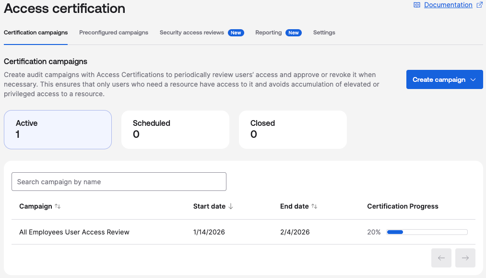
>
> The progress for this campaign has been updated.

2.  Select the campaign.

> 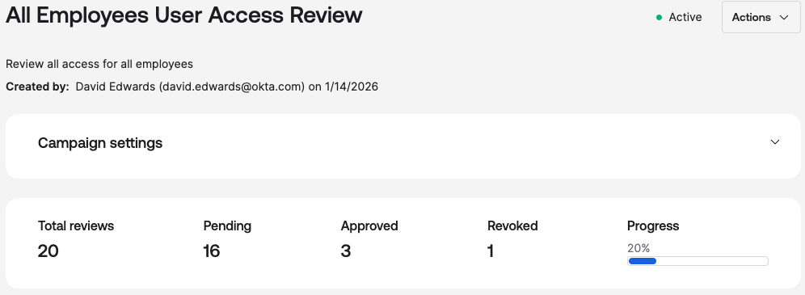
>
> The counts for the campaign and the progress bar have been updated.

3.  Go to the **<u>Closed</u>** tab to see that the items we saw closed
    as the reviewer are also reflected here.

4.  Click the **Actions** menu.

> 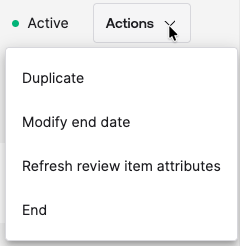
>
> An admin can
> [<u>duplicate</u>](https://help.okta.com/en-us/content/topics/identity-governance/access-certification/copy-campaign.htm)
> the campaign (pick up all the settings and create a new campaign),
> extend the campaign. Refresh the view or close the campaign now (End).

5.  Click the **End** option to close the campaign early.

> 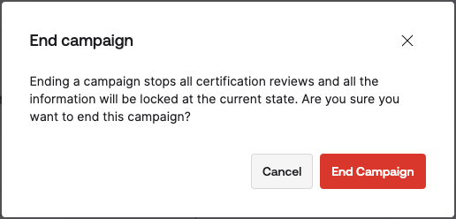

6.  On the **End campaign** confirmation dialog, click the **End
    Campaign** button. This will move it to the closed status.

> 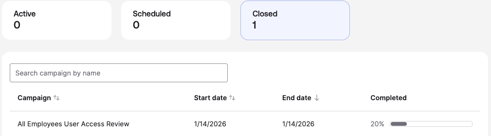

This concludes the first access certifications lab looking at a user
access review (user campaign) and exploring most of the configuration
settings as we walked through it. The next lab will look at a resource
campaign with entitlements.

---

[← Introduction to the Labs](02-introduction-to-the-labs.md) | [Lab 3.2 - Resource Campaign with Entitlements →](04-lab-32---resource-campaign-with-entitlements.md)
