## Lab 3.2 - Resource Campaign with Entitlements

In this lab we will walk through creating and running a resource
campaign. The difference is that a resource campaign is focused on the
resource and who’s attached to it, rather than a user campaign that is
looking at the resources attached to a user.

This lab will use an app with entitlements. The example will use the
Building Access app from previous labs, but you could use any
entitlement-enabled app.

The flow is almost exactly the same as for the previous lab so we won’t
show all the screens, just highlight the key differences.

### Create a Resource Campaign

We will walk through the creation of the campaign:

1.  Log into the **Okta Admin Console** as an administrator.

2.  Go to **Identity Governance \> Access Certifications**

3.  Click the **Create campaign** button, then select ***Resource
    Campaign***.

4.  On the **General** page:

- Give the campaign a **name** and **description** based on the app you
  will review

- Accept the **Start date** and **time**

- Accept the **Duration**

- Do not select Make this recurring

- Select the **Create auditor reporting package** (which we will use in
  the Reporting labs later).

5.  Click the **Next** button to go to the **Resources** page.

> 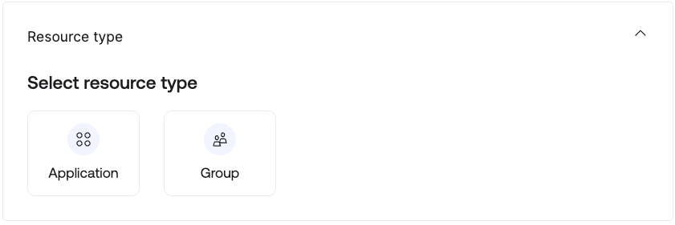
>
> There are two resources you can select, Application and Group. With
> Application you are certifying the users assigned to the app(s), with
> Group you are certifying the users assigned to the group(s).

6.  Click the **Application** tile.

7.  In the Select applications field, search for and select the
    application(s) you want to add.

> 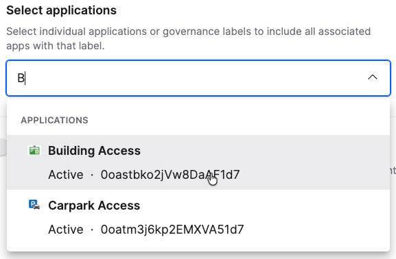

8.  Enable the **Review entitlements** option.

> 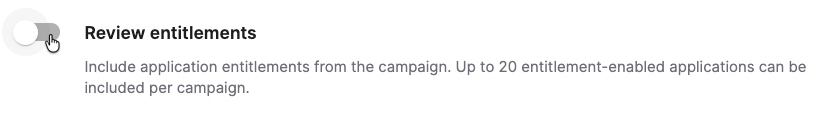
>
> An Entitlements section is displayed for the app you selected.

9.  Expand the list of options in the **Select scope** field.

> 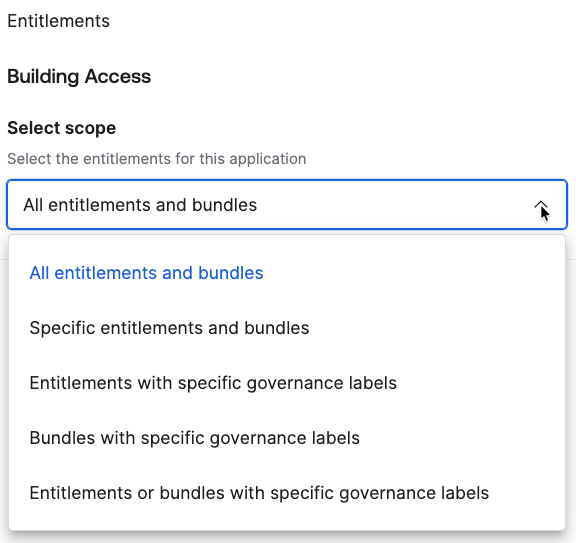
>
> You can select all or specific entitlements and bundles. There are
> also options to leverage governance labels for selection. We do not
> cover these in the labs but there is a [<u>Governance
> Labels</u>](#resource-labels) topic in the [<u>Advanced
> Topics</u>](#advanced-topics) section.

10. Select ***All entitlements and bundles***.

11. Click the **Next** button to go to the **Users** page. Here you
    define the users scope (for users assigned the resources).

> 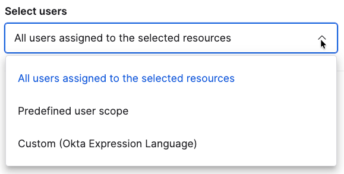
>
> The options are:

- All users assigned to the selected resource

- Predefined user scope - there is currently only one predefined user
  scope and that’s users with SoD violations. You could run a campaign
  to show only users with SoD violations.

- Custom using Okta Expression Language

> You can also exclude specific users. For example you may want to
> exclude sensitive users from a review.

12. Select the ***All users assigned to the selected resources*** option
    and do not select the **Exclude users from the campaign** option.

13. Click the **Next** button to go to the **Reviewer** page.

14. This is the same as you had with the user campaign. Select
    ***Manager*** as the reviewer and set a Fallback reviewer

15. Click the **+ Add level** option and select ***Group*** as the
    **Second-level reviewer**.

16. In the expanded view, select a group to be the reviewers (for
    example the execs group).

17. In the **Additional level settings** section, leave the **Only
    approved decisions option** selected (if an access is revoked we
    don’t want it to go to the second level reviewer).

18. Leave the slider where it is (Day 14) for when the second-level
    reviews are to begin.

> This is the time where the first-level of reviews are automatically
> expired and passed to the second-level reviewers. If you approve an
> access before this time, it will automatically go to the second-level
> reviewer even if before this setting. We will show this later in this
> lab.
>
> More details on how this works can be found in the [<u>product
> documentation</u>](https://help.okta.com/oie/en-us/content/topics/identity-governance/access-certification/iga-ac-create-campaign.htm?cshid=csh-resource-reviewer-type#Configur2).
>
> 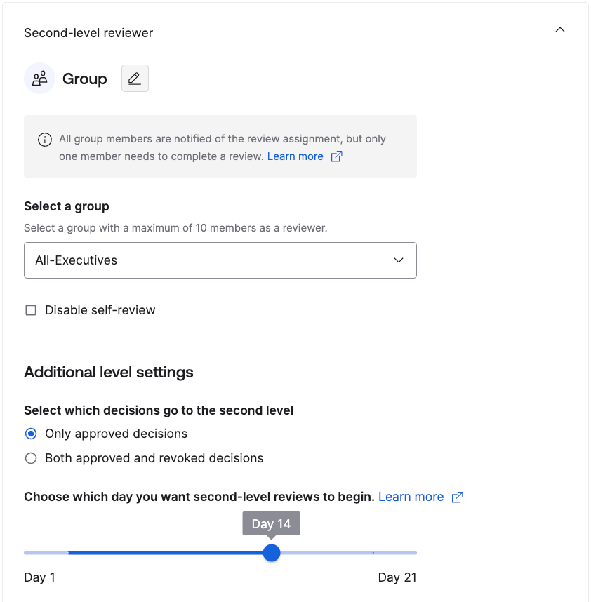
>
> You could select the **Disable self-review** as you might get execs
> reviewing themselves.

19. Expand the **Additional Settings** section and enable (select) both
    the **Require justification** and **Disable bulk decisions**
    options.

> 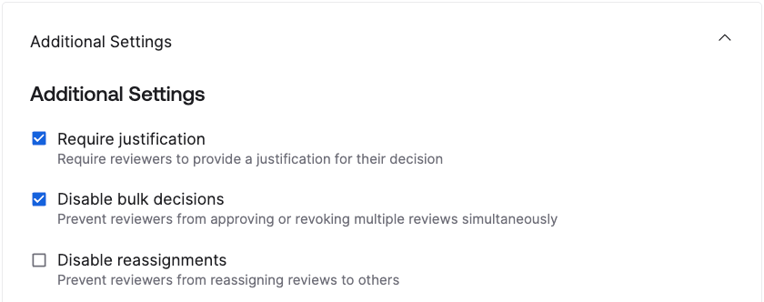

20. Click **Next** to go to the Remediation page.

21. Select **Remove access from user** in the **Reviewer revokes
    access** section.

> 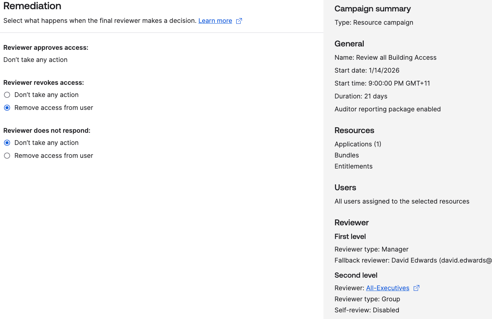

22. Review the **Campaign summary** and click the **Schedule Campaign**
    button.

As before the campaign can be launched.

### Launch the Campaign

1.  As in the previous lab, go into the new campaign and use **Actions
    \> Launch** to launch it.

2.  On the **Launch campaign** confirmation dialog, click the **Launch**
    button.

3.  When the campaign becomes **Active**, select it to open it.

4.  Scroll down to the **<u>Pending</u>** review items.

> 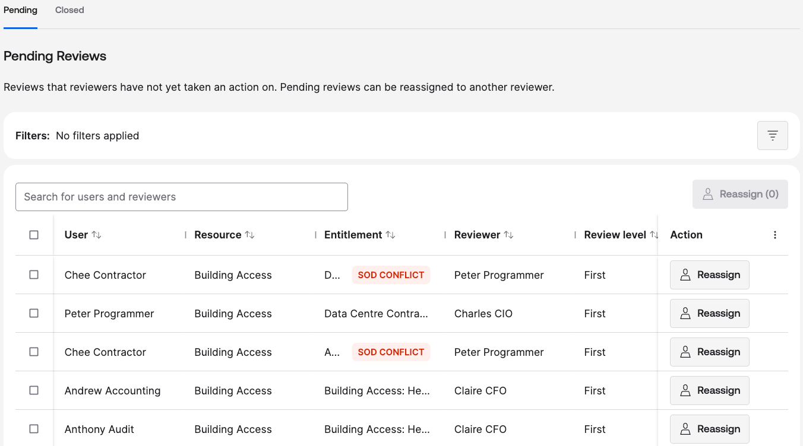
>
> If you ran the [<u>SoD access
> request</u>](#lab-2.3---request-conditions-with-sod-checking) lab
> earlier against this application, you should see a SoD conflict.
>
> The columns in the table are sortable. You can select one of them,
> like the User column, to sort that column.

5.  Select the review item (table row) with one of the **SOD CONFLICT**
    flags.

6.  In the slide-out panel, scroll down to see the **SOD conflict
    details** section.

> 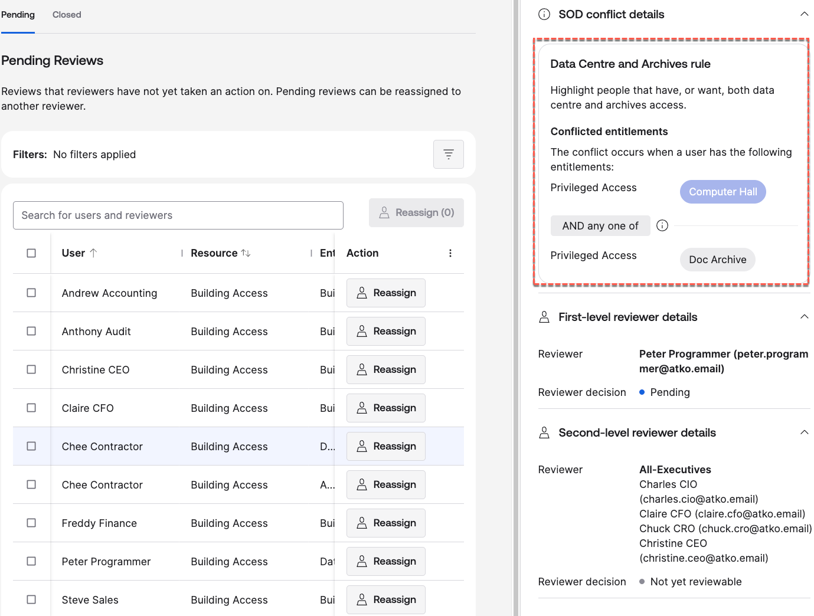
>
> This highlights the SoD rule that was triggered for this user.
>
> The panel also shows the two levels of reviewer, with the manager (in
> this case the contractors supervisor) as the First-level reviewer, and
> the group as the Second-level reviewer (with all the members listed
> out).

Reviewers can now perform their reviews.

### Run the Campaign

For this section we will use the contractor supervisor to review access
as that will show the SoD violation, but you could use any of the
managers.

1.  Log into the **Okta Dashboard** as your reviewer.

2.  Click on the **Okta Access Certification Reviews** tile.

3.  Click on the new resource campaign.

> 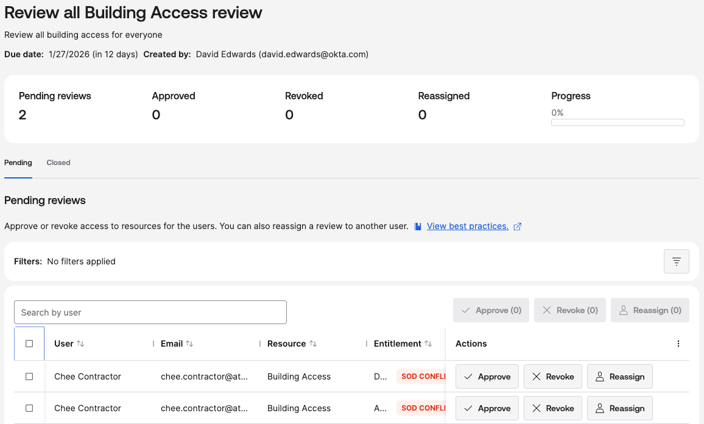

4.  Before looking at the items, select both rows and observe what
    happens to the bulk actions.

> 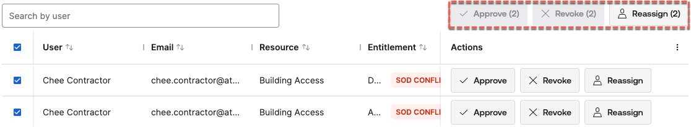
>
> Multiple items can be selected, but only the Reassign action is
> available. This is because we selected Disable bulk decisions.

5.  Deselect all, and select one of the rows. The slide out panel will
    show the same information.

> 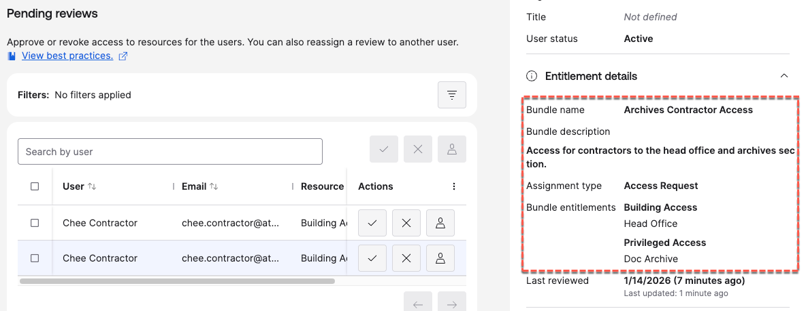
>
> If you recall the Access Request labs where we exposed Entitlement
> Bundles to be requestable, one lab allocated the first bundle and then
> the following lab triggered a SoD violation but we allowed the user to
> have the second bundle. We can see the violation further down the
> slide-out panel.
>
> 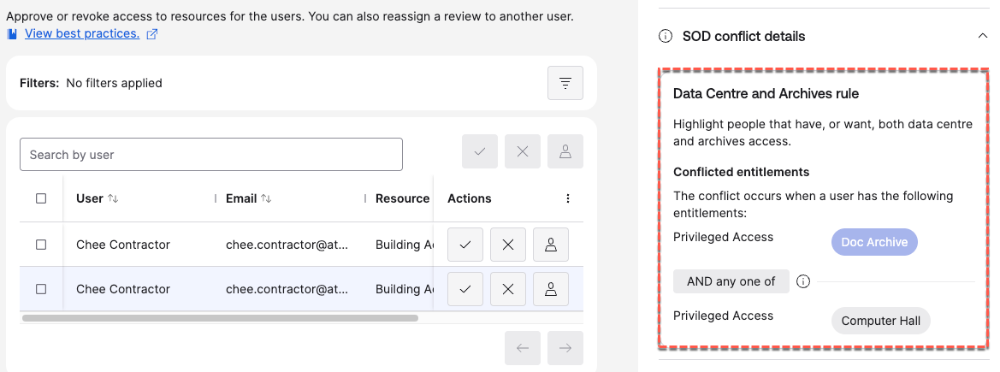
>
> In this scenario the reviewer can see the two entitlements in conflict
> in the same place and decide which access to revoke.

6.  Close the slide out panel, then **Approve** one of the entitlement
    bundles in conflict.

> Notice that you cannot submit the approve action until you add a
> justification.
>
> 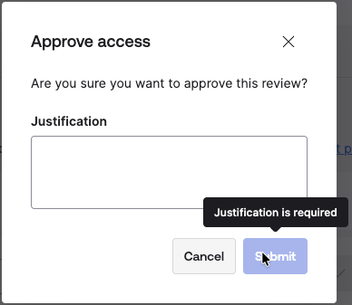
>
> This is because of the **Justification required** option we set when
> creating the campaign.

7.  Enter a justification for each and click the Submit button.

8.  **Revoke** the other access in conflict and supply a justification
    and **Submit**.

9.  This will remove them from the Pending view. Go to the
    **<u>Closed</u>** view.

> 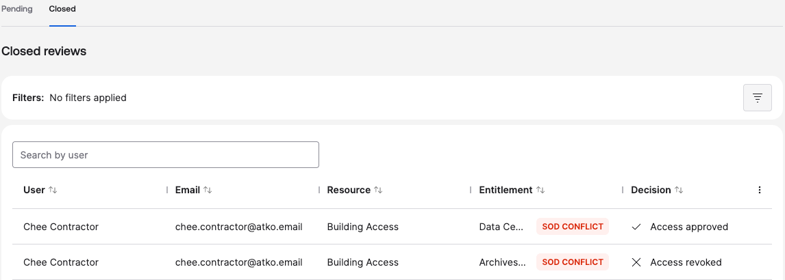

When this access is removed as a result of revoking the second
entitlement bundle, the SoD conflict will be removed (and not show up on
any SoD reporting). However in the context of the campaign, which is a
point-in-time view of the users and their assigned resources, the
conflict is still there.

### Managing the Campaign

1.  Return to the administrator and their view of the active campaigns.

2.  Select this campaign.

> 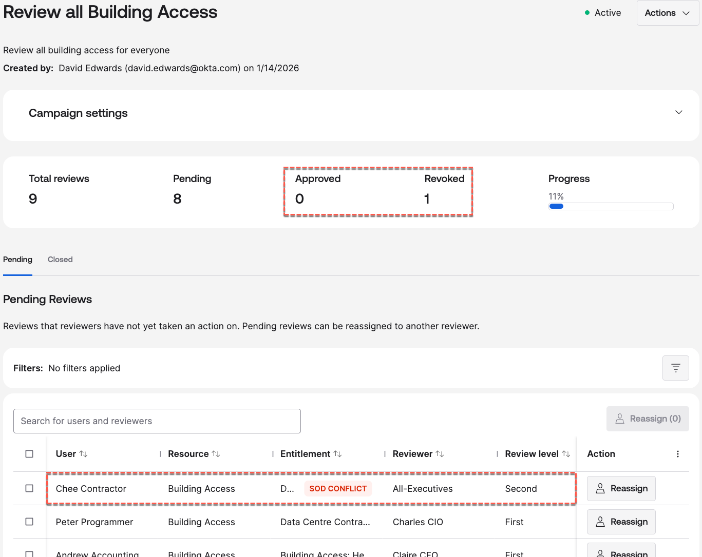
>
> Notice the Approved and Revoked counts. Revoked=1 as expected, but
> Approved = 0. Why is this? Because we have a second level approver
> configured and they will see all Approval actions and be able to
> revoke them.
>
> Then have a look at the review items. The approved entitlement bundle
> that contributes to the SoD conflict is showing a Review level of
> Second, meaning it’s ready for second-level review.

3.  Log into the **Okta Dashboard** as one of your second level
    reviewers, go to the **Okta Access Certification Reviews** tile and
    open the campaign.

4.  Go to the SEcond-level reviews

> 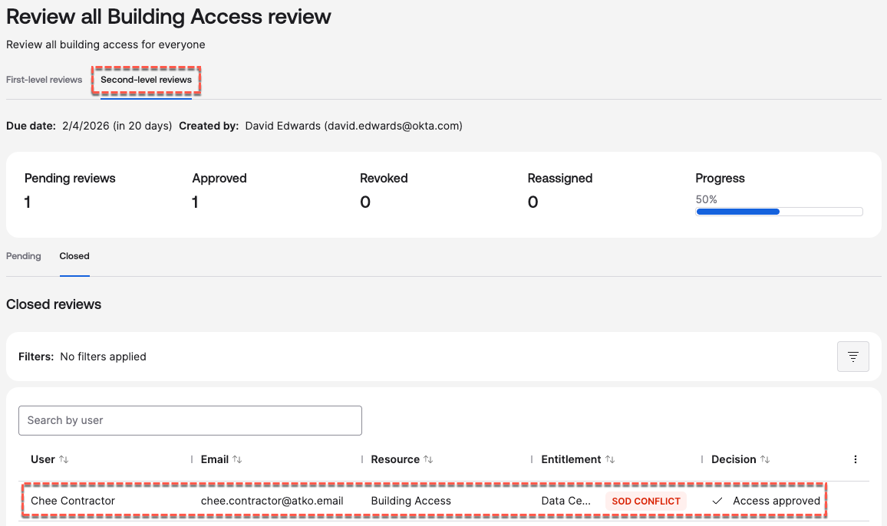
>
> You should see the one review item (of the SoD pair) that was approved
> by the first-level reviewer.

5.  **Approve** this access.

> 

6.  Return to the Okta Admin Console as the administrator and select the
    campaign as before (if you left it running in another window you may
    need to refresh it).

7.  Go to the **<u>Closed</u>** review items tab.

> 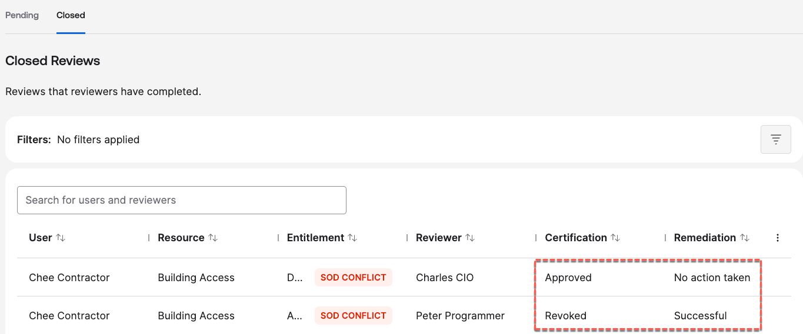
>
> You should see both entitlement reviews that were in the SOD CONFLICT
> showing. One should be shown as approved by the second-level reviewer.
> The other should be shown as Revoked by the first-level approver, and
> the Remediation was Successful (meaning the access was removed).

8.  As before, use the **Actions \> End** option to close the campaign.

9.  To confirm, go to **Applications \> Applications** and select the
    application (Building Access).

10. Find the user assigned to the application that was just reviewed and
    **View access details**.

> 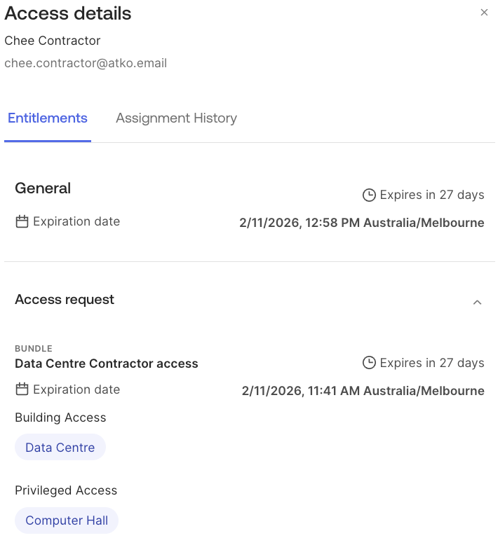
>
> You should only see one entitlement bundle on the user.

11. Go to the **<u>Assignment History</u>** tab.

> 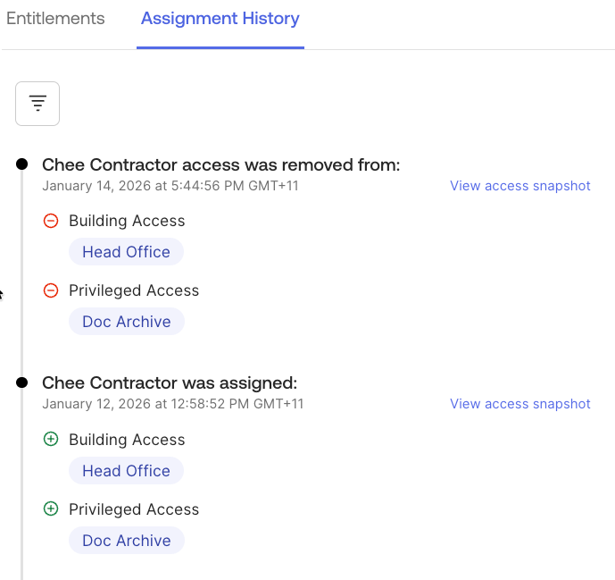
>
> You should see where the second bundle was removed as part of the
> revocation of access in the campaign. The second entry shown above was
> when the entitlement bundle was added to the user via an Access
> Request (earlier lab).

12. Finally go to the **Okta System Log** entries for this user. You
    should see an event where the entitlements were updated.

> 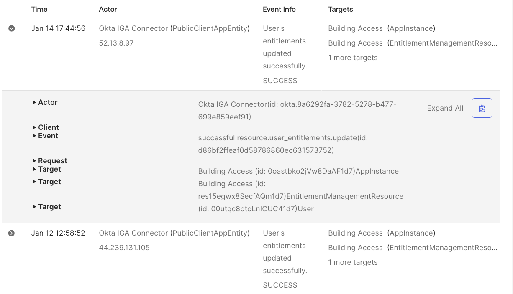
>
> The recent event, a resource.user_entitlements.update event, is for
> removing the access. If you drill into the event you will see in the
> DebugData that the event was a DENY action for the entitlement bundle.
>
> Again, the second entry shown is for the entitlement bundle being
> added in a previous lab.

This concludes the lab looking at a resource campaign. We have shown how
to configure and run a resource campaign and how it differs from a user
campaign. We have also used this lab to show how we can resolve SoD
Conflicts on entitlements through access certification.

This also concludes the section on Access Certifications. There are many
more ways to use campaigns and we will talk to some of them in the
[<u>New Access Certification
Capabilities</u>](#new-access-certification-capabilities) section later
in this document. There are also many examples on the internet on access
certification with OIG and extending them through Workflows and APIs.

---

[← Lab 3.1 - User Access Review](03-lab-31---user-access-review.md)
