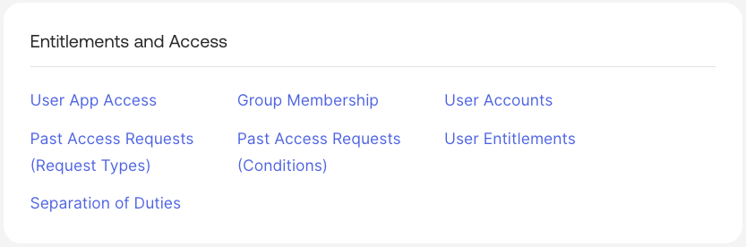
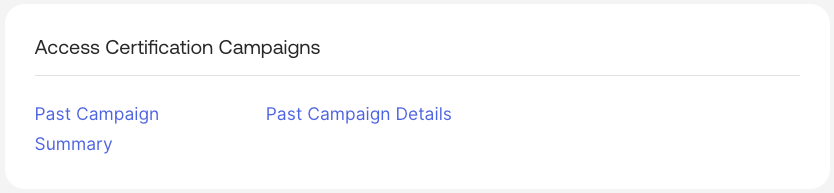
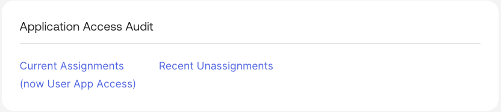
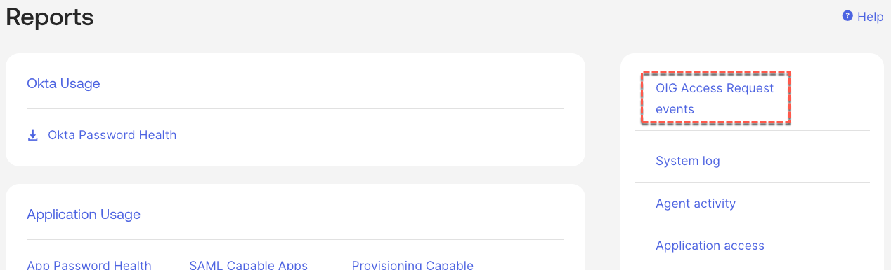

## Reporting in Okta Identity Governance

### Standard OIG Reports

The main focus for OIG reporting is the out-of-the-box reports provided
in the Okta Reports menu. There are a number of IGA-specific reports
available in addition to the standard Okta reports that may be relevant
to governance needs.

The Okta reports follow two patterns:

- Reports that are generated in real-time and presented in the Admin UI
  (and can be filtered and downloaded as CSV files).

- Reports that are generated in the background and an email is sent to
  the report requester indicating where they can be downloaded from.

The reports fall under three reporting categories:

- **Entitlements and Access** - reports presenting assignments, access
  requests and SoD.

> 

- **Access Certification Campaigns** - view the summaries and detailed
  results of past campaigns.

> 

- **Application Access Audit** - reports specifically looking at
  assignments, including recent un-assignments.

> 

There are some limitations on reporting you should be aware of.

- Firstly there is no scheduling or delivery mechanism for reports, nor
  is there an API to programmatically access them.

- Some of the reports are leveraging live data, whereas others are
  leveraging data that has to be stored in a background process and may
  not be available immediately. The Access Certification Campaign
  reports are an example of this - the reports may not show the most
  recent campaigns depending on when the data sync ran.

- There is no compliance reporting.

- There is no bespoke reporting mechanism.

We will explore some of these reports in the first lab.

### Access Certification Reporting

When creating access certification campaigns there is an option to
create an auditor reporting package. When the campaign completes there
will be a report, accessed via the Access Certification app, to generate
and view that report.

We will look at this in a lab.

### Okta System Log Reporting

As all events for entitlements, access requests and access certification
are written to the Okta System Log, you could build custom reports based
on the different event types associated with the OIG functions. This is
standard System Log functionality.

For example, I could create a filter of eventType sw “access” for all
access request events and save the filter to a custom report. This will
then appear in the list of reports on the right of the Reports page.

All of the current [<u>event
types</u>](https://developer.okta.com/docs/reference/api/event-types/)
are shown on the okta Developer site.

We will not run a lab on this.

---

[Introduction to the Labs →](02-introduction-to-the-labs.md)
