## Lab 4.1 - Explore Standard OIG Reports

In this lab we will walk through some of the standard OIG reports
available.

### Locate the OIG Reports

To find the standard OIG reports:

1.  Log into the **Okta Admin Console** as an administrator.

2.  Go to **Reports \> Reports**.

3.  Scroll down to find the three OIG report sections mentioned above..

> 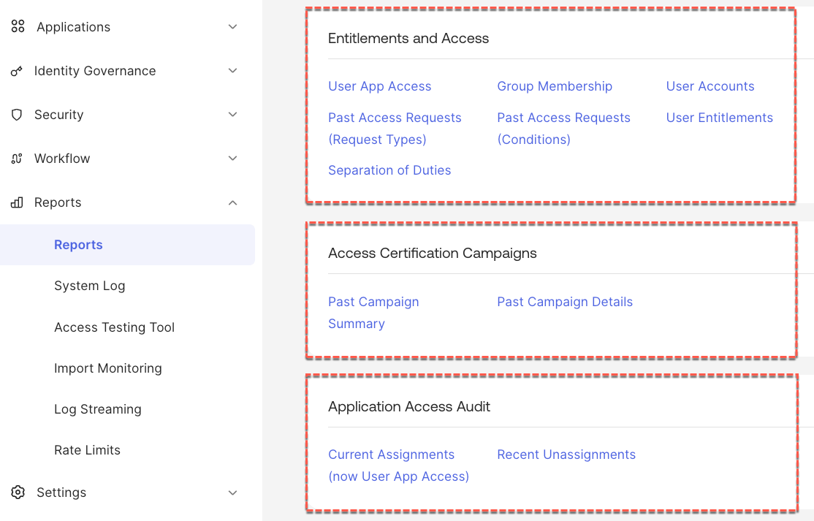

From here we can run the reports.

### Run Entitlement and Access Reports

Now let's have a look at some of the reports in the Entitlements and
Access section.

User App Access Report

1.  Click on the **<u>User App Access</u>** report. It may take a few
    seconds to fill the table.

> 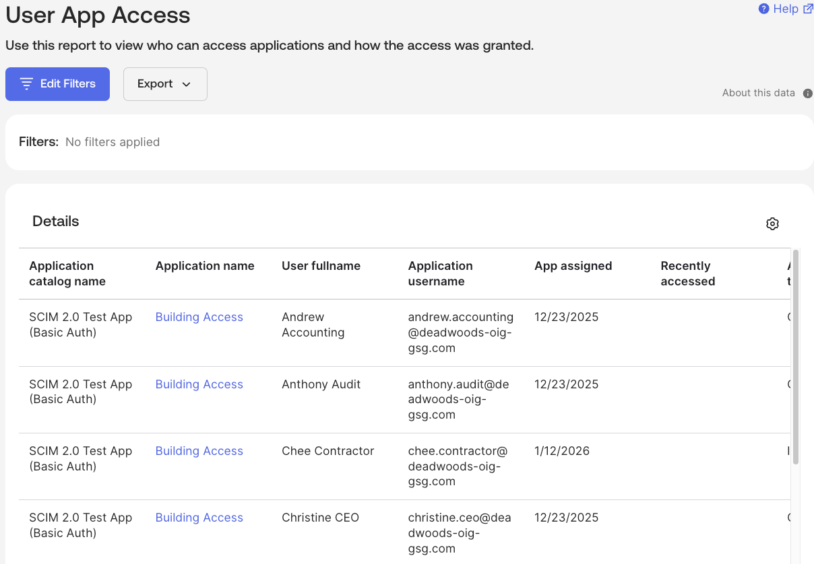
>
> This report shows all users and their app accesses. It sorts by
> application by default.
>
> The report may be too wide for your window, so you may need to scroll
> right to see the other columns.
>
> Useful information shown includes the app name, the user fullname and
> application username (account name), when it was assigned and how it’s
> assigned (individual or group), and if it’s by group, what that group
> is, where the group is from and how the user is assigned to the group.
>
> Notice the Filters section shows No filters applied. We can apply
> filters to make working with the report easier.

2.  Click on the **Edit Filters** button.

3.  Set a filter, such as **Field** ***User fullname***, **Operator**
    ***equals***, and **Value** Peter Programmer (or one of your users).

> 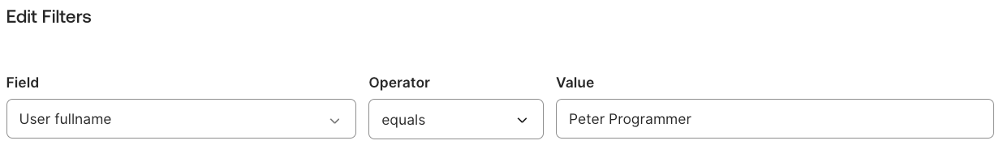
>
> Notice that you have a range of fields you can use, and you can have
> multiple filters (combined with an AND).

4.  Click the **Apply** button.

> 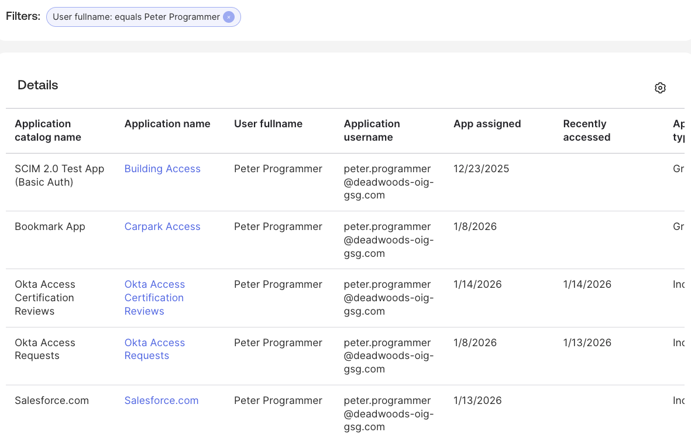
>
> The filter is shown and the filtered list presented.

5.  Click the **Export** button to see the export options.

> 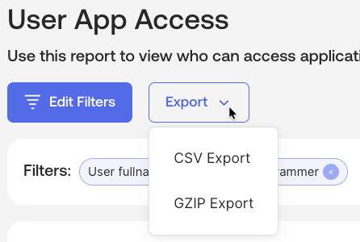
>
> The filtered report can be exported as a CSV file or a CSV file zipped
> in GZIP format. There is no PDF export option.

6.  Click the **CSV Export** option to download the file. Click the
    Dismiss button on the confirmation dialog.

> 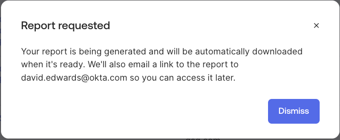
>
> For the report to be downloaded directly, you need to allow pop-ups.

7.  Open the CSV file and check its contents match the report.

> 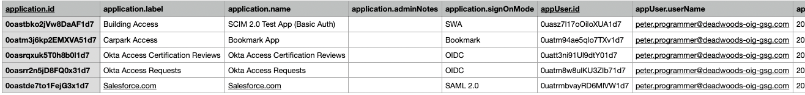
>
> You will see that the report contains a lot more information,
> particularly about the user, than was shown online.

8.  Back on the Okta Admin Console, click the **<u>Back to Reports</u>**
    link.

#### Past Access Requests Reports

There are two Past Access Request reports, one for Request Types and one
for Conditions. Both have a similar output, but need separate reports
because of the way the data is stored and accessed.

9.  Click on the **<u>Past Access Requests (Conditions)</u>** report.

> 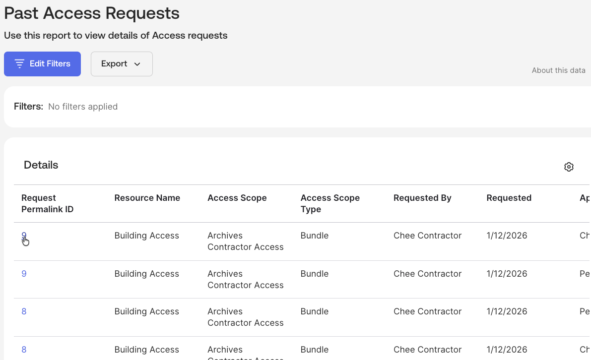
>
> The report shows all access request conditions run for all users..
>
> It shows the resource name, access scope name and type (e.g. one of
> the entitlement bundles), who requested it and when, who the approver
> was and their decision, the condition run and time to resolve, and the
> outcome (status).
>
> Note that the first column is a link to the condition (or request
> type) that will take the user into the Access Requests Platform UI to
> that item.
>
> As before you can filter and export the report. This report also has a
> PDF Export option.

10. Click the **Export \> PDF Export** option

11. When prompted to **Choose columns**, select the **All** option and
    click the **Apply** button. Again click **Dismiss** on the
    confirmation.

12. The report opens in a new browser tab (you can download from there).

> Have a look at it. Showing all columns makes the reports somewhat
> unreadable, so you may want to consider what information you want in
> the report (or use CSV and edit in your spreadsheet tool.

13. Back on the Okta Admin Console, click the **<u>Back to Reports</u>**
    link.

#### User Entitlements Report

14. Click on the **<u>User Entitlements</u>** report.

> 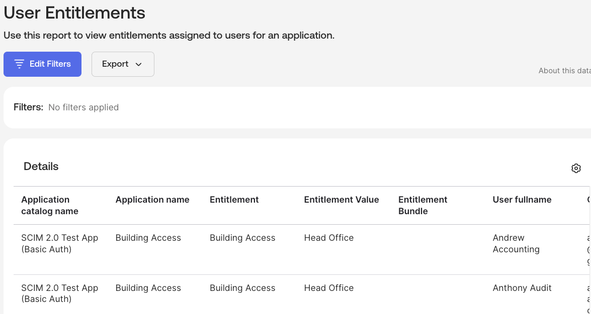
>
> This report is focusing on the application entitlements. It shows the
> app, entitlement name and value, whether it was a group or individual
> assignment and how it was granted (e.g. policy, entitlement bundle).
>
> This is a great report to see a complete view of entitlements granted
> across all users in an application (like Salesforce).

15. Back on the Okta Admin Console, click the **<u>Back to Reports</u>**
    link.

Another report worth exploring is the Separation of Duties report. If
you have only done the SoD Access Requests lab, you could run this
report to see the SoD conflicts. However if you did the second Access
Certifications lab that cleaned up the conflict you will see nothing.
You could run the report to confirm the violation was cleaned up in the
Access Certification lab, but we will leave that to you.

### Access Certification Campaigns Reports

There are two access certification campaign reports, one a summary of
each campaign and one providing details on every review item in every
campaign. We will look at both of them.

Depending on the time between running the Access Certification labs and
running this lab, you may or may not see anything in the reports. If you
just ran the certification labs, you’re unlikely to see any data in
these reports.

1.  In the **Reports** view, click on the **<u>Past Campaign
    Summary</u>** report.

> 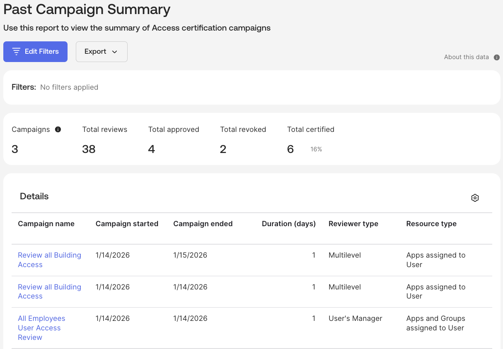
>
> This report has a row for each campaign run. You can see in the above
> example there are campaigns from the two access certification labs
> (and a duplicate for some screen captures).
>
> The report shows the name (clickable link to the campaign), start/end
> dates, resource type and count, number of users and review items, %age
> completed and counts of the approved/revoked/not certified.
>
> This could be useful to present to auditors showing the execution of
> reviews.

2.  Click the **Back to Reports** link.

3.  Click the **Past Campaign Details** report.

> 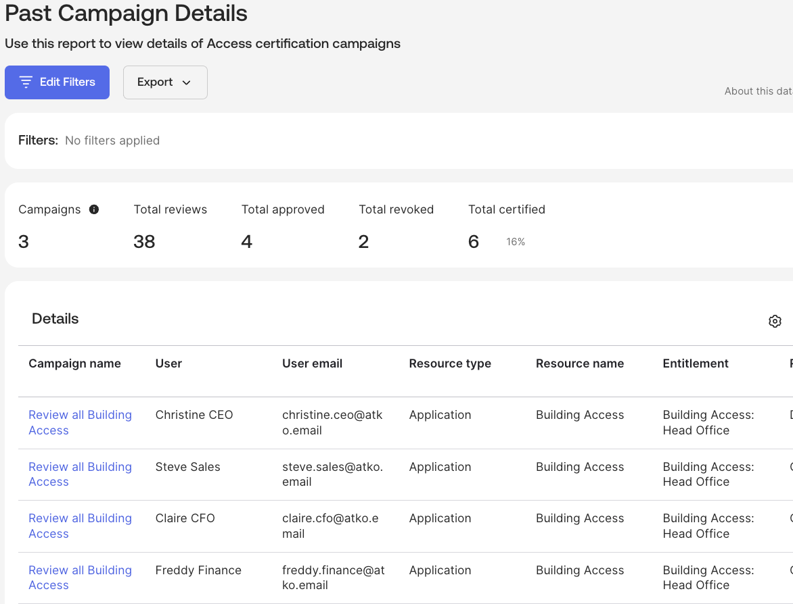
>
> This shows every review item for every campaign that has been run (and
> filtering results may be appropriate).
>
> It shows the campaign name (linkable again), the user and resource
> (and entitlement if relevant), reviewer, result of review, if approved
> or revoked it shows the date and any justification added, the
> remediation and start/end dates.
>
> This report may be very useful for audit or compliance. For example,
> if you ran campaigns on admin access, privileged access or high-risk
> access this report could be useful.

4.  Click the **Back to Reports** link.

### Application Access Audit Reports

We will finish off this lab looking at one of the Application Access
Audit Reports.

1.  In the **Reports** view, click on the **<u>Recent
    Unassignments</u>** report.

> 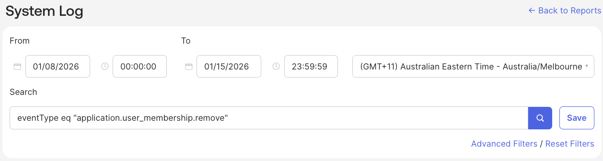
>
> As you can see this is actually a System Log report for the eventType
> application.user_membership.remove.
>
> 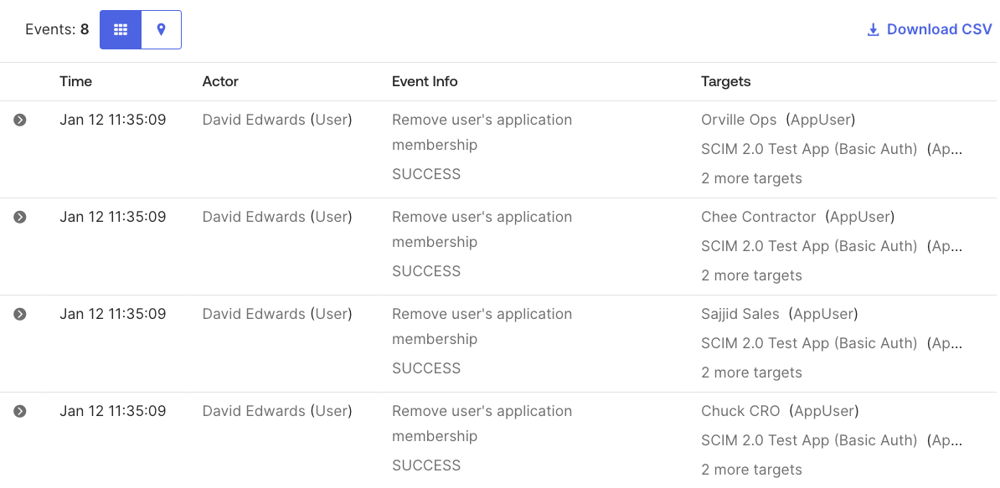
>
> You could review the events in the UI, or use the Download CSV link to
> download and analyse in a spreadsheet tool. However the report does
> not show what entitlement was removed, so you would need to use the
> system log event to go find out (for example for entitlements, go look
> at the Assignment History as we saw in an earlier lab).

This concludes the exploration of the standard OIG reports. You can have
a look at each one and determine if there is value in it for your
organisation.

---

[← Introduction to the Labs](02-introduction-to-the-labs.md) | [Lab 4.2 - Campaign Audit Reports →](04-lab-42---campaign-audit-reports.md)
