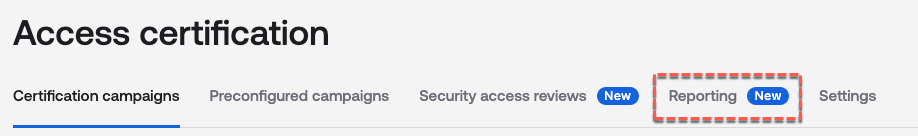
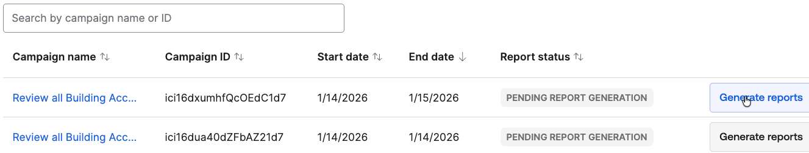
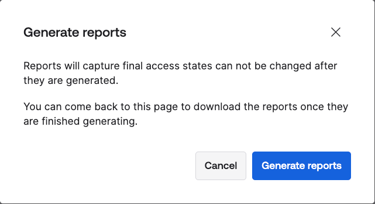
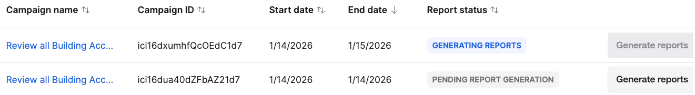
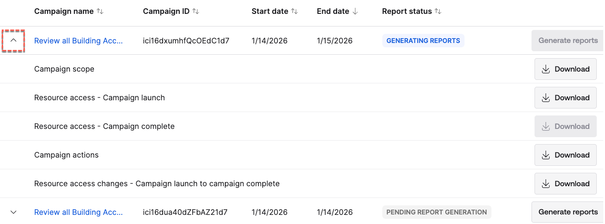

## Lab 4.2 - Campaign Audit Reports

The other type of report we will look at is the access certification
campaign reports (aka [<u>Auditor reporting
package</u>](https://help.okta.com/oie/en-us/content/topics/identity-governance/auditor-reporting/auditor-report-pkg.htm)).
These are generated when the **Create auditor reporting package** option
is set on the campaign.

The package will contain five separate reports: **Campaign scope**,
**Resource access - Campaign launch**, **Resource access - Campaign
complete**, **Campaign actions**, and **Resource access changes -
Campaign launch to campaign complete**.

We will generate and then look at these reports.

### Generate the Audit Reporting Package

1.  As an administrator in the **Okta Admin Console**, go to **Identity
    Governance \> Access Certifications.**

2.  On the Access certification page, select the **<u>Reporting</u>**
    tab.

> 
>
> You should see at least one report, from the second access
> certification lab (the screen shot shows two due to a duplicate
> campaign run).
>
> 
>
> Note the status that is showing as PENDING REPORT GENERATION. If the
> campaign is still running you will get a status saying it’s running
> and the generate button is disabled.

3.  Click the **Generate reports** button beside the campaign.

4.  On the **Generate reports** confirmation dialog, read the message
    and click the **Generate reports** button.

> 
>
> The status of the report will change to GENERATING REPORTS and the
> generate button is disabled.
>
> 
>
> The report generation may take some time.

5.  Click the down arrow beside the campaign name to see the progress.

> 
>
> You can download each report as they become available.

### \

### Review the Auditor Reporting Package Reports

More information on each of the reports can be found on the [<u>Auditor
report
package</u>](https://help.okta.com/oie/en-us/content/topics/identity-governance/auditor-reporting/auditor-report-pkg.htm)
product doc page.

1.  When the reports become available **Download** them.

2.  Open up the **Campaign scope** report (it will be called
    ***campaign_details\_\*\*\*.csv***).

> This summary report contains a row for each review item in the
> campaign and shows all the details for that item including review
> date/time and justification, and remediation.

3.  Open up the **Resource access - Campaign launch** or **Resource
    access - Campaign complete** report.

> These reports are a snapshot of all access for the application
> assignments before and after the campaign. They can be used to compare
> start and end states.

4.  Open up the **Campaign actions** report.

> This report shows the actions taken in response to the campaign. This
> will be in response to a revoke decision. It is showing details of the
> system log events.

5.  Finally open up the **Resource access changes - Campaign launch to
    campaign complete** report.

> This report shows the difference between campaign start and campaign
> end for all resources in the scope of the campaign.

This concludes the lab looking at the Audit report package capability
within Access Certifications.

It also completes the Reporting labs section of the guide. In this
section we have looked at some of the standard (out-of-the-box) reports
provided with Okta Identity Governance as well as the newer Audit
reporting package for Access Certifications.

This completes the lab sections of this guide. The remaining sections
discuss some of the advanced features available with Okta Identity
Governance.

---

[← Lab 4.1 - Explore Standard OIG Reports](03-lab-41---explore-standard-oig-reports.md)
