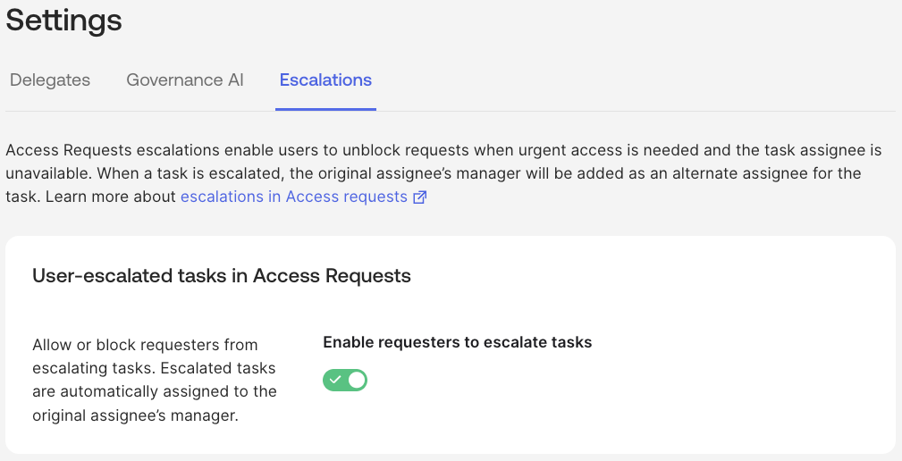

## Governance Object Management and Settings

This section highlights some of the advanced capabilities in OIG to
manage resources.

### Delegates and Escalations

OIG has a [<u>Governance
delegates</u>](https://help.okta.com/oie/en-us/content/topics/identity-governance/delegates.htm)
feature where users can assign another user as a delegate to complete
governance tasks on their behalf temporarily or permanently. Governance
tasks include access certification campaign review items and access
request approvals, questions, and tasks. For Access Requests, a delegate
can complete governance tasks for requests managed by both conditions
and request types.

There is also a setting to [<u>Allow requesters to escalate
tasks</u>](https://help.okta.com/oie/en-us/content/topics/identity-governance/access-requests/allow-escalation-for-requesters.htm).
It will allow or block requesters from escalating tasks for their access
requests from the Settings page. Access requests tasks include
questions, approvals, actions, and custom tasks. Escalated tasks are
automatically assigned to the original task assignee's manager.

Both of these settings can be controlled from the **Identity Governance
\> Settings** page.

### Collections

In the [<u>Entitlement
Management</u>](#exploring-entitlement-management) section we saw that
bundles could contain entitlements from a single app, but not across
apps. There is a new (currently) Early Access feature called
[<u>Resource
collections</u>](https://help.okta.com/oie/en-us/content/topics/identity-governance/rc/resource-collection.htm)
that allow you to combine a set of apps and entitlements.

A resource collection may contain the apps and associated entitlements
that are required for a specific role in your org. You can directly
assign resource collections to users.

Create access request conditions to streamline the process of providing
access to resource collections. After you set up conditions and enable
them, users can request access to a collection directly from their
End-User Dashboard.

Run Access Certifications campaigns to monitor user access to apps and
entitlements assigned by resource collections. Customize campaign
settings to include information about resource collections that assign
apps and entitlements. This provides more contextual information to
reviewers when they decide to approve or revoke user access.

### Resource Labels

A new feature called [<u>Resource
labels</u>](https://help.okta.com/oie/en-us/content/topics/identity-governance/resource-labels/resource-labels.htm)
has been added to help manage resources.

A resource label is metadata that an org can use to add context to
resources in Okta. Admins can use these labels to quickly find resources
that fulfill specific requirements and further automate governance
configurations.

Resource labels are defined similarly to (key, value) pairs, except the
resource label key is effectively a name that encompasses all the values
that belong to it. For example, your org might define a resource label
key named Compliance, whose values include SOX, HIPAA, and GLBA. These
labels can then be applied to all the resources that satisfy these
standards. When a label is applied to a resource, that label appears
with the resource in the Admin Console. So when the SOX label is applied
to an app, viewing that app in the Admin Console also displays the SOX
label.

Labels are managed via the [<u>Labels
API</u>](https://developer.okta.com/docs/api/iga/openapi/governance.api/tag/Labels/).

### Resource Owners

There has been the ability to assign owners to groups in Okta for some
time. Individual users or groups of users could be assigned then
referenced in access requests or access certification campaigns.

This has been extended to include [<u>Resource
owners</u>](https://help.okta.com/oie/en-us/content/topics/identity-governance/resource-owners/resource-owners.htm).
Owners can be assigned to apps, entitlement bundles, and entitlements,
then used in access requests or access certification campaigns.

---

[← Design Consideration Documentation](01-design-consideration-documentation.md) | [Access Requests Integrations (Chat and Ticketing) →](03-access-requests-integrations-chat-and-ticketing.md)
