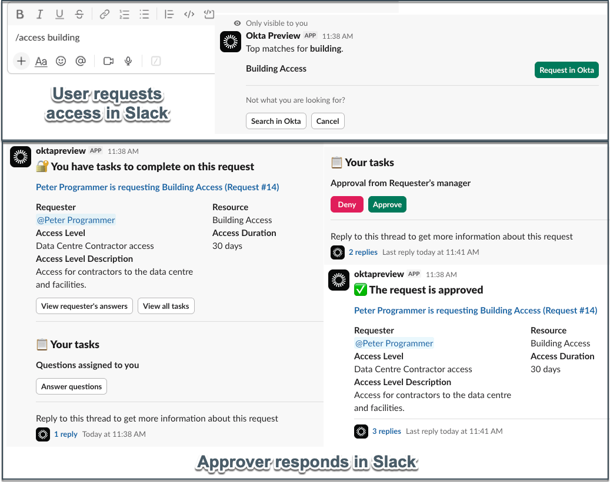

## Access Requests Integrations (Chat and Ticketing)

In the Access Requests section we looked at the Access Request Platform
integrations. In addition to Okta and Okta Privileged Access, we can
integrate with two chat apps (in Slack and Microsoft Teams) and two
ticketing apps (Jira and servicenow).

### Chat & Collaboration Integrations (Slack and Microsoft Teams)

Access Requests in OIG supports integration with both
[<u>Slack</u>](https://help.okta.com/oie/en-us/content/topics/identity-governance/access-requests/ar-submit-request-slack.htm)
and [<u>Microsoft
Teams</u>](https://help.okta.com/oie/en-us/content/topics/identity-governance/access-requests/ar-submit-request-msteams.htm).
Both support:

- Requesters requesting access to resources via the chat app, and

- Approvers getting notification and being able to review and approve an
  access..

An example in Slack is shown below.

The request experience will change depending on whether the **Unified
requester experience** feature is enabled or not. Without this feature,
access requests from chat can only be performed for Request Types
(although the approver flows work for both).

This feature has the potential to be a great productivity boost to
requesting/approving access. Rather than expecting people to go to the
app to request/approve, use of the chat integrations means you’re where
people are working all the time. In addition, being able to chat between
requesters and approvers in real time in the chat tool can significantly
reduce the time taken to review and approve access.

### Ticketing Integration with Access Requests

The ticketing integration with
[<u>Jira</u>](https://help.okta.com/oie/en-us/content/topics/identity-governance/access-requests/ar-integrate-jira.htm)
and
[<u>servicenow</u>](https://help.okta.com/oie/en-us/content/topics/identity-governance/access-requests/ar-integrate-servicenow.htm)
will push the current state of a request into the ticketing system.

It is a one-way push from Access Requests (within the Request Type) to
the ticketing tool. It is designed so that there is a record in the
ticketing system of the request, alongside any other requests in the
ticketing system (perhaps you have reporting tied to the ticketing
system and you need visibility to all requests).

This feature is only available with Request Types, not Conditions.

There is a wider consideration about requests being raised in a
ticketing system and then being pushed to Access Requests/OIG/Okta. This
is outside the scope of this guide, but there are documents on the
internet looking at servicenow and Jira integration with OIG and Okta.

---

[← Governance Object Management and Settings](02-governance-object-management-and-settings.md) | [New Access Certification Capabilities →](04-new-access-certification-capabilities.md)
