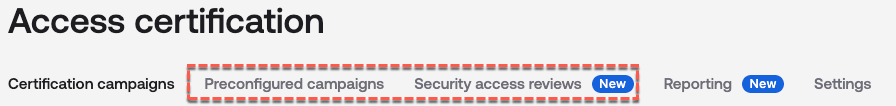
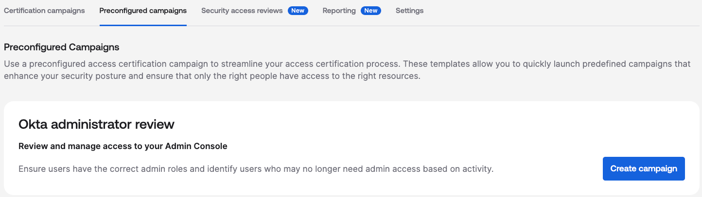
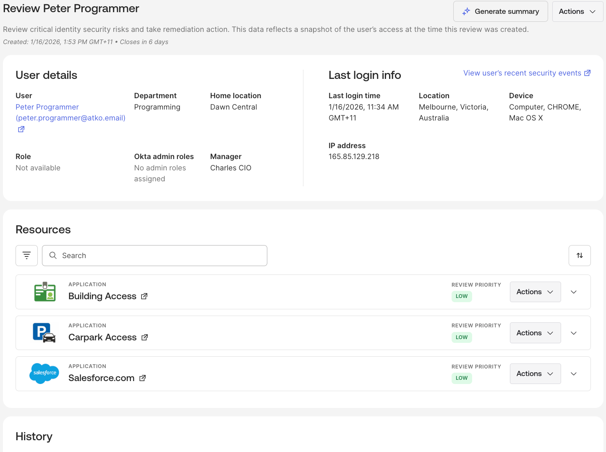

## New Access Certification Capabilities

We have covered the standard user and resource access certification
campaigns in the Access Certification section of the guide. There are
two additional features that may be useful: Preconfigured campaigns and
Security access reviews.

.

### Preconfigured Campaigns

Access Certifications comes with a set of [<u>preconfigured
campaigns</u>](https://help.okta.com/oie/en-us/content/topics/identity-governance/access-certification/create-preconfigured-campaigns.htm).
Think of them as a set of “starter packs” for campaigns, so you can
quickly build and run campaigns.

There are currently two that will show depending on your environment:

- **Discover inactive users** - Use this campaign to review apps with
  the highest number of inactive users. The default is set to users who
  have been inactive for 90 days. By default, this campaign doesn't
  review entitlements, groups, or other resources.

- **Okta administrator review** - Use this campaign to review users'
  admin access to the Admin Console. This campaign is available only if
  you're subscribed to Okta Identity Governance and are signed in to the
  Admin Console as a super admin.

With the inactive users campaign, you may see recommendations from Okta
on the Access Certifications page or the Assignments tab for an app to
run a variation of this campaign.

### Security Access Reviews

The [<u>Security access
reviews</u>](https://help.okta.com/oie/en-us/content/topics/identity-governance/access-certification/sec-access-review/sar.htm)
feature allows you to review user access to sensitive resources in
response to security incidents. A security access review is a review of
a user's access to resources, their level of access, and the method with
which access was granted. These reviews are prioritized based on app and
entitlement criticalities and access anomalies, and are built to foster
greater account and org security.

Using the Admin Console or APIs, you can launch these manually or
trigger them automatically as a response to specific security events.
This allows you to investigate access anomalies, confirm that access is
appropriate, and revoke it temporarily or permanently if necessary.

These could be used as part of an incident response against specific
users rather than scheduled campaigns.

---

[← Access Requests Integrations (Chat and Ticketing)](03-access-requests-integrations-chat-and-ticketing.md) | [Workflows Integrations →](05-workflows-integrations.md)
