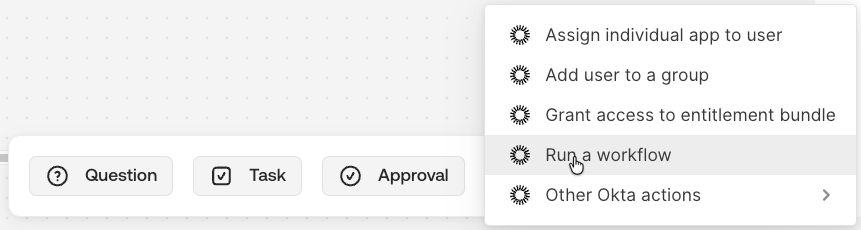
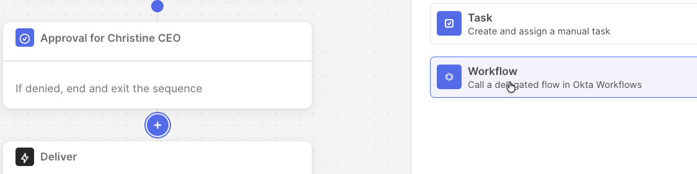

## Workflows Integrations

[<u>Okta
Workflows</u>](https://help.okta.com/wf/en-us/content/topics/workflows/workflows-main.htm)
is a no-code automation platform that automates many business processes
using a library of integrated third-party apps and functions. It is
included in the Okta Identity Governance product packaging as there are
often scenarios that call for bespoke processes. The section is a brief
summary of some of the use cases where Workflows could be used.

### Workflows and Entitlement Management

Workflows can play a role in managing entitlements for disconnected
apps. There are Okta APIs for
[<u>Entitlements</u>](https://developer.okta.com/docs/api/iga/openapi/governance.api/tag/Entitlements/)
and [<u>Entitlement
Bundles</u>](https://developer.okta.com/docs/api/iga/openapi/governance.api/tag/Entitlement-Bundles/),
as well as other governance capabilities which could be used to build a
bulkload/maintenance mechanism in Workflows.

### Calling Workflows from Access Requests

Both Request Types and Conditions have actions to call Workflows.

This allows the flow to pass a set of attributes to a workflow and have
it run. The workflow is configured as a delegated flow with the
arguments needed to be passed from the request flow.

This is used a lot when there are additional actions to be performed as
part of an access request that request types or conditions can’t do. For
example logging a specific type of ticket in a ticketing system, sending
out a special notification to chat, sending an email, or gathering some
information about the request and returning it into the messages on a
request.

Note that the request flow triggers the workflow and then continues to
the next step. It does not wait for the workflow to complete and does
not have a means to consume the results or output of a workflow to
influence the rest of the request flow.

### Triggering Workflows from System Log Events

Another common requirement is for a workflow to be run in response to an
event in the Okta System Log.

One example is to create a secondary access review campaign when one
completes. Another is to perform some special remediation action other
than a simple revoke function, which is triggered off the revoke event
in the system log. It could also send Slack notifications for access
reviews.

### Workflows for Reporting and Other OIG Uses

Workflows can address the need for bespoke reporting leveraging the Okta
connectors/APIs to collect and massage data, saving it as a CSV file or
spreadsheet.

There have been workflows built to reassign approvals/reviews when a
person is on leave (there is now the Delegate feature). Workflows have
been built to determine approvers based on work shifts (change the
people in a team as the day shift changes to the night shift) or geo
location.

Whilst there are connectors for AWS IAM and IAM Identity Centre, they do
not handle the user-permission set mappings. This has been done with
Workflows and AWS Lambda functions.

There are many more examples that can be found on the internet.

---

[← New Access Certification Capabilities](04-new-access-certification-capabilities.md) | [Identity Governance for Other Okta Products →](06-identity-governance-for-other-okta-products.md)
