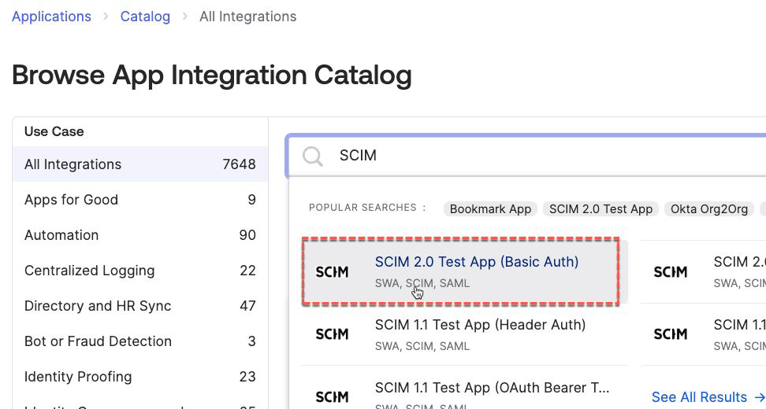
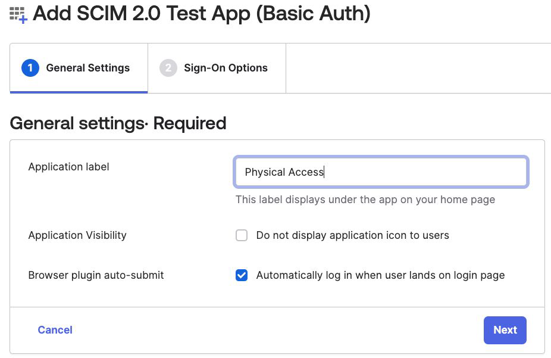
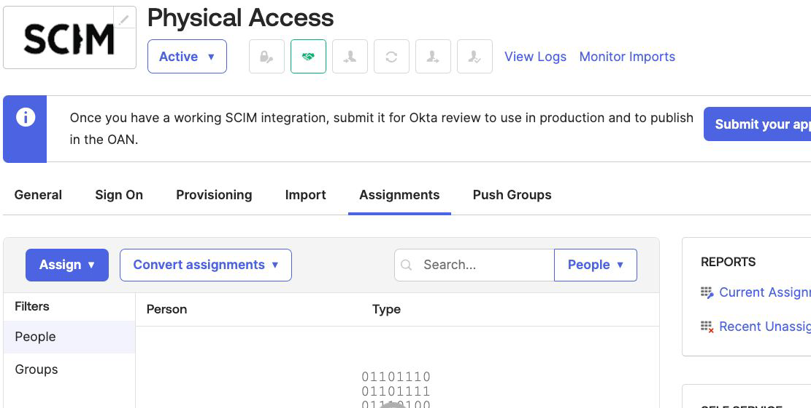

## Appendix A - Create a Dummy SCIM Application

If you have not set up a dummy SCIM application and need it for the
labs, the following steps will walk through an example.

### A.1 Introduction

Entitlements need to be tied to an application in Okta. In later parts
of this guide we will connect to a real external system, but for this
part we want to explore the core entitlement management objects in Okta.
The limitations page in the documentation

([<u>Considerations and limits \| Okta Identity
Engine</u>](https://help.okta.com/oie/en-us/content/topics/identity-governance/em/limitations.htm))
lists some options. The simplest is to create a SCIM template app.

### A.2 Create a SCIM App

To create a dummy SCIM app:

1.  Go into the **Okta Admin UI** and go to **Applications \>
    Applications**.

2.  Select **Browse App Catalog**

3.  Search for SCIM

> 

4.  Select the ***SCIM 2.0 Test App (Basic Auth)***

5.  Select **Add Integration**

6.  Give it a label and leave the other values as default. You may want
    to select the Application Visibility checkbox if there are other
    users in your system who may be confused by seeing this new
    application.

> 

7.  Click **Next**

8.  On the **Sign-On Options** tab, leave everything as default and
    click **Done**. As we’re not SSO’ing to the app, we don’t care about
    the SSO settings, just that we have an app in Okta.

> 

9.  Assign a group of users to the new application, such as the Everyone
    group.

This application is now ready to assign entitlements to.

---

[Appendix B - Configure the Access Requests Platform for Request Types →](02-appendix-b---configure-the-access-requests-platform-for-request-types.md)
