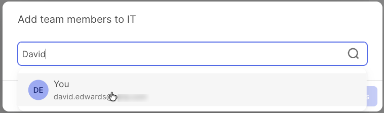

## Appendix B - Configure the Access Requests Platform for Request Types

This section will walk through confirming that the Access Requests
Platform is configured ready to create Request Types.

### B.1 Introduction

[<u>Request
Types</u>](https://help.okta.com/oie/en-us/content/topics/identity-governance/access-requests/ar-request-types.htm)
are the legacy way to build access request flows. Whilst both conditions
and request types are run by the access request platform, the use of
request types requires more interaction with the platform as well as
some configuration.

Please refer to the [<u>product documentation on request
types</u>](https://help.okta.com/oie/en-us/content/topics/identity-governance/access-requests/ar-request-types.htm)
to become familiar with the concepts and terminology.

The following sections assume you have enabled the **Access Requests -
Unified Requester Experience** Early Access feature flag. It exposes
both conditions and request types through the Request access button on
the Okta Dashboard and means you do not need to expose the Okta Access
Request app to users explicitly.

### B.2 Okta App Configuration

You have already confirmed that the Okta Access Request app is working
during previous labs, but we will walk through it just to confirm.

To check how Access Requests in defined in Okta:

1.  If not already there, log into the **Okta Dashboard** as an
    administrator and go to the **Okta Admin Console**.

2.  Go to **Applications \> Applications** and find the **Okta Access
    Requests** application.

3.  Click on the application to open it. The default tab is the
    **<u>Assignments</u>** tab.

>  src="../media/image164.png"
> style="width:6.48542in;height:4.84375in" />
>
> Notice that all the users who are assigned have been assigned
> individually. This is because they have interacted with access request
> conditions (in the earlier labs) either as a requester or an approver.
>
> If you do not have the **Access Requests - Unified Requester
> Experience** EA feature enabled, you would need to add a group to the
> app for any user who will need to raise a request via a request type.
> We will not do this.

4.  Go to the **Push Groups** tab. This will be empty - there are no
    push groups assigned to the app by default.

> Push groups are used when the Access Request Platform needs to know
> about group membership, such as controlling who can participate in a
> step in a flow. If you are just using a request type to assign a
> requester to a group, you don’t need to use a push group.
>
> We will add Push Groups in the lab step.

### B.3 Exploring and Configuring the Access Requests Platform

In this section we will explore the Access Request Platform and perform
any configuration we need to prior to creating request types.

1.  From within the **Okta Admin Console**, go to **Identity Governance
    \> Access Requests**. It will open in a new tab.

>  src="../media/image135.png"
> style="width:6.47708in;height:3.375in" />
>
> If you have come in as an administrator you will see more menu items
> than you did coming in as a requester or approver. Specifically, there
> are three additional menu items:

- Request Types - where you manage the request types,

- Teams - where you manage access request teams, and

- Settings - where you configure the instance of the access request
  platform.

> The term “Teams” here refers to the administrative grouping used
> within the Access Request Platform (it’s a legacy term). It should not
> be confused with “Teams” used in Okta Privileged Access to refer to
> the OPA tenant, nor Microsoft Teams.
>
> We will explore/configure each of these sections.

#### Settings Menu Item

The Settings menu item is for the system-wide settings.

2.  Go to the **Settings** menu item. The default tab is the
    Integrations tab.

>  src="../media/image288.png"
> style="width:6.47907in;height:5.38958in" />
>
> This is where the
> [<u>integrations</u>](https://help.okta.com/oie/en-us/content/topics/identity-governance/access-requests/ar-integrations.htm)
> are defined. The Okta integration is already configured (this is how
> you’ve been able to run the conditions labs). The others are:

- **Okta Privileged Access** - this sets up the connection to the
  [<u>Okta Privileged Access</u>](#okta-privileged-access) tenant for
  JIT access requests.

- **Chat & Collaboration Integrations** - configure integrations with
  slack or Microsoft Teams so that users can request access or approve
  access. See [<u>Slack and Microsoft Teams Integration with Access
  Requests</u>](#chat-collaboration-integrations-slack-and-microsoft-teams)
  for more details.

- **External Ticket Integrations** - configure integrations with Jira or
  servicenow to push the results of an access request to either of those
  tools.

> We will not configure these integrations in the labs.

3.  Go to the **<u>Resources</u>** tab.

>  src="../media/image32.png"
> style="width:6.48438in;height:3.85975in" />
>
> This tab shows all the **Applications**, **Okta groups**,
> **Entitlement bundles** and **Workflows** synchronised from Okta into
> the Access Request Platform.
>
> These lists are automatically synced from Okta on a schedule however
> you can force a sync by using the **Update now** button.

4.  Click on the **Manage Access** button for the Applications.

>  src="../media/image88.png"
> style="width:5.24479in;height:2.06045in" />
>
> This dialog shows all the teams defined in this Access Requests
> instance and whether they can use all Applications when constructing
> request types. If you create a new request type with a team and the
> team does not have this enabled, that request type won’t be able to
> assign users to this application.

5.  Enable it for the **IT** team and click the Save button..

6.  Go through the other resource types (**Okta Groups**, **Entitlement
    bundles** and **Workflows**), check that they reflect your Okta org
    (there will be no workflows if you have not set them up to work with
    Access Requests) and enable access for the IT team to the resource..

> If you add new teams to Access Requests, you will need to repeat this
> step to allow the request types created by the new teams to manage
> resources.

7.  Go to the **<u>Configuration lists</u>** tab. It should be empty.

> Configuration Lists are custom lists you can create and use in Request
> Types which are discussed later. They can be custom lists of strings
> (like a pick-list of text) or subsets of Resource lists (like a
> specific set of applications or groups).
>
> Configuration Lists are a powerful aspect of Request Types, however
> there is no API available to manage them. So if you want to have
> different lists of groups or different lists of applications for
> different request flows, you will need to maintain them manually
> through the UI. For this reason you should carefully consider if you
> want to use Configuration lists and if you do, how you will maintain
> them.

8.  Go to the **<u>Pushed Groups</u>** tab. It should be empty as you
    don’t have any groups pushed from Okta.

There is also an Export tab to [<u>export
data</u>](https://help.okta.com/oie/en-us/content/topics/identity-governance/access-requests/ar-export.htm)
from the Access Requests Platform. We will not look at this in this
document.

#### Teams Menu Item

Teams are grouping mechanisms in the Access Request Platform. From the
[<u>product
documentation</u>](https://help.okta.com/oie/en-us/content/topics/identity-governance/access-requests/ar-team-create.htm):

*Create Access Requests teams to organize users into logical groups for
managing the administrative aspect of request types and requests. You
can create a team that has a structure similar to that of an existing
department or customize it to fit specific business needs. By default,
Access Requests creates an empty IT team for every organization.*

*Teams can share one or more team members. However, each team is
responsible for creating their own request types and managing the
requests associated with the request type. Team members ensure that
requests reach the correct stakeholders or approvers and receive proper
oversight.*

*Teams can assign request types to specific users, other teams, or use
information from Okta to route requests to an Okta group or the
requester's manager. This ensures that critical requests receive the
necessary oversight and allows organizations to simplify decision-making
and accountability. This approach ensures that the system routes
requests to the correct person.*

Teams are a legacy concept and you should minimise the use of them if
possible. If you want to understand more about grouping within the
Access Request Platform see [<u>this
article</u>](https://iamse.blog/2022/09/10/oig-access-requests-understanding-user-grouping/),
but note that it uses the term “workflow” to refer to a “request type”.

We will look at, and use, the supplied Teams.

9.  Go to the **Teams \> All** menu item.

>  src="../media/image187.png"
> style="width:6.47292in;height:2.58146in" />
>
> There are two teams defined, **IT** and **Privileged Access**. The
> latter is used solely for Okta Privileged Access and we are not
> concerned with it.
>
> We will use the IT team for this document. You could add more teams
> but we will not.

10. Go to **Teams \> My Teams**. This shows what teams this user (the
    admin) is part of.

The view is empty meaning this user is not part of any teams. We will
fix that.

11. Go back to **Teams \> All** and click on the IT tile.

12. Click on the **Add member** button.

>  src="../media/image28.png"
> style="width:6.47708in;height:3.95833in" />

13. Find and select this admin user.

14. Confirm that this admin is now part of the team (go to **Teams \> My
    Teams** and the **IT** team should show up).

There are other settings we could look at with teams, such as the
request assignment options and the integrations applied, but we will not
cover that in this guide. There are many articles on the internet on
using and configuring teams.

#### Request Types

The last admin menu item in the Access Requests Portal is the Request
Types. This is where we configure the flows, the request types
themselves.

15. Go to **Request Types \> All**.

>  src="../media/image163.png"
> style="width:6.47292in;height:2.2347in" />
>
> This is where you manage the request types. There are views for All
> request types, request types in a Draft status, and request types by
> team (IT and Privileged Access if there are no more teams added).
>
> Note the advisory saying you should use request conditions if
> possible.

The Access Requests Platform is now ready to build and test a request
type.

%%%

---

[← Appendix A - Create a Dummy SCIM Application](01-appendix-a---create-a-dummy-scim-application.md)
